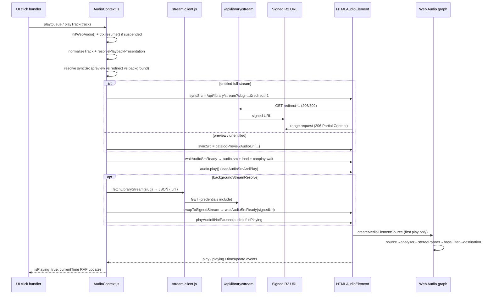

# 01 — Playback Flow Trace

Date: 2026-05-27  
Scope: Runtime audio output pipeline only (read-only).  
Status legend: **CONFIRMED-CODE** | **NEEDS-RUNTIME**

---

## End-to-end sequence



---

## Entry points (user click → playTrack)

| Source | File:line | Handler |
|--------|-----------|---------|
| Home release card | `src/components/music/ReleaseCardPlayButton.js:38-58` | `handlePlay` → `playQueue([track], 0)` |
| Home page modal/album | `src/app/page.js:960-1019` | `playTrack` / `playQueue` |
| Continue listening | `src/components/music/ContinueListening.js:72` | `playTrack(track, { resumeAt })` |
| My Music tab | `src/components/music/MyMusicTab.js:394-430` | `playTrack` / `playQueue` |
| Global dock toggle | `src/lib/player/useImmersivePlayback.js:20-28` | `engineToggle()` → `audio.toggle()` |
| Media engine facade | `src/media/useMediaEngine.js:126` | `play(track)` → `audio.playTrack(...)` |

**CONFIRMED-CODE:** All production playback funnels through a single `<audio>` ref in `AudioProvider` (`src/context/AudioContext.js:2083-2089`).

---

## Stream fetch → signed URL

### Redirect fast path (entitled users)

**CONFIRMED-CODE:** `resolvePlaybackSrc` returns redirect URL:

```204:207:src/lib/music-access.js
export function libraryStreamRedirectSrc(slug) {
  if (!slug) return "";
  return `/api/library/stream?slug=${encodeURIComponent(slug)}&redirect=1`;
}
```

**CONFIRMED-CODE:** `playTrack` uses redirect as `syncSrc` when entitled (no background JSON prefetch required):

```1052:1061:src/context/AudioContext.js
    if (usesLibraryStream && streamSlug) {
      const entitledFullStream = Boolean(nextTrack.metadata?.access?.canStream);
      if (previewSrc && !entitledFullStream) {
        syncSrc = previewSrc;
        backgroundStreamResolve = true;
      } else if (redirectFastPath) {
        syncSrc = nextTrack.src;
      } else {
        backgroundStreamResolve = true;
      }
    }
```

### JSON prefetch path (background swap)

**CONFIRMED-CODE:** `fetchLibraryStream` → signed URL JSON:

```61:68:src/lib/playback/stream-client.js
export async function fetchLibraryStream(slug, { force = false, sessionId = null } = {}) {
  const params = new URLSearchParams({ slug });
  if (force) params.set("force", "true");
  if (sessionId) params.set("sessionId", sessionId);

  const res = await fetch(`${LIBRARY_STREAM_PATH}?${params.toString()}`, {
    credentials: "include",
  });
```

**CONFIRMED-CODE:** Background swap after preview start:

```1134:1148:src/context/AudioContext.js
    const swapToSignedStream = async (resolved) => {
      const signedUrl = resolved.track?.src;
      if (!signedUrl || signedUrl === syncSrc) return;
      const resumeAt = audio.currentTime || 0;
      skipPauseInterruptionRef.current = true;
      await waitAudioSrcReady(audio, signedUrl);
      // ... seek restore ...
      if (stateRef.current.isPlaying) await playAudioIfNotPaused(audio);
```

---

## audio.src assignment and play()

**CONFIRMED-CODE:** Central helpers:

```59:90:src/context/AudioContext.js
async function waitAudioSrcReady(audio, src) {
  audio.src = src;
  await new Promise((resolve) => {
    // canplay / canplaythrough / error / 3s timeout
    audio.load();
  });
}

async function loadAudioSrcAndPlay(audio, src) {
  await waitAudioSrcReady(audio, src);
  try {
    await audio.play();
  } catch (e) {
    if (e.name !== "AbortError") {
      console.error("[AUDIO]", e.name, e.message);
    }
  }
}
```

**CONFIRMED-CODE:** `playTrack` calls Web Audio init before src load:

```985:989:src/context/AudioContext.js
  const playTrack = useCallback(async (track, options = {}) => {
    initWebAudio();
    if (audioCtxRef.current?.state === "suspended") {
      void audioCtxRef.current.resume();
    }
```

**CONFIRMED-CODE:** New track path:

```1257:1260:src/context/AudioContext.js
      if (!isSameTrack) {
        skipPauseInterruptionRef.current = true;
        audio.pause();
        await loadAudioSrcAndPlay(audio, syncSrc);
```

---

## Web Audio graph attachment

**CONFIRMED-CODE:** First `playTrack` call creates graph (once):

```440:461:src/context/AudioContext.js
  const initWebAudio = useCallback(() => {
    if (audioCtxRef.current || typeof window === "undefined") return;
    const audio = audioRef.current;
    if (!audio) return;
    try {
      const Ctx = window.AudioContext || window.webkitAudioContext;
      if (!Ctx) return;
      const ctx = new Ctx();
      const analyser = ctx.createAnalyser();
      // ...
      const source = ctx.createMediaElementSource(audio);
      const stereoPanner = ctx.createStereoPanner();
      // ...
      source.connect(analyser);
      analyser.connect(stereoPanner);
      stereoPanner.connect(bassFilter);
      bassFilter.connect(ctx.destination);
```

**CONFIRMED-CODE:** After `createMediaElementSource`, element output is routed exclusively through the graph (browser spec). Direct `<audio>` speaker path is bypassed.

---

## Exception handlers on playback path

| Stage | Handler | File:line | Behavior |
|-------|---------|-----------|----------|
| `audio.play()` rejection | catch, log unless AbortError | `:84-88`, `:96-99` | Silent swallow of AbortError |
| Web Audio init failure | catch, `console.warn` | `:467-469` | Playback continues without graph |
| Stream error | `onError` | `:766-882` | Retry signed URL once, preview fallback on 401, set error state |
| Stream resolve error | `applyStreamResolveError` | `:1064-1132` | Access denied, concurrent stream, retry UI |
| playTrack outer catch | `:1315-1318` | Sets `isPlaying: false`, error message |
| Device change | `:901-912` | Pauses if no audiooutput devices enumerated |

---

## UI state vs element state coupling

**CONFIRMED-CODE:** `isPlaying` is driven by element `play`/`pause` events:

```579:608:src/context/AudioContext.js
    const onPlay = () => {
      userPausedRef.current = false;
      patchState({ isPlaying: true, error: null, hasStarted: true, isBuffering: false });
      // ...
    };

    const onPause = () => {
      // ...
      patchState({ isPlaying: false });
```

**CONFIRMED-CODE:** `playTrack` also sets `isPlaying: true` optimistically at end (`:1313`) even when background swap may leave element paused — **NEEDS-RUNTIME** to confirm desync after signed URL swap.

---

## Auth gate impact on audio element mount

**CONFIRMED-CODE:** Unauthenticated users never mount `AudioProvider` children path:

```29:31:src/components/auth/AppAuthRoot.js
  if (!authenticated) {
    return <AuthGate variant="root" open onVerified={handleVerified} />;
  }
```

Layout nests `AudioProvider` inside `AppAuthRoot` (`src/app/layout.js:35-37`), so join/sign-in screen has **zero** `<audio>` elements.

**NEEDS-RUNTIME:** Browser probe at `https://www.2mrrw.com` (unauthenticated) confirmed `audioCount: 0`. Authenticated playback inspection requires signed-in session.
