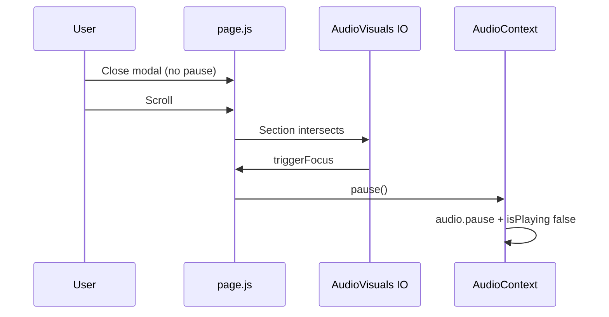

# Part 6 — Playback Interruption Chains

**Scope:** Actual chains only — `pause`, destroy audio, recreate element, `setQueue`, clear track, reset state. Cross-check with `.tmp-playback-interruption-forensic-20260531/event-chain.md` (re-verified).

---

## Reproduction: modal close → scroll → music stops (single/album path)

### Chain A — Confirmed causal (single/album)

| Step | Action | File:function / line |
|------|--------|----------------------|
| 1 | Playback running | `AudioContext` `playTrack` / `playQueue` pipeline |
| 2 | User closes modal | `closeSingleModal` / `closeAlbumModal` — **no `pause()`** L1368–1377 `page.js` |
| 3 | User scrolls | `mainScrollRef` scroll → `applyHeroParallax` L776–800 (DOM only) |
| 4 | Audio Visuals IO threshold | `IntersectionObserver` L408–421 `AudioVisualsSection` |
| 5 | `triggerFocus()` once | L383–391 |
| 6 | **`handleAudioVisualsFocused`** | L760–762: `if (isPlaying) pause()` |
| 7 | `dispatchPlaybackCommand(PAUSE)` | `AudioContext.js` ~L2904 |
| 8 | `pauseInternal` → `audioRef.current.pause()` | L2557–2559 |
| 9 | `pause` event → `patchState({ isPlaying: false })` | L1096–1109 |

**Verdict for this path:** First bad playback event is **D4** in prior forensic — **page-level focus handoff**, not auth/reload.

### Chain B — Feature modal path (alternate)

| Step | Action | File:line |
|------|--------|-----------|
| 1 | Close feature modal | `closeFeatureModal` L1334–1338 |
| 2 | **`pause()`** immediately | L1338 — stops before scroll |

---

## Chains ruled out for scroll-after-modal (single/album)

| Suspected cause | Evidence against |
|-----------------|------------------|
| Full page reload | No `location.reload`; no home `router.refresh` |
| `AudioProvider` unmount | Provider outside `AppAuthRoot` placeholder |
| Auth bootstrap / `refreshAccountState` | No audio APIs in `AuthContext` |
| `TOKEN_REFRESHED` | Ignored L296–298 |
| Session recovery `setQueue` | Skipped when `hasStarted` L41–48 `AudioPhase10Bridge.js` |
| Scroll listener alone | Parallax + section IO only; pause only via AV focus |
| `liveCountdown` tick | Re-render only L1078–1092 |
| Page visibility (tab hidden) | Saves position; does not pause on scroll-in-view |

---

## Other pause entry points on home (`page.js`)

| Trigger | Calls global `pause()`? | Lines |
|---------|-------------------------|-------|
| `handleAudioVisualsFocused` | **Yes** | 760–762 |
| `closeFeatureModal` | **Yes** | 1338 |
| `dismissNowPlaying` | **Yes** | 1385–1388 |
| Carousel / hero / ambient video | **No** (separate `HTMLVideoElement` / `Audio` ambient) | 748–756, 997, 1106–1133 |
| Modal close single/album | **No** | 1368–1377 |

---

## `AudioContext` — destroy / recreate / queue reset

| Operation | Unmounts `<audio>`? | Clears track? | When |
|-----------|---------------------|---------------|------|
| `pauseInternal` | No | No — position kept | User/command pause |
| `stopInternal` | No | Yes — stops playback state | Explicit stop command L2684+ |
| `setQueue` | No | Replaces queue | User play / recovery (guarded) |
| `playTrackInternal` | No | May change `src` on element | Track change |
| `upgradeToFullStream` | No | Swaps stream URL if preview | `entitlements:updated` L2293–2300 |
| Provider unmount cleanup | Removes listener RAF | — | L3365–3370 |

**No** code path destroys `audioRef` DOM node without unmounting `AudioProvider`.

---

## Visibility handlers (playback-related)

### `AudioContext.js` L3040–3162

- **hidden:** save position; optional stream URL refresh — **does not call `pause()`** on hide.
- **visible:** `syncPlaybackUiFromAudioElement` or `RECOVER` command — may resume if was playing.

### `page.js` L995–1007 (home tab)

- **hidden:** pauses **carousel `<video>`** elements only — not global music engine.

### `useSyncEngine.js` L98–101

- Visibility sync for control system — not audited as music pause source on home.

---

## Auth-adjacent playback effects (not scroll-modal primary)

| Event | Effect | Interrupt level |
|-------|--------|-----------------|
| `entitlements:updated` + preview playing | `upgradeToFullStream()` | Medium — URL swap, possible gap |
| `refreshAccountState` 401 | Clears auth state | Next play may fail; no immediate pause |
| Bootstrap complete | UI re-render | Low |

Dispatch sites for `notifyEntitlementsUpdated`: `page.js` checkout L1453, `success/page.js` L129 — **not** home scroll.

---

## Audio Visuals — prior audit confirmation

**Confirmed:** `AudioVisualsSection` IO → `onAudioVisualsFocused` → `pause()` is the **only** scroll-correlated global music stop on single/album path.

YouTube iframe `postMessage` play/pause (L399–417) affects embed only.

---

## Mermaid (single/album path)

