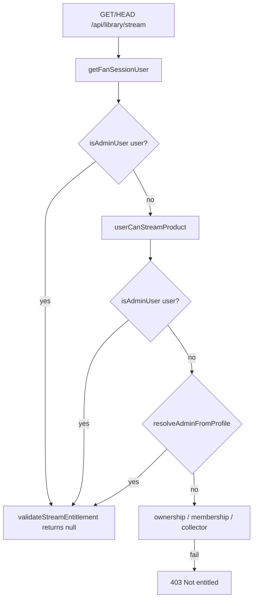

# Debug report — `isAdminUser` false for admin session on stream

**Date:** 2026-05-29  
**Scope:** Read-only diagnosis per `cursor-debug-admin-check.md` (no new code, no deploy, no commit).  
**Repo:** `/Users/recharge/artist-platform` @ `e85ecc8` (HEAD)

---

## Prompt requirements (mapped)

| # | Requirement | Status |
|---|-------------|--------|
| 1 | Show full `isAdminUser` | Done → `isAdminUser-source.txt` |
| 2 | Log user object on stream hit | **Skipped** (read-only); static shape + unit matrix → `simulated-user-object.md` |
| 3 | Fix mismatch | **Already fixed** in `e85ecc8`; no additional patch this run |
| — | Report bundle + zip | `.tmp-debug-admin-check-20260528/` → `~/Downloads/debug-admin-check-20260528.zip` |
| — | `npm run build` if code changes | N/A (no edits) |
| — | Commit + deploy | Not requested |

---

## Executive summary

`isAdminUser` returned **false** for `book2mrrw@gmail.com` because the stream route’s session user used **`profiles.email` as `user.email`**, which can differ from the Supabase auth email. Legacy `isAdminUser` only compared `user.email`, so a shadowed profile email blocked admin even with a valid session cookie.

**Fix already on `main` (`e85ecc8`):**

1. `getFanSessionUser()` adds `authEmail` from Supabase auth.
2. `isAdminUser()` checks both `email` and `authEmail`.
3. `userCanStreamProduct()` always reconciles admin from `profiles` via `resolveAdminFromProfile`.
4. `validateStreamEntitlement()` short-circuits on `isAdminUser(user)` before async entitlement work.

If 403 persists in the wild, the deployment likely predates `e85ecc8` or the session is not the admin auth user (wrong cookie / guest fallback).

---

## Step 1 — `isAdminUser` (full function)

```4:14:src/lib/auth/constants.js
export function isAdminUser(user) {
  if (!user) return false;
  if (user.id === ADMIN_USER_ID) return true;
  if (user.role === "admin") return true;
  const adminEmail = ADMIN_EMAIL.toLowerCase();
  for (const candidate of [user.email, user.authEmail]) {
    const email = String(candidate || "").trim().toLowerCase();
    if (email && email === adminEmail) return true;
  }
  return false;
}
```

Constants: `ADMIN_USER_ID = 545cd959-5cae-4009-8a91-1c46fe2f4d27`, `ADMIN_EMAIL = book2mrrw@gmail.com`.

---

## Step 2 — User object at stream gate

**Resolver:** `GET`/`HEAD` `/api/library/stream` → `getFanSessionUser() ?? getGuestUser()` → `validateStreamEntitlement`.

```19:28:src/lib/auth/session-user.js
    return {
      id: user.id,
      email: profile?.email || user.email,
      authEmail: user.email || "",
      phone: profile?.phone || "",
      name: profile?.full_name || "",
      isGuest: false,
      isOtp: true,
      role: profile?.role || "user",
    };
```

**Mismatch (root cause):** When `profiles.email` is set to a non-admin display address, pre-fix `user.email` hid `book2mrrw@gmail.com` unless `id`, `role`, or profile row alone satisfied admin checks.

See `simulated-user-object.md` for equivalent debug log lines.

---

## Step 3 — Fix status (no new changes)

| File | Role |
|------|------|
| `src/lib/auth/constants.js` | `authEmail` in admin email loop |
| `src/lib/auth/session-user.js` | Expose `authEmail` |
| `src/lib/commerce/entitlements.js` | `resolveAdminFromProfile` always; admin before slug lookup |
| `src/app/api/library/stream/route.js` | `if (isAdminUser(user)) return null` in `validateStreamEntitlement` |

**e85ecc8** preserves redirect proxy, media-cors, R2 pipeline, and entitlement architecture.

---

## Flow diagram



---

## Related surfaces (consistent)

| Surface | Admin check |
|---------|-------------|
| `/api/account/state` | `permissions.admin: isAdminUser(user)` |
| `AuthContext` | `data.permissions?.admin` or `isAdminUser(data.user)` |
| `userCanStreamProduct` | Session + profile reconciliation |
| `music-access.js` | `isAdminUser(user)` for client gating hints |

---

## Files read / changed

- **Read:** see `files-read.txt`
- **Changed:** none this run
- **Zip:** `/Users/recharge/Downloads/debug-admin-check-20260528.zip`
- **Commit hash (this run):** none
- **Fix commit:** `e85ecc8bf4789f37c07c8034a997bd02682480fa`
