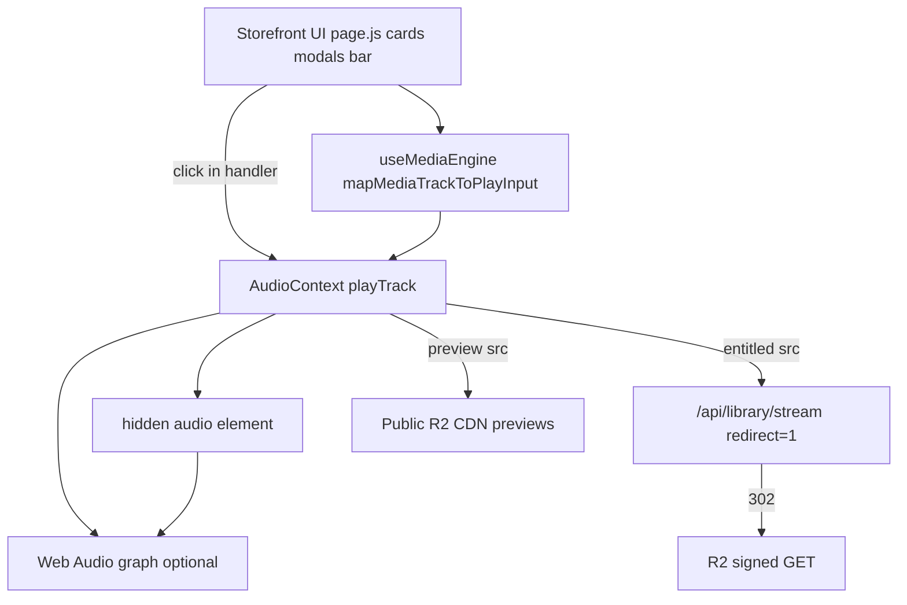

# Desktop Audio Path Map

Single engine for all viewports. “Desktop path” = typical Chrome/macOS session where auth is warm and gestures are lenient.

## Architecture



## Entry paths (all converge on `playTrack`)

| Surface | File:line | Trigger | Track build |
|---------|-----------|---------|-------------|
| Single card play | `ReleaseCardPlayButton.js:38-58` | `onClick` → `playQueue([track])` | `toPlaybackTrack` (`music-playback.js:10-46`) |
| Open single modal | `page.js:1105-1126` | `openSingleModal` → `playTrack` in handler if `!authLoading` | `toPlaybackTrack(..., "preview_modal")` |
| Open feature modal | `page.js:1132-1155` | same pattern | `"feature_modal"` |
| Album modal | `page.js:1171-1177` | `playAlbumTracks` | `albumTracksForPlayback` |
| Global bar toggle | `useImmersivePlayback.js:20-28` | `engineToggle` → `AudioContext.toggle` | no new track |
| Immersive modal scrub/toggle | `ImmersivePreviewModal.js:508-512, 833` | `toggle` / `seek` only | playback already started from `page.js` |

## `toPlaybackTrack` → src resolution

```10:46:src/lib/music-playback.js
export function toPlaybackTrack(item, accountState, source = "library", overrides = {}) {
  const access = resolveTrackAccess(item, accountState);
  ...
  src: resolvePlaybackSrc(item, access, { userId }),
  metadata: { access, ... },
}
```

```204:227:src/lib/music-access.js
export function resolvePlaybackSrc(track, access, { userId } = {}) {
  if (access?.canStream && track.slug) {
    return libraryStreamRedirectSrc(track.slug); // /api/library/stream?slug=...&redirect=1
  }
  ...
  return catalogPreviewAudioUrl(previewPath); // public CDN
}
```

## `playTrack` sequence (entitled subscriber)

| Step | File:line | Behavior |
|------|-----------|----------|
| Gesture unlock | `AudioContext.js:1137-1146` | `play()` → `pause()` at volume 0 (sync, before first `await`) |
| Web Audio resume | `1148-1149` | `initWebAudio()` + `await resumeWebAudioContextIfSuspended` |
| Stream mode | `1204-1221` | `redirectFastPath` true → `syncSrc` = `/api/...&redirect=1`, **no** `backgroundStreamResolve` |
| Load + play | `1457` | `loadAudioSrcAndPlay(audio, syncSrc)` → browser follows 302 to R2 |
| State | `1413-1424` | `isPlaying: true` via `onPlay` listener |

**Desktop advantage:** `authLoading` often false before first tap → `playTrack` stays inside click handler (`page.js:1125-1126`).

## Stream API (server)

| Step | File:line |
|------|-----------|
| Middleware refresh | `middleware.js:10-14` → `supabase/middleware.js:30` |
| User resolve | `stream/route.js:109` → `getFanSessionUser()` ?? `getGuestUser()` |
| Entitlement | `stream/route.js:40-44` → `userCanStreamProduct` → 403 if false |
| Redirect | `stream/route.js:81-91` → 302 signed R2 URL |

## Web Audio

| Step | File:line |
|------|-----------|
| First `playTrack` | `initWebAudio` attaches `MediaElementSource` (`515-541`) |
| Graph | `source → analyser → stereoPanner → bassFilter → destination` |
| Element attrs | `crossOrigin="anonymous"`, `playsInline` (`2363-2369`) |

## Service worker

| Component | File:line | Role |
|-----------|-----------|------|
| Register | `layout.js` inline | registers `/sw.js` on load |
| KEEP_ALIVE ping | `AudioContext.js:424-446` | every 20s while playing |
| SW handler | `public/sw.js:12-19` | ACK only; **no fetch intercept** |

## Desktop-typical success conditions

- Supabase cookies present on `www.2mrrw.com` → stream 302/JSON succeeds
- `accountState` loaded → `metadata.access.canStream` true for entitled tracks
- Chrome allows `audio.play()` after src swap / visibility resume
- `redirect=1` avoids `swapToSignedStream` + `playAudioIfNotPaused` bug path
