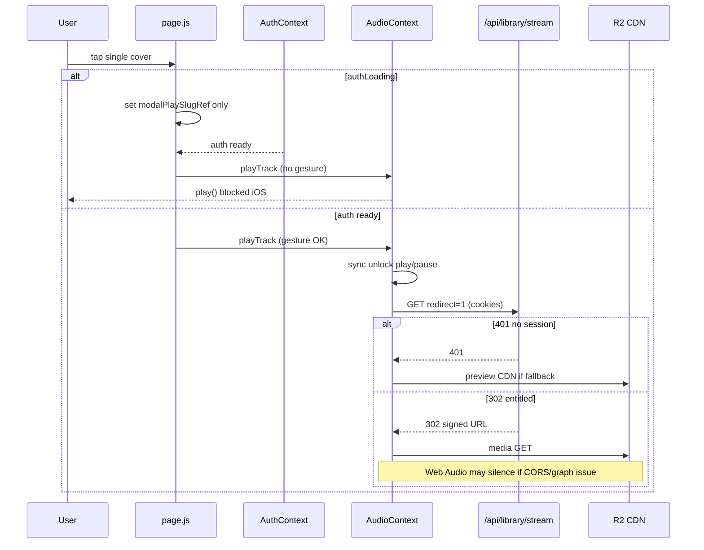

# Mobile Audio Path Map

Same code paths as desktop; differences are **policy**, **timing**, and **touch UX**. Priority: iOS Safari, then Android Chrome.

## Mobile detection (UI only — not playback fork)

| Location | File:line | Logic |
|----------|-----------|-------|
| Home shell | `page.js:601-602` | `isMobile` state, resize listener |
| Global player bar | `GlobalAudioPlayerBar.js:368-376` | `window.innerWidth < 768` |
| PWA standalone | `AudioContext.js:261-267` | `display-mode: standalone` / `navigator.standalone` |

**No `isMobile` branch inside `AudioContext.playTrack`.**

## Critical mobile-only failure paths

### A. Gesture chain broken — deferred modal play

```1121:1126:src/app/page.js
    if (authLoading) {
      modalPlaySlugRef.current = single.slug;
      return;
    }
    if (playbackTrack?.src) void playTrack(playbackTrack);
```

```970:990:src/app/page.js
  useEffect(() => {
    if (authLoading) return;
    ...
    if (playbackTrack?.src) void playTrack(playbackTrack);
  }, [authLoading, ...]);
```

| Stage | Risk |
|-------|------|
| User taps cover on cold load | `authLoading === true` → no `playTrack` in tap |
| Auth finishes | `useEffect` calls `playTrack` **outside user gesture** |
| iOS Safari | `play()` rejected → silent or paused; UI may still update partially |

**Mobile skew:** slower network/CPU + ITP → higher chance of `authLoading` during first tap.

### B. Session cookies / account state on stream

| Layer | File:line | Mobile risk |
|-------|-----------|-------------|
| Browser client | `supabase/client.js:4-17` | Session in cookies under `2mrrw-auth-token` |
| Server stream | `stream/route.js:109-112` | 401 if no fan + no `guest_session` |
| Fetch | `stream-client.js:66-68` | `credentials: "include"` (correct) |
| Account state | `AuthContext.js:109-143` | Stale guest payload can clear `permissions.admin` |
| Entitlement UI | `music-access.js:103-131` | Wrong `canStream` → preview CDN src instead of stream |

**Admin mobile (commit area `922381d`):** historical mismatch between client `storageKey` and server default caused server to see no OTP session while client showed logged-in — preview-only on mobile. Key alignment exists in current tree; **verify deployed build**.

**Guest vs fan:** `session-user.js:30-31` falls back to `getGuestUser()` when Supabase user missing — stale `guest_session` after OTP login can win until cleared (`AuthContext.js:181`, `clearGuestSessionCookie`).

### C. Web Audio + cross-origin full stream

| Step | File:line | Mobile note |
|------|-----------|-------------|
| `initWebAudio` on first play | `515-541` | iOS starts `AudioContext` **suspended** |
| `crossOrigin="anonymous"` | `2367` | Required for CORS-enabled R2 samples |
| R2 CORS | `r2-cors-recommended-from-docs.json` | Allows `https://www.2mrrw.com` |
| Signed URL host | redirect target | Must send `Access-Control-Allow-Origin` for Web Audio |

**Symptom:** `currentTime` advances, UI playing, **no audio** — classic `MediaElementSource` + CORS.

**Preview path:** public CDN (`catalogPreviewAudioUrl`) — same cross-origin issue if graph attached; previews may “work” on desktop if graph init fails silently more often on mobile first play.

### D. `playAudioIfNotPaused` inverted logic

```123:131:src/context/AudioContext.js
async function playAudioIfNotPaused(audio) {
  if (audio.paused) return;
  try {
    await audio.play();
```

Used after background signed URL swap:

```1294:1308:src/context/AudioContext.js
    const swapToSignedStream = async (resolved) => {
      ...
      await waitAudioSrcReady(audio, signedUrl);
      if (stateRef.current.isPlaying) await playAudioIfNotPaused(audio);
```

After `load()`, element is **paused** → function returns without `play()`. Hits paths where `backgroundStreamResolve` is true (preview-first, non-redirect legacy src).

### E. Toggle / resume without sync unlock

| API | File:line | Missing vs `playTrack` |
|-----|-----------|-------------------------|
| `resume` | `1862-1872` | no silent `play()/pause()` unlock |
| `toggle` → `resume` | `1928-1931` | same |
| Modal `toggle` | `ImmersivePreviewModal.js:508-512` | user tap here **does** carry gesture — OK for pause/resume **if** already unlocked |
| Visibility resume | `2110-2125` | `setTimeout` + `el.play()` — often **no gesture** on iOS |

### F. Touch UX on global bar (not silent-audio root, but “broken” reports)

| Behavior | File:line |
|----------|-----------|
| Single tap play delayed 300ms | `GlobalAudioPlayerBar.js:453-458`, `511-515` — `DOUBLE_TAP_MS` |
| CS hold steals tap | `433-467` |
| `preventDefault` on touch end | `488-491` |

### G. Preview vs full on mobile

| Condition | Src | Cap |
|-----------|-----|-----|
| `!access.canStream` | preview CDN | `PREVIEW_HARD_CAP_SEC` 30s (`57`, `759-780`) |
| `canStream` + entitled | `/api/library/stream?redirect=1` | full |
| Stream 401 + `canStream` in metadata | preview fallback (`1225-1251`) | preview only — **metadata can be wrong if account state stale** |

### H. Service worker

`public/sw.js` — message ACK only. **Unlikely to block audio**; no media fetch handler.

### I. iOS / Android element attributes

```2363:2369:src/context/AudioContext.js
      <audio
        ref={audioRef}
        preload="auto"
        playsInline
        crossOrigin="anonymous"
        {...{ "webkit-playsinline": "", "x-webkit-airplay": "allow" }}
```

| Attribute | Purpose |
|-----------|---------|
| `playsInline` / `webkit-playsinline` | avoid fullscreen takeover |
| `crossOrigin` | Web Audio + CORS |
| `x-webkit-airplay` | AirPlay — **NEEDS-RUNTIME** if silent on external route |

## Mobile user journey map



## Production probe baseline (unauthenticated mobile-equivalent)

Same as desktop curl: stream **401**, account/state **200** guest — any real playback test **requires** authenticated DevTools on device.
