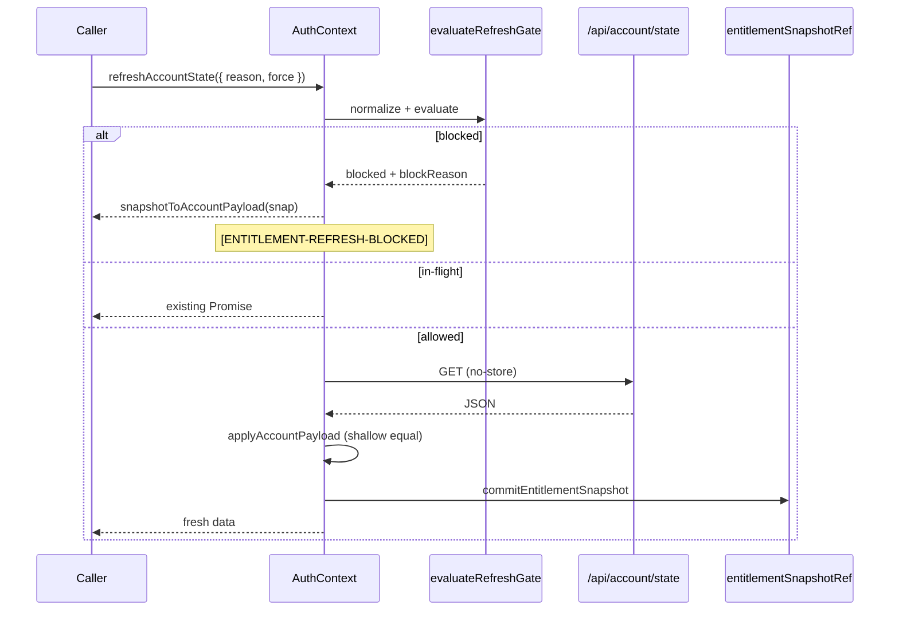

# Account State Debounce Flow

## Invalidate before high-signal events

`invalidateEntitlementSnapshot(reason)` sets `lastUpdated = 0` so the next refresh is not blocked by the 10s debounce window.

| Flow | Invalidate | Refresh |
|------|------------|---------|
| Bootstrap | `auth:bootstrap` | `force: true` |
| OTP login | `auth:login` | `force: true` |
| Inline checkout | `purchase:completed` | `force: true` |
| `/success` poll | attempt 0 only | `force: true` each attempt |
| Subscribe poll | — | `force: true` each attempt |

## Library change (debounced path)

`library:change` from home catalog / `useMusicLibrary` does **not** pass `force`. Repeated taps within 10s coalesce to cached snapshot — same entitlement outcome until window expires or user forces via commerce/login paths.

## In-flight coalescing

Concurrent callers share one fetch promise (`accountStateInFlightRef`). Second caller logs `duplicate-in-flight` and awaits the same result.
