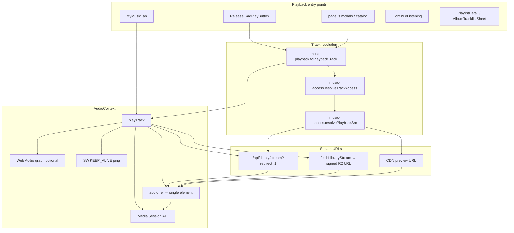

# Audio engine flow — 2MRRW artist-platform

**Audit date:** 2026-05-27 · **Primary target:** iOS Safari

## Architecture summary

There is **one** `<audio>` element, owned by `AudioProvider` in `src/context/AudioContext.js`. All UI surfaces (`GlobalAudioPlayerBar`, `ImmersivePreviewModal`, catalog cards) call into the same context via `useAudioPlayer()` or the thin `useMediaEngine()` adapter.



## 1. Entry points (initiate playback)

| Location | Line(s) | Trigger | Calls |
|----------|---------|---------|-------|
| `src/components/music/ReleaseCardPlayButton.js` | 38–58 | `onClick` on 44×44 play button | `toPlaybackTrack` → `playQueue([track], 0)` or `toggle()` if same track |
| `src/app/page.js` | 1095–1115 | `openSingleModal(single)` | `toPlaybackTrack` → `playTrack(playbackTrack)` |
| `src/app/page.js` | 1129–1151 | `openFeatureModal(feat)` | same |
| `src/app/page.js` | 1174–1181 | `openAlbumModal(album)` | `playAlbumTracks(album, 0)` → `playQueue` / `playTrack` |
| `src/app/page.js` | 1018, 1023 | inline catalog handlers | `playQueue` / `playTrack` |
| `src/components/music/MyMusicTab.js` | 394, 408, 430 | library row / shuffle play | `playTrack` / `playQueue` |
| `src/components/music/ContinueListening.js` | 72 | resume chip click | `playTrack(track, { resumeAt })` |
| `src/components/music/PlaylistDetail.js` | 28, 69 | play all / row | `playQueue` |
| `src/components/music/AlbumTracklistSheet.js` | 69, 72 | play album | `playQueue` |
| `src/media/useMediaEngine.js` | 126 | `play(track)` API | `audio.playTrack(mapMediaTrackToPlayInput(track))` |
| `src/components/preview/ImmersivePreviewModal.js` | 675, 953 | modal `toggle` / track row | `useMediaEngine().toggle` / `seek` (does not start new track unless page already called `playTrack` on open) |

**Note:** Opening `ImmersivePreviewModal` from `page.js` **starts playback in the same user gesture** as the card click via `playTrack` before the modal paints (`page.js` 1115, 1151).

## 2. `playTrack` sequence (ordered)

Source: `src/context/AudioContext.js` `playTrack` (~1178–1572).

1. **Gesture unlock** — if `audioEl.paused`, `unlockAudioFromGesture` (silent play/pause at volume 0).
2. **`initWebAudio()`** — create graph once: `MediaElementSource` → `Analyser` → `StereoPanner` → `BiquadFilter` → `destination`.
3. **`resumeWebAudioContextIfSuspended`** — Safari AudioContext resume.
4. **`setPreviewEnded(false)`**.
5. **`normalizeTrack(track)`** — slug, src, cover, CS assets, metadata.
6. **`resolvePlaybackPresentation`** — CS mode title/src/cover/rate.
7. **`preloadCoverImage`** + perf mark `AUDIO_START_LATENCY_START`.
8. **Validate** audio ref and `nextTrack.src`; early `patchState` + return if missing.
9. **`streamErrorRetriedRef = false`**.
10. **Sync src selection** (`syncSrc`):
    - Library stream + not entitled → `previewSrc` from CDN.
    - Library stream + `redirect=1` → keep redirect URL (browser follows 302).
    - Library stream + entitled + not redirect → `backgroundStreamResolve = true` (play redirect/preview first, swap signed URL async).
11. **Background signed URL** (if entitled): `resolveLibraryStreamForTrack` → `swapToSignedStream` on success; `applyStreamResolveError` on failure (preview fallback, access denied, conflict).
12. **Position memory** — `clearPlaybackPosition` on track change; `getSavedPlaybackPosition` / `accountState.mediaProgress` for `resumeAt`; `clampRestorePosition`.
13. **Previous track teardown** — `finalizeStreamSession`, `recordLocalListening` if switching slugs.
14. **`patchState`** — `currentTrack`, `hasStarted: true`, clear errors/conflict.
15. **`preloadCsAssets`**.
16. **Crossfade** (optional) if switching tracks while playing & `currentTime > 3`.
17. **Load & play** — `loadAudioSrcAndPlay(audio, syncSrc)` if new track; else seek/resume same track.
18. **`applyCsToElement`** — playbackRate, preservesPitch, pending seek on `loadedmetadata`.
19. **First-listen swell** — volume ramp if `isFirstListen(slug)`.
20. **`updateMediaSession(..., { playing: true })`**.
21. **`patchState({ isPlaying: true, playbackState: "playing" })`**.

## 3. Stream resolution

| Path | Condition | URL shape | File |
|------|-----------|-----------|------|
| Preview CDN | `!access.canStream` or guest preview | `catalogPreviewAudioUrl(preview_path)` | `music-access.js` 223–226, `stream-client` N/A |
| Redirect fast path | `canStream` + `libraryStreamRedirectSrc(slug)` | `/api/library/stream?slug=…&redirect=1` → 302 signed R2 | `music-access.js` 204–207, `route.js` 81–91 |
| JSON prefetch | `fetchLibraryStream` (background or retry) | GET `/api/library/stream?slug=` → `{ url, expiresIn, sessionId }` | `stream-client.js` 61–104 |
| Offline | `getOfflinePlaybackUrl` when cached | blob/local | `music-access.js` 217–218 |

Server auth: `GET` requires `getFanSessionUser() ?? getGuestUser()` (`route.js` 109–112). Entitlement via `userCanStreamProduct` (403 if denied).

## 4. Web Audio graph

Initialized in `initWebAudio` (`AudioContext.js` 517–565), first user gesture via `GESTURE_UNLOCK_EVENTS` (568–614).

```
audio element → MediaElementSource → Analyser (fft 256)
  → StereoPanner (space mode pan)
  → BiquadFilter lowshelf (bass boost +8dB)
  → AudioContext.destination
```

On init failure, `webAudioAvailableRef = false`; audio still plays via native element output.

## 5. State management

| State / ref | Location | Updated by |
|-------------|----------|------------|
| React `state` (`isPlaying`, `currentTrack`, `currentTime`, `duration`, `queue`, `csMode`, `error`, `isBuffering`, …) | `AudioContext.js` 161–184, 340 | `patchState`, audio event handlers |
| `stateRef` | 310, 639–647 | mirror of state for listeners |
| `streamMetaRef` | 325 | signed URL metadata from `fetchLibraryStream` |
| `userPausedRef` | 319 | user pause vs OS interrupt |
| `skipPauseInterruptionRef` | 320 | suppress auto-resume on intentional src swap |
| `wasPlayingBeforeHideRef` | 329 | visibility resume |
| `audioRef` | 302 | DOM `<audio>` |

Progress UI: `timeupdate` + RAF loop (`startProgressRaf`) while playing.

## 6. Audio element attributes (as rendered)

```2396:2403:src/context/AudioContext.js
      <audio
        ref={audioRef}
        preload="auto"
        playsInline
        crossOrigin="anonymous"
        {...{ "webkit-playsinline": "", "x-webkit-airplay": "allow" }}
        style={{ display: "none" }}
      />
```

- **`playsInline` / `webkit-playsinline`:** inline playback on iOS (required for background/lock screen behavior with Media Session).
- **`crossOrigin="anonymous"`:** required for `createMediaElementSource` when graph succeeds.
- **`x-webkit-airplay="allow"`:** AirPlay permitted.
- **No** `controls` attribute (custom UI only).

## Event → side effects (selected)

| Event | Handler lines | Effect |
|-------|---------------|--------|
| `play` | 723–739 | `isPlaying: true`, keep-alive ping, position save timer, Media Session playing |
| `pause` | 742–772 | stop timers; if not user pause → `canplay` auto-resume hook |
| `timeupdate` | 775–821 | preview 30s cap + fade; Media Session position; listening 30s milestone |
| `ended` | 825–924 | queue advance / repeat / preview end |
| `error` | 926–1049 | offline wait, one stream retry, preview fallback |
| `waiting` / `stalled` | 714–715 | `isBuffering: true` |
