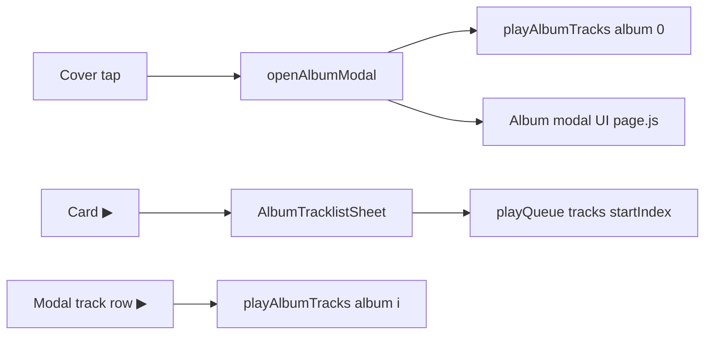

# Albums & EPs section

## Data

| Symbol | Location | Role |
|--------|----------|------|
| `albums` | `app/page.js` ~203–207 | T.B.H., (A.D), Love Hz Vol.1 — `tracks[]` as strings |
| `INLINE_ALBUMS` | ~212 | Fallback alias |

Fields: `slug`, `cover`, `price`, `date`, `vinyl`, `tracks` (title strings only in static data).

## `CatalogGrid.js` (`type="albums"`)

| Concern | Line ref | Detail |
|---------|----------|--------|
| Cover click | ~86 | `onCardClick?.(item)` → **`openAlbumModal`** |
| Play item shape | ~32 | `albumCardPlaybackItem(item)` — first track or album-level |
| Play button override | ~140–142 | `onPlayClick` → **`onOpenAlbumTracklist`** (sheet), **not** album modal |
| Entitlement | ~30, 131 | `resolveContentAccess`, `showPlayActions` via `itemHasPlayableAudio` |
| Cart-only path | ~153–154 | When no playable audio but `showCart` |
| Upcoming | ~43–80 | Locked card, no play |

## Three album playback entry points

| Entry | Opens modal? | Starts playback? | Line refs |
|-------|--------------|------------------|-----------|
| Cover | Yes (`selectedAlbum`) | Yes, track 0 | `openAlbumModal` page.js ~1156–1162 |
| Card play | No (sheet) | On track pick in sheet | CatalogGrid ~140–142; sheet ~54–67 |
| “Play Album” in modal | — | Yes from index 0 | page.js ~1670–1671 |
| Per-track in modal | — | `playAlbumTracks(selectedAlbum, i)` | ~1659 |

## `playAlbumTracks` (~1008–1019)

1. `albumTracksForPlayback` → array of `toPlaybackTrack` per track
2. If length > 0: `playQueue(tracks, startIndex)`
3. Else if `access.canStream`: single `playTrack(toPlaybackTrack(album,...))`

## Album modal (`page.js` ~1577–1688)

- **Not** `ImmersivePreviewModal` — custom `motion.div`, zIndex **8888**
- `registerModal("album-modal")` when `selectedAlbum` (~1185–1188)
- Track list: `selectedAlbumAccess?.canStream` gates play buttons (~1630)
- Cart / vinyl when `showCart` (~1673–1676)
- `MusicPlusButton` on album (~1679–1684)

## `AlbumTracklistSheet.js`

| Concern | Line ref |
|---------|----------|
| zIndex | 9000 (~111) — above album modal |
| Play all / shuffle | ~187–224 → `playAndClose` closes sheet |
| Per-track play | ~346–357 |
| Entitlement per row | `resolveTrackAccess` ~242–245 |

## Vinyl / cart

- Album modal: Add to Cart, Add Vinyl (~1673–1676)
- CatalogGrid: `+ Cart` via `ReleaseCardActions` (~144)
- Vinyl slug pattern in page: `` `${album.slug}-vinyl` `` via `addVinylToCart` ~1088

## `AlbumCard`

No standalone `AlbumCard.js` — rendering is entirely **`CatalogGrid`** for albums.
