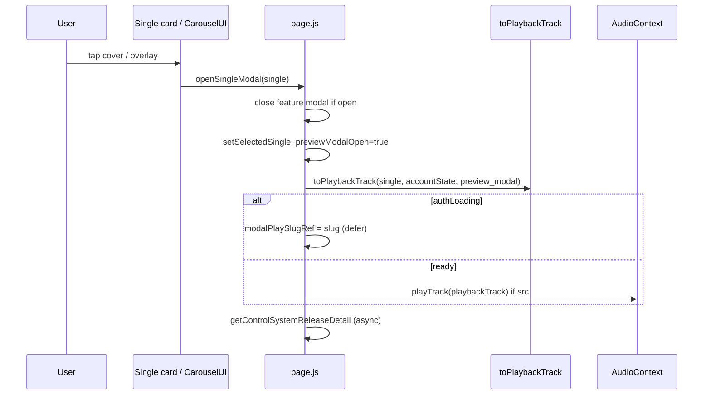
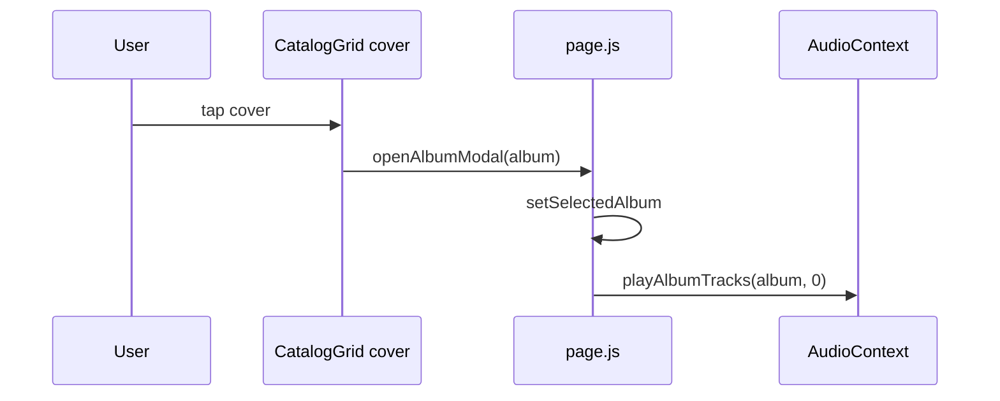

# Open modal & audio flow

## `openSingleModal` (`page.js` ~1090–1115)

| Step | Line | Notes |
|------|------|-------|
| Close competing feature modal | ~1091–1096 | |
| Set UI state | ~1097–1098 | |
| Build track | ~1101–1105 | Entitlement + `src` via `resolvePlaybackSrc` |
| Auth defer | ~1106–1108 | Sets ref, **no play yet** |
| Play | ~1110–1111 | `void playTrack(playbackTrack)` |
| Detail enrich | ~1112–1114 | Does not block play |

### Deferred play (`useEffect` ~951–981)

When `authLoading` becomes false:

- If `featureModalOpen` + `featureModalPlaySlugRef` matches → play feature
- Else if `previewModalOpen` + `modalPlaySlugRef` matches `selectedSingle.slug` → play single

Clears ref after firing.

## `openFeatureModal` (~1117–1145)

Same pattern with:

- Closes single modal + clears `modalPlaySlugRef` (~1120–1124)
- `toPlaybackTrack(..., "feature_modal")`
- `featureModalPlaySlugRef` for auth defer (~1135–1137)
- Clears `nowPlaying` (~1119)

## `handleSingleClick` (~1165–1169)

Thin wrapper → `openSingleModal`. Used by `CarouselUI` only (not home singles row, which calls `openSingleModal` directly).

## `closeSingleModal` (~1172–1177)

Sets modal closed, clears refs, **`pause()`** — stops global audio.

## Play button path (no modal)

`ReleaseCardPlayButton.handlePlay` (~38–79):

1. `e.stopPropagation()` — card click does not fire
2. `toPlaybackTrack(item, accountState, source)` — e.g. `home_single_card`
3. `playQueue([track], 0)` or `toggle` if same track

**No call to `openSingleModal`.**

### Race: open modal vs card play

| Scenario | Outcome |
|----------|---------|
| User taps cover quickly after ▶ | Modal opens; `openSingleModal` calls `playTrack` again — likely same slug, re-entrant play |
| User taps ▶ while modal opening | Both may call play; last wins in AudioContext |
| Auth loading + open modal | Play deferred; card ▶ might still play if auth resolved on button path first |

`openSingleModal` dependency array includes `nowPlaying` (~1115) but function body does not use it — possible stale closure / extra re-creations only.

## Feature cover path

`FeaturesRail` ~22: `onOpenFeature(feat)` → full open + play sequence.

## Album: `openAlbumModal` (~1156–1162)

No `previewModalOpen`; uses inline album modal + immediate queue.

## Album play button path

`CatalogGrid` ~140–142: `onPlayClick` → `setAlbumTracklistRelease(item)` only.

Sheet `playAndClose` → `playQueue` then `onClose` (~54–67).

## Deep links (~1448–1481)

| Type | Action |
|------|--------|
| `song` | `openSingleModal` |
| `album` | `openAlbumModal` |
| `feature` | `openFeatureModal` |

## ImmersivePreviewModal after open

Does **not** auto-play on mount; relies on parent `playTrack` already called.

User taps play in modal when track not current:

- `playTrack({ ...single })` without `toPlaybackTrack` (~475–478)

User taps when same track:

- `toggle()` (~481)

## `nowPlaying` side effect (~983–999)

While modal open, `currentTrack` changes do **not** update `nowPlaying` state used for home mini player—reduces duplicate chrome on page, not in layout global bar.
