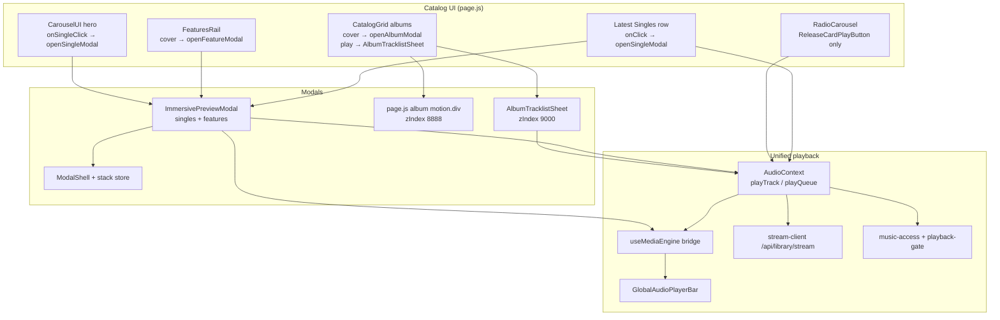

# Modal, Catalog & Media Engine Audit

**Date:** 2026-05-27  
**Repo:** `/Users/recharge/artist-platform`  
**Mode:** Read-only (no code changes)

## Executive summary

The storefront uses **one global audio pipeline** (`AudioContext` → hidden `<audio>`) with a thin **`useMediaEngine` / `useImmersivePlayback` adapter** for UI. Immersive singles/features share **`ImmersivePreviewModal`** (palette from cover, `ModalShell`, floating/desktop player controls). Albums use a **separate inline modal in `page.js`** plus **`AlbumTracklistSheet`** for track-pick playback without opening the album modal.

**Opening a single or feature modal starts playback immediately** (`openSingleModal` / `openFeatureModal` → `toPlaybackTrack` → `playTrack`), with a deferred path while `authLoading`. **Card play buttons** on singles/features use **`playQueue` only** and do not open the modal—so cover-tap vs play-tap are intentionally divergent. **Album cover** opens the album modal **and** calls `playAlbumTracks`; the album card **play** button opens the tracklist sheet instead.

The **global dock** (`GlobalAudioPlayerBar` in `layout.js`) stays visible whenever `hasStarted && currentTrack`, including during immersive modals. **`page.js` mini “now playing”** is suppressed while preview/feature modals are open—creating **two different “modal hides chrome” rules**.

## Architecture (high level)

## Top 5 findings (ranked)

1. **Modal open auto-plays; card play does not open modal** — `openSingleModal` / `openFeatureModal` call `playTrack` immediately (`page.js` ~1090–1140). `ReleaseCardPlayButton` uses `playQueue` with `stopPropagation` and no modal—users get different behavior from cover vs ▶.
2. **In-modal play uses raw catalog object, not `toPlaybackTrack`** — `ImmersivePreviewModal` `handlePlayPause` calls `playTrack({ ...single })` (~475–478) without resolving `src` / `metadata.access`; opener path uses `toPlaybackTrack` with source tags (`preview_modal` / `feature_modal`).
3. **Dual player chrome during immersive modal** — `GlobalAudioPlayerBar` does not check modal stack; `nowPlaying` mini player on `page.js` is hidden when `previewModalOpen || featureModalOpen` (~983–999)—global bar + modal player can stack.
4. **Album paths split three ways** — Cover → `openAlbumModal` + `playAlbumTracks(0)`; play on card → `AlbumTracklistSheet` only; track rows in album modal → per-track play. Easy to confuse “open” vs “play”.
5. **`authLoading` deferred play refs** — `modalPlaySlugRef` / `featureModalPlaySlugRef` replay in `useEffect` (~951–981); rapid modal switches before auth settles can target the wrong slug if refs are not cleared consistently.

## Deliverables in this folder

| File | Purpose |
|------|---------|
| `modals-inventory.md` | Every modal-related file |
| `singles-section.md` | Latest Singles + carousel + radio |
| `features-section.md` | Features rail |
| `albums-section.md` | Albums grid + album modal + sheet |
| `unified-media-engine.md` | AudioContext, engine, stream, access |
| `modal-playback-integration.md` | Modal player vs global bar |
| `open-modal-audio-flow.md` | openSingleModal / handlers trace |
| `risks-and-inconsistencies.md` | Ranked risks |
| `manifest.txt` | File list |

## Zip

`/Users/recharge/Downloads/modal-catalog-media-audit-20260527.zip`
