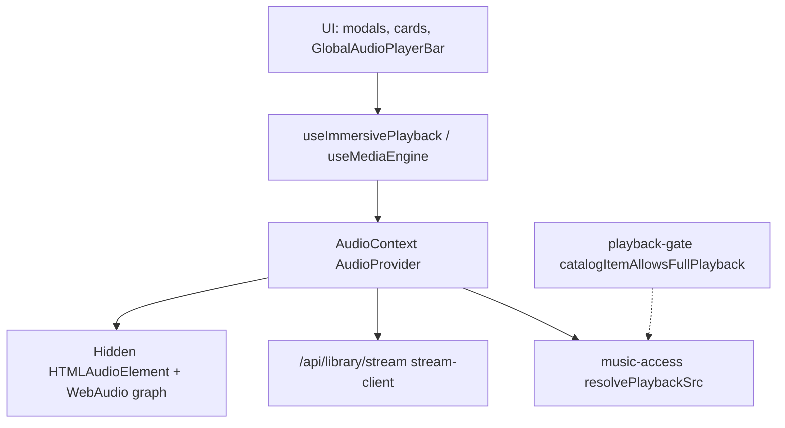

# Unified media player engine

## Layer diagram

## `context/AudioContext.js`

| Export / API | Line ref (approx) | Role |
|--------------|-------------------|------|
| `AudioProvider` | ~293 | Root provider; owns audio element, queue, preview cap |
| `useAudioPlayer` | ~2217 | Hook for all playback state + actions |
| `playTrack` | ~1038+ | Normalize track, resolve CS presentation, library stream vs preview, `loadAudioSrcAndPlay` |
| `playQueue` | ~1726+ | Sets queue; plays start index |
| `previewOnly` handling | ~672+, ~1103–1112 | 30s cap `PREVIEW_HARD_CAP_SEC`; preview fallback on 401 |
| `upgradeToFullStream` | used by ReleaseCardPlayButton | After timed preview for entitled users |
| Stream integration | ~1095+ | `parseStreamSlugFromSrc`, `fetchLibraryStream`, redirect fast path |

**Single source of truth:** one `currentTrack`, one `isPlaying`, shared by modal and global bar.

## `media/useMediaEngine.js`

| Export | Role |
|--------|------|
| `useMediaEngine` | `useSyncExternalStore` on `mediaEngineBridge`; maps AudioContext → `{ state, seek, toggle, analyser, ... }` |
| `mapContextTrackToMediaTrack` | ~10–19 | id/slug/title/artist/artwork/audioUrl |
| `mapAudioContextToMediaEngine` | ~108+ | Bridge snapshot for subscribers |

Modal visualizers (`ImmersiveModalScene`, `PreviewPlayerControls`) read **engine** time/analyser, not a second audio element.

## `lib/player/useImmersivePlayback.js`

- Adapter: spreads `useAudioPlayer` + `handlePlayToggle` delegating to `engineToggle` (~11–36)
- Used by **`GlobalAudioPlayerBar`** (~306)

## `lib/playback/stream-client.js`

| Function | Role |
|----------|------|
| `fetchLibraryStream` | ~61+ | GET `/api/library/stream?slug=` credentials include |
| `isLibraryStreamSrc` | ~6+ | Detect signed stream URLs |
| `isLibraryStreamRedirectSrc` | ~21+ | `redirect=1` fast path |
| `streamUrlNeedsRefresh` | ~50+ | Expiry refresh window |

## `lib/playback/playback-gate.js`

Server-aligned **catalog** gate (P1.4): `catalogItemAllowsFullPlayback` uses `ownedSlugs`, subscription, collector — **not** catalog UI flags alone (~13–42).

## `lib/music-access.js`

| Function | Role |
|----------|------|
| `resolveTrackAccess` | ~98+ | Per-track owned/subscriber/collector/preview flags |
| `resolveContentAccess` | ~279+ | UI tier: `showCart`, `showPrice`, `canStream`, badges |
| `resolvePlaybackSrc` | (used by `toPlaybackTrack`) | Preview URL vs library stream path |

## `lib/music-playback.js`

| Function | Line | Role |
|----------|------|------|
| `toPlaybackTrack` | ~10–46 | Builds `{ slug, src, metadata.access, cover, cs* }` |
| `albumCardPlaybackItem` | ~50–74 | First track shape for album cards |
| `albumTracksForPlayback` | ~77+ | Queue items for album |

## `components/audio/GlobalAudioPlayerBar.js`

| Concern | Line ref |
|---------|----------|
| Mounted in | `app/layout.js` ~43 (always in tree) |
| Visibility | `if (!hasStarted \|\| !currentTrack) return null` ~580 |
| Data | `useImmersivePlayback` + `useMediaEngine` ~306–339 |
| Preview ended CTA | ~605+ |
| **No modal-stack check** | Plays during immersive modal |

## Preloader

`media/preloader/MediaPreloader` — `preloadTrack` from `ReleaseCardPlayButton` (~7, ~31).

## Deprecated

- `components/media/_deprecated/ModalAudioPlayer.js` — unused separate modal player
