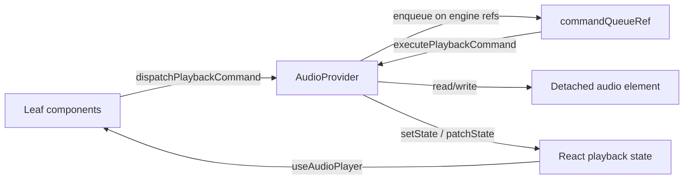

# Phase 10 — Audio Engine Singleton Architecture

**Repo:** `/Users/recharge/artist-platform`  
**Date:** 2026-06-01  

## Goal

Detach playback **lifecycle** from React re-renders without changing playback timing, entitlement resolution, viewport policy, or stream behavior (Phases 8–9 preserved).

## Singleton module

**File:** `src/lib/playback/audio-engine-runtime.js`

| Surface | Role |
|---------|------|
| `getAudioEngineRuntime()` | Tab-scoped runtime bag (`window.__2MRRW_AUDIO_ENGINE_RUNTIME__`) |
| `getAudioEngineRefs()` | Stable ref objects: `audioRef`, `commandQueueRef`, command metadata refs |
| `ensureDetachedAudioElement()` | Create/mount one hidden `<audio>` on `document.body` |
| `noteAudioProviderMount()` / `noteAudioProviderUnmount()` | Provider lifecycle counters (element retained on unmount) |

## What lives in the engine vs React

| Concern | Owner |
|---------|--------|
| `<audio>` DOM node | **Engine** (detached, `document.body`) |
| Serial command queue (`commandQueueRef`) | **Engine** refs |
| `dispatchPlaybackCommand` / `executePlaybackCommand` | **AudioContext** (unchanged behavior) |
| React UI state (`useState`, `patchState`) | **AudioProvider** bridge |
| Phase 9 `resolve-playback-intent.js` | Unchanged |
| Phase 8 command aliases + authority depth | Unchanged |

## Data flow

## Trace tags (dev / `NEXT_PUBLIC_PLAYBACK_TRACE=1`)

- `[PLAYBACK-ENGINE-LIFECYCLE]` — runtime create, element mount, provider mount/unmount
- `[PLAYBACK-RENDER-NO-IMPACT]` — provider re-render driven only by auth/entitlement identity fields

## Non-goals (this pass)

- Moving `executePlaybackCommand` body out of `AudioContext.js`
- Portal-based element (body mount chosen for minimal diff)
- Changing `onPause` auto-recover or visibility handlers
