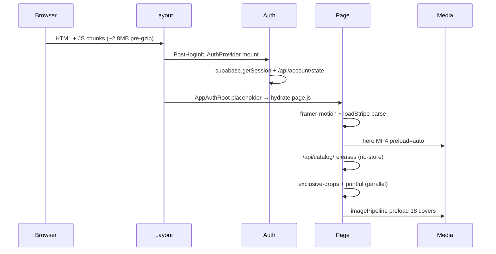

# Thermal & Startup Resource Audit

**Audit date:** 2026-05-29  
**Mode:** Read-only  
**Build:** `npm run build` exit 0 (Next.js 16.2.4, ~9.9s compile)

---

## Scope

Startup heat = CPU + memory + GPU pressure from first navigation through interactive home shell. Traced: hydration, JS execution, animation init, MP4 init, image decode, audio element init, React mount, context propagation, network parallelism.

**Live profiling:** Not executed in this pass (no iOS Safari trace attached). Items marked **requires live measurement** where thermal/FPS cannot be inferred from static analysis alone.

---

## Startup timeline (code-order model)



---

## 1. Startup CPU

| Source | Evidence | Est. impact |
|--------|----------|-------------|
| **JS parse/compile** | 35 chunks, 2.8 MB uncompressed; dual 407 KB React/Next chunks | **High** — dominates early main thread |
| **React hydration** | `page.js` 2777 lines single tree; `AppAuthRoot` placeholder then full tree | **High** |
| **framer-motion** | `page.js` L4; chunks 134–337 KB identified in prior audit | **Medium–High** — spring configs L72–75, AnimatePresence |
| **Stripe** | `loadStripe` at module scope L69 — runs on chunk evaluation | **Medium** — even when checkout closed |
| **Supabase auth** | Dynamic import in effect L238; `getSession` + optional localStorage parse L245–266 | **Medium** |
| **Catalog JSON parse** | `fetch` L703–712 `res.json()` on mount | **Medium** — blocks `setBrowseSingles` state |
| **Scroll listeners** | Resize L650–654, hero scroll L657–662, singles sync L837–862 | **Low at idle** — **High during scroll** |

**Measured:** Build compile 9.9s (dev machine, not user device).  
**requires live measurement:** Main-thread "Scripting" ms first 5s on iPhone 12/13.

---

## 2. Startup memory

| Source | Evidence | Notes |
|--------|----------|-------|
| **Provider state** | `AudioContext` full state object + queue; `AuthContext` library + ownedSlugs | Baseline heap |
| **Inline catalog fallbacks** | `INLINE_SINGLES` + merged catalog in `page.js` state | Retained for session |
| **Image pipeline cache** | `imagePipeline.preload` up to 18 items L822–834 | In-memory + link hints |
| **Video elements** | Hero 1 + N singles in DOM (paused off-screen) | Decoder buffers even when paused |
| **Service worker** | `layout.js` L33–36 registers `/sw.js` on load | Extra thread + cache |

**requires live measurement:** Safari Web Inspector heap after hydrate; count `<video>` nodes.

---

## 3. Hydration spikes

| Step | File | Behavior |
|------|------|----------|
| Boot placeholder | `AppAuthRoot.js` (per `10-client-hydration-audit.md`) | Full-viewport black until `hydrated` |
| Client page mount | `page.js` L1 | Entire storefront reconciles at once |
| Auth gate | `useEntitlementAccountState` + `useAuth` dual subscription L9, L535 | Two context listeners on page |
| Global audio bar | `layout.js` L48 | Mounts with providers |

**Risk:** Large synchronous hydration → long **Total Blocking Time** on mobile.  
**requires live measurement:** `HYDRATION_START/END` marks exist but dev-only (`performanceMarks.js` L21–22, L27–32).

---

## 4. JS execution (first second)

1. Download/parse ~2.8 MB chunks (network-dependent).
2. Evaluate `stripePromise = loadStripe(...)` (`page.js` L69).
3. Initialize contexts: `AudioProvider` registers audio element effects (`AudioContext.js` L447+, L692+).
4. Fire mount effects: catalog, exclusive-drops, printful, inventory, deep links (multiple `useEffect` blocks L650+).

**Hidden bottleneck:** Module-level side effects before first paint complete.

---

## 5. Animation init

| Init | Location | Cost driver |
|------|----------|-------------|
| Hero `motion.div` | L1778–1796 | Layout reads if animating |
| Mobile nav sheets | `SHEET_UP` spring L75 | GPU transform on open |
| Singles row `fadeInUp` | `LatestSinglesStyleRow.js` L75 | Staggered CSS animation per card |
| Pulse on "2MRRW" | L1795 `animation:"pulse 2.5s infinite"` | Continuous compositor work |

**GPU note:** `backdropFilter: blur(20px)` on sidebars L1733, L2394, L2417 — extra layers at rest.

---

## 6. MP4 init

| Video | Preload | When starts |
|-------|---------|-------------|
| Hero `A2B.mp4` | **auto** | Immediately on home render L1783 |
| Singles carousel | metadata | DOM mount; play when in viewport L631–641 |
| Ambient | default (autoPlay) | When `currentTrack` set + playing |

**CDN:** `catalogMotionVideoUrl("videos/A2B.mp4")` — competes with JS + API on cold load.  
**requires live measurement:** moov atom position (faststart), Content-Length, first-frame time.

---

## 7. Image decode

- **Eager preload effect** L822–834: up to 8 singles + 4 features + 6 albums + 4 radio slides → **22 items max**, priority `"high"`.
- **Singles poster + video src** (`LatestSinglesStyleRow.js` L105–106) — duplicate fetches possible.
- **Pipeline:** `imagePipeline.preload` → `decoding="async"` (per `04-media-timing.md`).

**CPU/GPU:** Decode runs on main thread / compositor; 18 high-priority preloads on home tab mount increases startup contention with hero MP4.

---

## 8. Audio init

| Component | Evidence |
|-----------|----------|
| Single `<audio>` | `AudioContext.js` provider render ~L2955+ `preload="auto"` |
| Web Audio graph | `initWebAudio` on first play L641+ (not startup unless autoplay) |
| CS preload | `preloadCsAssets` L366–390 — creates video/audio elements on track play, not cold start |
| SW keep-alive | `KEEP_ALIVE` postMessage when playing — not startup |

**Startup:** Audio element in DOM idle — **low CPU** until play.  
**Playback start:** `unlockAudioFromGesture`, `waitAudioSrcReady` — see ranked #1 and audio latency audit.

---

## 9. React mount & context propagation

**Layout chain** (`layout.js` L38–54):
```
PostHogInit → AuthProvider → AppAuthRoot → AuthGateProvider → AudioProvider
  → SessionRecoveryRoot → StripeProvider → children + GlobalAudioPlayerBar
```

**Propagation cost:**
- Any `AuthContext` update re-renders subscribers (session bootstrap L220–280).
- `AudioContext` idle: low churn; **playing: ~60 updates/s** (ranked #1).
- `page.js` subscribes `useAudioPlayer` + `useAuth` + `useMediaEngine` — maximum coupling.

---

## 10. Unnecessary fetches & parallel requests

**Parallel on cold load (typical home visit):**

| Request | Gated? | File |
|---------|--------|------|
| JS chunks | — | build |
| Supabase session | — | AuthContext L241 |
| `/api/account/state` | signed-in | AuthContext L140 |
| `/api/guest/session` | guest | AuthContext L179 |
| `/api/catalog/releases` | **no** | page.js L703 |
| `/api/catalog/exclusive-drops` | **no** | L868 |
| `/api/printful/products` | **no** | L901 |
| Hero MP4 CDN | **no** | L1783 |
| Cover preloads | home tab | L822–834 |
| PostHog | effect | PostHogInit |
| Stripe.js | module | L69 |

**Correctly gated:** `/api/public/vault` only `innercircle` tab L882–897.

**Thermal implication:** Radio + CPU from parallel TLS, JSON parse, and video buffer fill → device warmth within 10–30s on cellular.

---

## 11. GPU during initial load

| Effect | Location | Severity |
|--------|----------|----------|
| Hero video + CSS `filter` blur/brightness | L1787 | Medium |
| Hero `transform: scale` from scroll state | L1788 | Medium when scrolling |
| Multiple `backdropFilter` panels | L1733, L1876, L2394, L2417, L2456, L2520 | Medium |
| Ambient `blur(120px)` | Only when playing | **High** during playback, not cold start |
| Singles hover `filter` transitions | LatestSinglesStyleRow L88–98 | Low until interaction |

**requires live measurement:** Safari Timeline → GPU layers count after load.

---

## Components causing CPU/GPU spikes (ranked)

1. **AudioContext RAF** — continuous main-thread React work while playing (not startup, but sustained heat).
2. **Hero MP4 decode + paint** — startup + ongoing.
3. **framer-motion + scroll setState** — scroll interaction on home.
4. **AmbientPlaybackBackground** — playback-phase GPU.
5. **18× cover preload + carousel videos** — startup burst.
6. **backdrop-filter stacks** — compositor overdraw on home layout.

---

## Hidden bottlenecks (easy to miss)

- **`loadStripe` at import time** — network to Stripe before user opens cart.
- **Exclusive-drops + printful** on mount — CPU for JSON + React setState on unused tabs.
- **Service worker registration** on every load — small but non-zero.
- **Singles strict in-viewport play** — good for decode budget; hero has no equivalent pause.
- **Dev-only perf marks** — no prod regression detection for startup regressions.

---

## Recommendations (audit-only, priority-aligned)

| Priority | Action | Expected thermal/startup effect |
|----------|--------|--------------------------------|
| P0 | Hero `preload="metadata"` | Lower startup bandwidth & decode heat |
| P0 | Decouple audio progress from context | Lower sustained CPU when playing |
| P1 | Defer printful/exclusive-drops | Fewer parallel startup tasks |
| P1 | Reduce ambient blur on mobile | Lower GPU heat during playback |
| P2 | Route-level provider splitting | Lighter non-home routes |

---

## Validation probes (live)

1. iOS Safari → Timeline: 10s after load, note Scripting vs GPU.
2. Network: request count before first catalog paint.
3. Memory: `<video>` count + JS heap size.
4. Compare device back temperature 60s idle vs 60s scroll+play (subjective + Instruments Energy Log).
