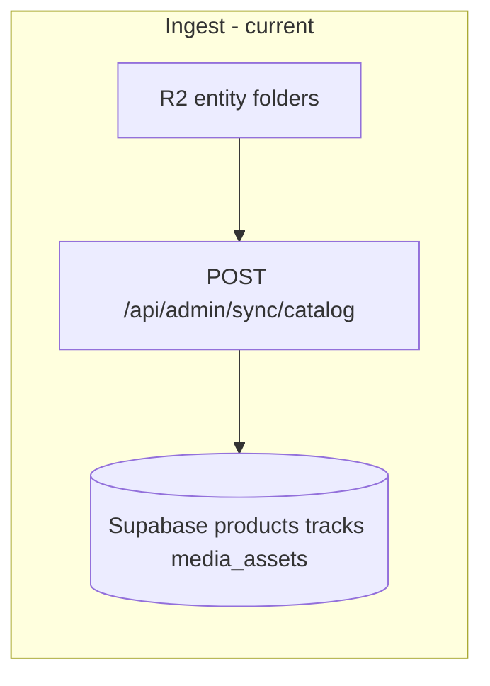
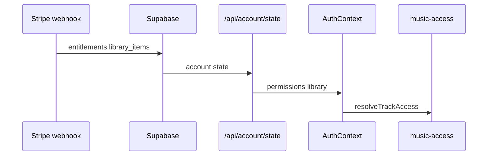

# 01 — Current Architecture Map

**As-built from source** (read-only, 2026-05-30). File paths are authoritative references.

---

## R2 bucket topology

Single Cloudflare R2 bucket (`CLOUDFLARE_R2_BUCKET_NAME`) with documented domain roots in `src/lib/media/constants/storage-domains.js`:

| Domain root | Constant | Purpose |
|-------------|----------|---------|
| `digital-assets/` | `AUDIO_ROOT` | Release masters (entity folders) |
| `previews/` | `PREVIEW_ROOT` | Public preview audio |
| `images/` | `IMAGE_ROOT` | Artwork entity folders |
| `videos/` | `VIDEO_ROOT` | Motion loops |
| `protected-media/` | `R2_PREFIX.PROTECTED_MEDIA` | Legacy `masters/` paths normalized here |

Legacy commerce rows may store paths without prefix; `normalizePlaybackR2Key` in `src/lib/playback/normalize-r2-key.js` maps to `digital-assets/` or `protected-media/`.

### Entity folder layout (canonical)

Built by `resolveStoragePath`, `resolvePreviewPath`, `resolveArtworkPath`, `resolveVideoPath` in `src/lib/media/canonical-paths.js`:

```
digital-assets/{singles|features|albums|mixtapes-and-eps}/{slug}/     ← master audio (flat files inside)
previews/{singles|features|albums|mixtapes-and-eps}/{slug}/           ← preview audio
images/{…}/{slug}/                                                    ← artwork
videos/{…}/{slug}/                                                    ← MP4 loops
```

**Discovery order for audio:** `.wav`, `.flac`, `.m4a`, `.mp3` (`src/lib/media/entity-resolver.js` L16).

Storefront canonical slugs and legacy keys: `src/lib/media/canonical-catalog.js`.

---

## Upload / catalog ingest flow

There is **no fan-facing upload API** in `src/app/api`. Catalog media is:

1. **Artist/ops upload to R2** (out-of-band; presign helpers exist: `createR2SignedPutUrl` in `src/lib/storage/r2.js` L85–91).
2. **Admin catalog sync** writes Supabase `products` rows with `storage_path` / `preview_path`:

   - `POST /api/admin/sync/catalog` — `src/app/api/admin/sync/catalog/route.js`
   - Normalizes paths via `normalizeStoragePathForStorefront` (`src/lib/sync/normalize-storage-path.js`)

3. **Optional** `release_media` / `media_assets` / `catalog_tracks` linkage for track-level masters (`resolve-playback-key.js` L25–66).



---

## Entitlement flow



**Server stream gate:** `userCanStreamProduct` — `src/lib/commerce/entitlements.js` L103–123  
(purchase, membership premium, or collector access + digital product type).

**Client stream gate:** `canRequestLibraryStream` — `src/lib/music-access.js` L217–221  
(requires `accountState.user.id === userId`).

**Never:** client-side entitlement overrides (platform guardrail).

---

## Playback resolution (entitled)

| Step | Module | Path |
|------|--------|------|
| Access | `resolveTrackAccess` | `src/lib/music-access.js` |
| Src URL | `resolvePlaybackSrc` → `libraryStreamRedirectSrc` | `src/lib/music-access.js` L224–237 |
| Play | `playTrackInternal` redirect fast-path | `src/context/AudioContext.js` ~1516–1524 |
| API | `GET /api/library/stream?redirect=1` | `src/app/api/library/stream/route.js` |
| Key | `resolvePlaybackKey` | `src/lib/playback/resolve-playback-key.js` |
| Sign | `getOrCreateStreamSignedUrl` | `src/lib/playback/stream-url-cache.js` |
| Bytes | `proxySignedR2Get` | `src/lib/server/r2-stream-proxy.js` |

`resolvePlaybackKey` chain:

1. `products` row by slug
2. `resolveStoragePathFromProduct` (tracks / media_assets / storage_path)
3. `discoverAudioInFolder` → first match in extension order
4. Fallback preview folder if no master (`playbackSource: "preview"`)

In-memory caches (60s TTL + inflight): playback key, entity resolver, stream signed URL, preview resolution.

---

## Playback resolution (preview / guest)

| Step | Module |
|------|--------|
| URL build | `catalogPreviewAudioUrl` — `src/lib/media-urls.js` |
| Folder discovery | `GET /api/media/preview?folder=…` — `src/app/api/media/preview/route.js` |
| CDN | `getPublicR2Url` → 302 redirect |

Canonical fast path: `preview_legacy` without R2 list (`preview/route.js` L44–58, Phase 4.8).

---

## Signed URL & proxy

- **Presign:** `createR2SignedGetUrl` — `src/lib/storage/r2.js` L80–83  
- **TTL:** `STREAM_SIGNED_URL_TTL_SECONDS` — `src/lib/playback/stream-pipeline.js`  
- **Why proxy:** R2 S3 endpoint CORS; browser loads same-origin Range — `src/lib/server/r2-stream-proxy.js` header comment L3–6  
- **Purchase download token:** `GET /api/access/[token]` — `src/app/api/access/[token]/route.js` (redirect signed GET on `digital-assets`)

---

## Collector & vault (media touchpoints)

| Surface | API / lib | Storage |
|---------|-----------|---------|
| Collector card entitlement | `grantEntitlementFlag`, `getCollectorAccessState` — entitlements | N/A |
| Library stream (full catalog) | `userCanStreamProduct` + collector path | Same stream pipeline |
| Vault media | `GET /api/vault/media` — `src/app/api/vault/media/route.js` | `buildR2Key(DIGITAL_ASSETS, storagePath)` signed JSON URL |
| Collector cards admin | `src/app/api/admin/collector-cards/route.js` | DB only |

Vault uses tier gating (`src/lib/vault/access.js`); external URLs bypass R2 when set in content row metadata.

---

## Observability (current)

| Signal | Location |
|--------|----------|
| Dev tap→audible marks | `src/lib/dev/performanceMarks.js` |
| Server-Timing | `src/lib/server/server-timing.js` on stream + preview routes |
| Stream debug | `R2_STREAM_DEBUG=1` on library stream |

---

## Known structural constraints

1. **Same file for master and stream** — large WAV/FLAC dominates CDN/proxy first-byte.
2. **Preview vs master separation** — previews often MP3; full play may still be WAV.
3. **Dual prefix legacy** — `digital-assets` vs `protected-media` normalization required.
4. **No transcoding pipeline** — Phase 4.8 explicitly locked.

See `02-proposed-architecture-map.md` for target state.
