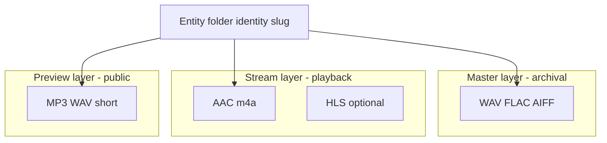

# 02 — Proposed Architecture Map (Hybrid Master + Stream)

**Status:** Design target — not implemented in Phase 5.

---

## Design principles

1. **Masters are authoritative** for ownership, collector fulfillment, and archival.
2. **Stream renditions are authoritative for playback** (in-app listen, lock screen, background).
3. **Entity folder identity is stable** — same slug/type paths; stream files are siblings, not replacements.
4. **Entitlement plane unchanged** — same `userCanStreamProduct`, same `redirect=1` client contract.
5. **Non-destructive rollout** — masters remain addressable; stream keys added in parallel.

---

## Proposed R2 layout

New domain root (proposed constant `STREAM_ROOT = "streaming"`):

```
streaming/{singles|features|albums|mixtapes-and-eps}/{entity-path}/
  ├── {slug}.m4a              # AAC-LC primary (CBR 128–192 kbps)
  ├── {slug}_256.m4a          # optional high tier
  └── manifest.m3u8           # optional HLS (Phase 5b)
```

Masters unchanged:

```
digital-assets/{…}/{entity-path}/
  ├── {master}.wav | .flac | .aiff   # archival / download
```

Previews unchanged (may later be generated from stream stem, not required for MVP):

```
previews/{…}/{entity-path}/
  ├── *-preview.mp3 | .wav
```



---

## Resolver precedence (proposed)

Extend `resolvePlaybackKey` (`src/lib/playback/resolve-playback-key.js`):

```
1. stream_key from media_assets (asset_role: stream_audio)  [new]
2. discover stream in streaming/… entity folder (.m4a)     [new]
3. existing master discovery (current behavior)
4. preview folder fallback (unchanged)
```

Return shape addition:

```javascript
{
  key: string,
  playbackSource: "stream" | "master" | "preview",
  masterKey?: string,      // for download UI / collector
  streamKey?: string,
  entityFolder: string,
  productId: string,
}
```

`normalizePlaybackR2Key` continues to map keys; stream prefix always under `streaming/` (no protected-media ambiguity).

---

## API surface (unchanged contracts)

| Endpoint | Change |
|----------|--------|
| `GET /api/library/stream` | Resolves stream key first; signs/proxies smaller object |
| `GET /api/media/preview` | No change Phase 5a |
| `GET /api/access/[token]` | Still redirects to **master** key for purchase download |
| `GET /api/vault/media` | Vault-specific; optional stream for A/V later |

Client: **no change** to `libraryStreamRedirectSrc` or `redirect=1` semantics.

---

## Ingest / transcode pipeline (proposed)


**Trigger options (pick one at implementation):**

- R2 event notification → worker (preferred at scale)
- Admin “publish” button post-upload
- Nightly backfill cron per entity folder missing stream

**Codec policy (MVP):** AAC-LC in MP4 container (`.m4a`), 48 kHz, 128 kbps stereo; loudness normalized to −14 LUFS integrated (platform-agnostic target).

---

## CDN strategy (proposed phases)

| Phase | Entitled full play | Preview |
|-------|-------------------|---------|
| 5a | Same-origin proxy of signed stream object (smaller file) | Existing public CDN |
| 5b | Optional signed CDN URL for `streaming/` with short TTL + entitlement cookie | Unchanged |
| 5c | HLS via CDN for Safari adaptive start | Generated `-preview` from stream |

Entitled bytes remain **gated** until 5b security review; do not make `streaming/` fully public without signed access.

---

## Caching alignment

Reuse Phase 4.8 patterns:

- Playback key cache keyed by `slug:trackSlug` includes `playbackSource`
- Stream URL cache unchanged (per user + slug)
- CDN `Cache-Control` on public previews; `private, no-store` on proxy (current `r2-stream-proxy.js` L21)

---

## Supabase metadata (proposed, schema phase later)

Optional `media_assets.asset_role = 'stream_audio'` linking to `streaming/…` key. **Design only** — no migration in Phase 5.

`products.storage_path` continues to point at master entity folder for backward compatibility.

---

## What does not change

- `AuthContext` / `AudioContext` command model
- Cinematic shell, framer-motion, page layout
- Stripe → webhook → entitlements pipeline
- Collector card verification flows
- Single global `<audio>` element

See `03-master-asset-strategy.md` and `04-streaming-asset-strategy.md` for layer detail.
