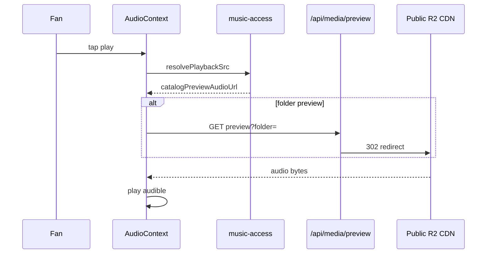
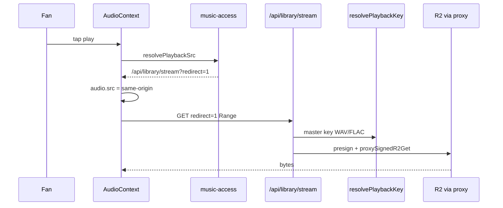
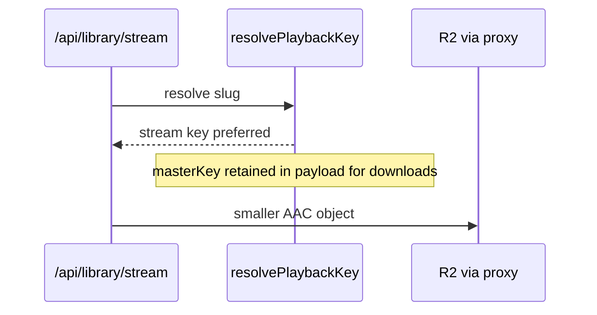

# 05 — Playback Flow Design (Current vs Proposed)

---

## Mode: Guest preview

### Current



**Files:** `src/lib/music-access.js` L224–244, `src/lib/media-urls.js`, `src/app/api/media/preview/route.js`  
**Measured:** Preview API **602 ms** TTFB prod → **~4 ms** warm (4.8); CDN range **954 ms** TTFB (4.7).

### Proposed (Phase 5a)

- **No change** to guest preview path for MVP.
- Phase 5b: catalog emits direct `preview_legacy` CDN URL (skip API) — already partially implemented via canonical fast path.

---

## Mode: Entitled full stream (purchase / sub / collector)

### Current



**Files:** `src/app/api/library/stream/route.js`, `src/lib/playback/resolve-playback-key.js`, `src/lib/server/r2-stream-proxy.js`  
**Client optimization:** No JSON+HEAD on tap — `AudioContext.js` redirect fast-path (4.7 verified).

### Proposed

Same diagram; **only** `resolvePlaybackKey` returns `streaming/…/*.m4a` first:



**Client:** unchanged `redirect=1`.  
**Projection:** `playback-src-to-first-byte` −30–60% vs WAV (**Medium confidence**); server segments similar (4.8 warm **3–9 ms** auth-only).

---

## Mode: Entitled JSON + HEAD (refresh / legacy)

### Current

Used on visibility refresh — `stream-client.js` `fetchLibraryStream` + `assertSignedAudioUrl` HEAD.

**Extra RTT:** +50–200 ms (**Est.** 4.5).

### Proposed

- Visibility refresh should prefer `redirect=1` (Phase 4.7 P2 C1) — orthogonal to hybrid but compounding.
- Stream files reduce HEAD validation time (**Projection**).

---

## Mode: Collector card owner (full catalog)

### Current

`userCanStreamProduct` true via `getCollectorAccessState` — same stream pipeline as subscription.

### Proposed

- Playback: stream rendition (faster catalog browsing).
- Download / bundle fulfillment: **master** via separate API surface (future explicit download endpoint).
- Optional HQ stream tier for collector — `04-streaming-asset-strategy.md`.

---

## Mode: Vault content

### Current

`GET /api/vault/media` — signed URL on `digital-assets` path or external URL — `src/app/api/vault/media/route.js`.

### Proposed (Phase 5c)

- Video vault: unchanged.
- Audio vault drops: add stream renditions when `media_type` is audio; tier gating unchanged (`canAccessVaultTier`).

---

## Mode: Offline playback

### Current

`getOfflinePlaybackUrl` checked first in `resolvePlaybackSrc` — `music-access.js` L226–228.

### Proposed

- Offline cache stores **stream rendition** file (smaller device footprint).
- Master available for explicit “download for keeps” action only.

---

## Timing stages (dev marks)

| Stage | Current | After hybrid |
|-------|---------|--------------|
| `playback-resolver` | null on redirect | still null on redirect |
| `playback-src-to-first-byte` | dominated by large master | **Projection** lower |
| Server-Timing `cdn` | proxy fetch | smaller payload |

Fill pending iOS marks per Phase 4.7 P0 V1.

---

## Error & fallback behavior (proposed)

```
if stream_key missing → discover master (today)
if master missing → preview folder (today)
if all missing → 404 MEDIA_UNAVAILABLE (today route.js L93–106)
```

Log `playbackSource` in stream diagnostics for rollout monitoring.
