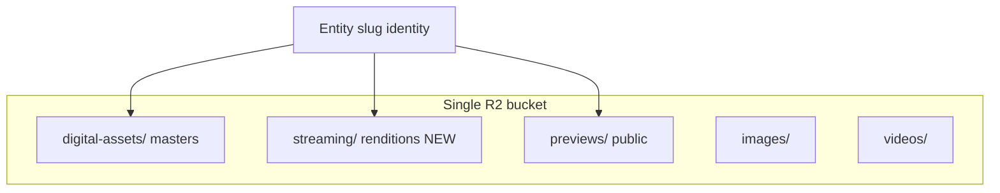

# 02 — R2 Compatibility

**Validates:** Proposed `streaming/` layer coexists with current R2 layout and resolver assumptions.

---

## Current bucket topology

From `src/lib/media/constants/storage-domains.js` and `src/lib/storage/r2.js`:

| Prefix | Constant | Access model |
|--------|----------|--------------|
| `digital-assets/` | `AUDIO_ROOT` | Signed GET + same-origin proxy |
| `protected-media/` | `R2_PREFIX.PROTECTED_MEDIA` | Legacy `masters/` normalization |
| `previews/` | `PREVIEW_ROOT` | Public CDN (`getPublicR2Url`) |
| `images/` | `IMAGE_ROOT` | Public CDN |
| `videos/` | `VIDEO_ROOT` | Public CDN |

**Proposed addition:** `streaming/` — new root, **not present in code today**.

---

## Folder structure validation

### Master layer (unchanged)

```
digital-assets/{singles|features|albums|mixtapes-and-eps}/{entity-path}/
  └── {filename}.wav | .flac | .mp3    ← flat files only, no nested audio/
```

Rules enforced by `canonical-paths.js`:
- Entity folder ends at release/track directory (`normalizeToEntityFolder`)
- Wrong nested dirs (`audio/`, `artwork/`) stripped (L27–52)
- `listR2Objects` non-recursive — only **direct child** files discovered (`r2.js` L118–126)

**Validation:** ✅ Proposed hybrid keeps masters in place; no path collision.

### Stream layer (proposed)

```
streaming/{singles|features|albums|mixtapes-and-eps}/{entity-path}/
  ├── {slug}.m4a              ← AAC-LC primary
  ├── {slug}_256.m4a          ← optional HQ tier
  └── manifest.m3u8           ← Phase 5e optional
```

Mirrors `resolveStoragePath` nesting — same `releaseType`, `releaseSlug`, `trackSlug`, `albumSlug` parameters with `STREAM_ROOT` substituted for `AUDIO_ROOT`.

**Validation:** ✅ Orthogonal prefix; no overwrite of master keys.

### Coexistence diagram



---

## Naming conventions

| Rule | Current | Proposed stream | Compatible? |
|------|---------|-----------------|-------------|
| Segments lowercase | `cleanSegment()` | Same helper reuse | ✅ |
| URL-safe slugs | `[^a-z0-9-]` stripped | Same | ✅ |
| Trailing slash on folders | Required for discovery | Required | ✅ |
| Filename in folder | Any ext in priority list | Deterministic `{slug}.m4a` | ✅ (new convention) |
| Legacy `masters/` prefix | → `protected-media/` | N/A for stream | ✅ isolated |

**Risk if stream placed in master folder:** `entity-resolver.js` lists `.m4a` after `.wav`/`.flac` (L16). A stream file in the **same** master folder would **not** be preferred over WAV — correct for download authority, wrong for playback-first. **Mitigation:** separate `streaming/` root (Phase 5 design) — **validated**.

---

## Resolver assumptions

| Assumption | Code location | Hybrid impact |
|------------|---------------|---------------|
| `normalizePlaybackR2Key` maps bare paths → `digital-assets/` | `normalize-r2-key.js` L7–27 | Must add `streaming/` passthrough (implementation) |
| Discovery extension order WAV-first | `entity-resolver.js` L16 | Stream resolver uses separate folder + `.m4a` priority |
| Non-recursive list | `r2.js` L135–168 | Stream folders same flat-file rule |
| 60s discovery cache | `entity-resolver.js` L21 | Stream keys cached same TTL |
| `buildR2Key(DIGITAL_ASSETS, path)` for downloads | `access/[token]/route.js` L22 | **Must remain master-only** |

### Key normalization gap (pre-implementation)

Today `normalizePlaybackR2Key` does **not** know `streaming/`:

```7:27:src/lib/playback/normalize-r2-key.js
export function normalizePlaybackR2Key(storagePath) {
  // ... maps to digital-assets/ or protected-media/
  return buildR2Key(R2_PREFIX.DIGITAL_ASSETS, normalized);
}
```

**Required change (Phase 5c):** Early return if path starts with `streaming/` — **documented, not blocking design approval**.

---

## Master + stream coexistence matrix

| Operation | Master key | Stream key | Conflict? |
|-----------|------------|------------|-----------|
| Entitled playback (today) | ✅ used | ❌ absent | — |
| Entitled playback (hybrid) | Fallback | ✅ preferred | None |
| Purchase download token | ✅ only | ❌ never | None if token route unchanged |
| Guest preview | ❌ | ❌ | Uses `previews/` |
| Admin sync `storage_path` | Points to master folder | Optional `stream_path` metadata | None |
| Vault media sign | Master path | Optional later | None MVP |

---

## CDN / ACL compatibility

| Prefix | Public CDN | Signed proxy | Hybrid note |
|--------|:----------:|:------------:|-------------|
| `previews/` | ✅ | — | Unchanged |
| `digital-assets/` | ❌ | ✅ | Masters stay private |
| `streaming/` | ❌ (MVP) | ✅ | Same proxy path as today |
| `streaming/` (5b) | Signed CDN TTL | Optional | Security review required |

Phase 5 design explicitly rejects public ACL on `streaming/` without signed access (Phase 5 `11-risks.md` R7/R8).

---

## Validation verdict

| Check | Status |
|-------|--------|
| Folder nesting matches `canonical-paths.js` | ✅ Pass |
| No master key overwrite | ✅ Pass |
| Resolver can dual-read with flag | ✅ Pass (design) |
| Download route isolation | ✅ Pass (code today) |
| `normalizePlaybackR2Key` stream-aware | ⚠️ Gap — implementation required |
| Live R2 object census | ⏸ Pending Phase 5b script |

**Overall R2 compatibility:** **Ready for additive rollout** with one resolver normalization extension.
