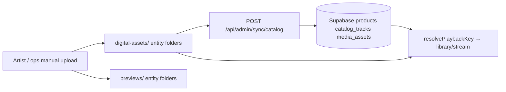
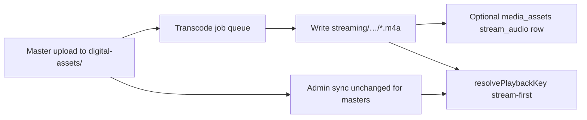

# 03 — Upload Pipeline Validation

**Scope:** Current ingest vs proposed hybrid ingest; required changes and risks.

---

## Current flow (as-built)

### Current upload surfaces

| Surface | Location | Role |
|---------|----------|------|
| R2 presigned PUT | `createR2SignedPutUrl()` — `r2.js` L85–91 | Out-of-band master upload |
| Admin catalog sync | `POST /api/admin/sync/catalog` — `route.js` | Writes `products.storage_path`, `preview_path` |
| Path normalization | `normalizeStoragePathForStorefront()` — `normalize-storage-path.js` | Maps to `digital-assets/` or `protected-media/` |
| Track linkage | `catalog_tracks`, `media_assets`, `release_media` | Optional; used by `resolve-playback-key.js` L25–66 |
| Fan upload API | **None** | — |
| Transcode worker | **None** | Phase 4.8 explicitly locked |

**Validation:** Today one physical file class serves both playback and archival.

---

## Proposed hybrid flow

### Trigger options (Phase 5 design)

| Option | Pros | Cons |
|--------|------|------|
| R2 event → worker | Automatic, scalable | Requires CF notification wiring |
| Admin "publish" post-upload | Simple, controlled | Manual step |
| Nightly backfill cron | Good for catalog catch-up | Delayed stream availability |

**Recommendation for MVP:** Nightly backfill + manual publish for new drops.

---

## Current vs proposed comparison

| Step | Current | Proposed | Change type |
|------|---------|----------|-------------|
| Master upload destination | `digital-assets/{type}/{slug}/` | Same | **None** |
| Preview upload | `previews/{type}/{slug}/` | Same (MVP) | **None** |
| Supabase `storage_path` | Master entity folder | Same | **None** |
| Stream file upload | N/A | `streaming/{type}/{slug}/{slug}.m4a` | **New** |
| Transcode | N/A | FFmpeg AAC-LC + faststart | **New** |
| `media_assets.asset_role` | `full_audio`, etc. | Add `stream_audio` | **Optional schema** |
| Admin sync payload | `storage_path`, `preview_path` | Optional `stream_path` in metadata | **Optional extension** |
| Playback resolution | Master discovery | Stream-first, master fallback | **Resolver change** |
| Download token | Master signed URL | Master only | **None** |

---

## Required changes (implementation phase)

| Priority | Change | File(s) | Blocking? |
|----------|--------|---------|-----------|
| P0 | `STREAM_ROOT` constant | `storage-domains.js` | Yes |
| P0 | `resolveStreamPath()` mirror of `resolveStoragePath` | `canonical-paths.js` | Yes |
| P0 | Transcode backfill job spec | New worker/script (out of repo today) | Yes |
| P0 | Stream-first in `resolvePlaybackKey` | `resolve-playback-key.js` | Yes |
| P0 | `normalizePlaybackR2Key` streaming passthrough | `normalize-r2-key.js` | Yes |
| P1 | `media_assets` stream rows | Supabase migration | No (folder discovery fallback) |
| P1 | Admin sync `stream_path` field | `admin/sync/catalog/route.js` | No |
| P1 | Cache invalidation on stream upload | `cache-invalidation.js` | Yes |
| P2 | Preview generation from stream stem | Preview pipeline | No |

---

## Optional changes

- HQ tier `{slug}_256.m4a` for collector marketing
- HLS packaging under same entity folder
- Regenerate `previews/` from stream (consistency vs ops cost)
- R2 event-driven transcode on `PutObject` to `digital-assets/`

---

## Risks

| Risk | Severity | Mitigation |
|------|----------|------------|
| New release uploaded without stream transcode | Medium | Master fallback — degraded latency, not outage |
| Wrong stream mapped to entity folder | High | Duration checksum; shadow-mode logging |
| Admin sync writes stream path to `storage_path` by mistake | High | Keep `storage_path` master-only; separate metadata key |
| Transcode queue backlog at launch | Medium | Prioritize top 20 storefront slugs first |
| Dual upload burden on ops | Medium | Automate transcode; document runbook |

---

## Validation verdict

| Criterion | Status |
|-----------|--------|
| Current pipeline supports master-only ops | ✅ |
| Proposed pipeline is additive | ✅ |
| No fan-facing upload changes | ✅ |
| Admin sync backward compatible | ✅ |
| Transcode infrastructure exists | ❌ Must build (Phase 5b) |
| Upload → stream SLA defined | ⚠️ Needs ops runbook |

**Upload pipeline readiness:** **Design-validated; implementation not started.**
