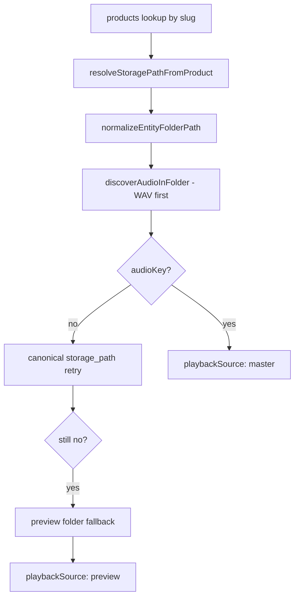
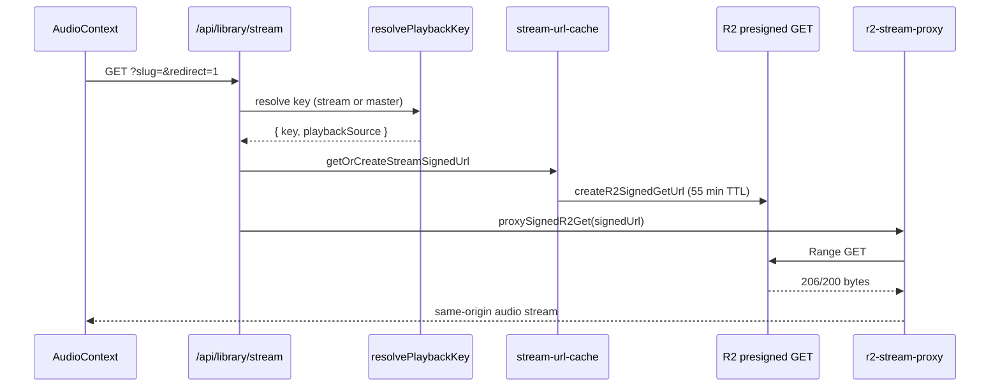

# 04 — Resolver Compatibility

**Focus:** Stream-first fallback logic, edge cases, signed URL flow compatibility.

---

## Current resolver chain

From `src/lib/playback/resolve-playback-key.js`:



### Current return shape

```javascript
{
  key: string,           // R2 object key
  source: string,        // path provenance (products.storage_path, catalog_tracks, etc.)
  playbackSource: "master" | "preview",
  entityFolder: string,
  productId: string,
}
```

Caches: 60s TTL + inflight dedup (`PLAYBACK_KEY_TTL_MS`, L7–11).

---

## Proposed stream-first chain

```
1. media_assets row with asset_role: stream_audio     [NEW]
2. discover .m4a in streaming/{entity-path}/        [NEW]
3. existing master discovery (current)                [UNCHANGED]
4. preview folder fallback                            [UNCHANGED]
```

### Proposed return shape extension

```javascript
{
  key: string,                              // stream or master key used for playback
  playbackSource: "stream" | "master" | "preview",
  masterKey?: string,                       // always populated when master exists
  streamKey?: string,
  source: string,
  entityFolder: string,
  productId: string,
}
```

**Client contract:** Unchanged — `library/stream` signs `resolved.key` only.

---

## Stream-first fallback logic

| Condition | Resolution | playbackSource |
|-----------|------------|----------------|
| Stream file exists + flag on | `streaming/…/*.m4a` | `stream` |
| Stream missing, master exists | `digital-assets/…/*.wav` | `master` |
| Both missing, preview exists | `previews/…` | `preview` |
| None found | `null` → 404 | — |
| `STREAM_PLAYBACK_PREFERRED=0` | Skip steps 1–2 | `master` |

**90-day dual-read:** Master always present during migration; stream optional per entity.

---

## Edge cases

### 1. Album track playback (`trackSlug` param)

- `resolveStoragePath(releaseType, slug, trackSlug, albumSlug)` — `canonical-paths.js` L78–84
- Stream path must use same nesting: `streaming/mixtapes-and-eps/{album}/{track}/{track}.m4a`
- Cache key: `slug:trackSlug` — already supported (`resolve-playback-key.js` L13–14)

**Validation:** ✅ Compatible.

### 2. Feature vs single release type inference

- `inferProductReleaseType()` — L109–136
- Features must not fall through to singles (path regex + canonical catalog)
- Stream folders use same `features/` prefix

**Validation:** ✅ Compatible.

### 3. Legacy `protected-media/masters/` paths

- `normalizePlaybackR2Key` maps legacy prefixes
- Stream layer uses dedicated `streaming/` — no legacy dual-prefix

**Validation:** ✅ Isolated.

### 4. Concrete file key in DB (not folder)

- `isConcreteMediaKey()` bypasses discovery — `entity-resolver.js` L51–54
- Stream role row should store full `streaming/…` key

**Validation:** ✅ Supported via DB path.

### 5. `.m4a` in master folder today

- Discovery order: WAV > FLAC > **m4a** > MP3
- If ops uploaded m4a to master folder without WAV, playback already uses m4a as "master"
- Hybrid separates concerns — stream m4a not in master folder

**Validation:** ⚠️ Document ops rule: masters = lossless; streams = `streaming/` only.

### 6. Preview fallback for entitled users

- Today: if no master, entitled user gets preview audio (L218–235)
- Hybrid: same — stream missing + master missing → preview
- **Risk:** entitled fan hears preview-quality — existing behavior, not regression

### 7. Cache staleness after master swap

- `clearPlaybackKeyCache()` — L174–177
- Must invalidate on stream upload + master replace
- `clearMediaResolverCaches()` wired on dev force refresh — `stream/route.js` L117

**Validation:** ⚠️ Extend invalidation hooks in Phase 5c.

### 8. Slug aliases (`love-hz` → `love-hz-vol-1`)

- Canonical catalog resolves alias — `canonical-catalog.js` L195–197, L268–271
- Stream paths use canonical slug from `resolveStoragePath`

**Validation:** ✅ Use canonical slug in transcode job mapping.

---

## Signed URL flow (unchanged architecture)



| Step | Hybrid change |
|------|---------------|
| Entitlement gate | None — `userCanStreamProduct` |
| Session create | None — `stream-pipeline.js` |
| Sign TTL | None — `STREAM_SIGNED_URL_TTL_SECONDS` |
| Proxy CORS | None — `Cache-Control: private, no-store` |
| Signed object | **Smaller** AAC file — less proxy duration |

Phase 4.8 warm path (3–9 ms auth-only) preserved; byte phase improves with smaller objects.

---

## Compatibility with Phase 4.8 caches

| Cache | Key | Hybrid note |
|-------|-----|-------------|
| Playback key | `slug:trackSlug` | Must include `playbackSource` in value |
| Stream URL | `userId:slug:trackSlug` | Same; re-sign when key changes |
| Entity resolver | `kind:folder` | Add `stream` kind or separate prefix |
| Preview resolution | Unchanged | Independent layer |

**Risk:** Stream URL cache holds presign for master key; after flip, stale master presign until TTL (~55 min). **Mitigation:** Cache key should incorporate `playbackSource` or hash of resolved key.

---

## Validation verdict

| Check | Status |
|-------|--------|
| Stream-first with master fallback | ✅ Design sound |
| Client/API contract unchanged | ✅ |
| Album trackSlug support | ✅ |
| Download route isolated from stream key | ✅ (today) |
| Cache invalidation plan | ⚠️ Needs key-hash extension |
| Feature flag rollback | ✅ Phase 5 `08-rollback-plan.md` |

**Resolver compatibility:** **Ready for implementation** with cache-key hardening noted.
