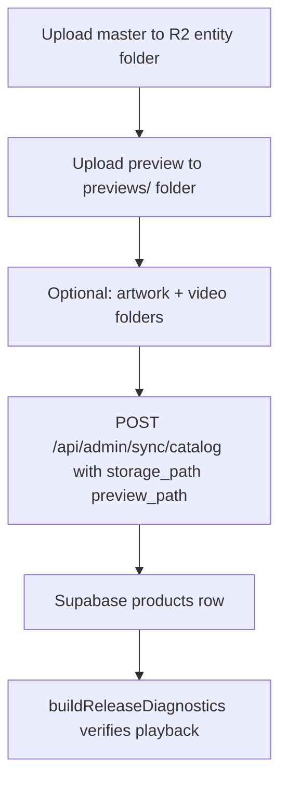
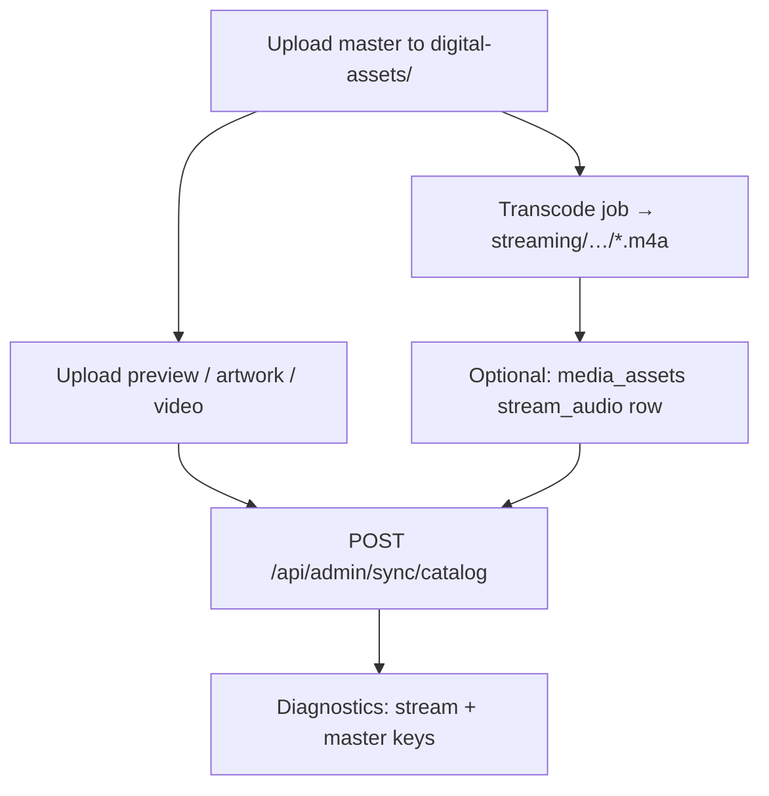

# 07 — Admin Workflow

**Impact:** Release upload, catalog sync, and media diagnostics under hybrid architecture.

---

## Current admin surfaces

| Surface | Path | Function |
|---------|------|----------|
| Catalog sync | `POST /api/admin/sync/catalog` | Upsert `products`, `vault_content` |
| Media diagnostics | `GET /api/admin/media-diagnostics` | Per-release availability + playback key |
| Seed products | `POST /api/admin/seed-products` | Bootstrap catalog |
| Collector cards | `POST /api/admin/collector-cards` | DB-only |
| Fulfill recovery | `POST /api/admin/fulfill-recovery` | Commerce recovery |

Auth: `x-seed-secret` header matching `ADMIN_SEED_SECRET`.

---

## Current release workflow



Path normalization: `normalizeStoragePathForStorefront()` — strips to `digital-assets/` or `protected-media/`.

**No transcode step today.**

---

## Proposed hybrid workflow



### Ops runbook additions

| Step | Owner | Tool |
|------|-------|------|
| Verify master upload | Ops | R2 console or `listEntityFolderObjects` |
| Trigger transcode | Ops / CI | FFmpeg batch or worker |
| Validate stream duration ±50 ms | Automated | FFprobe |
| Sync catalog | Ops | Existing admin sync |
| Smoke play entitled | QA | `admin/media-diagnostics` + device |

---

## Admin sync changes (proposed)

### Current payload (unchanged fields)

```javascript
{
  slug, title, product_type, price_cents, cover_url,
  storage_path,   // master entity folder
  preview_path,
  content_type, content_id, metadata
}
```

### Optional extension

```javascript
metadata: {
  stream_path: "streaming/singles/hour-glass/",  // entity folder or full key
  stream_verified_at: "ISO8601",
  transcode_version: "aac128-v1"
}
```

**Rule:** `storage_path` remains master folder — never point at `streaming/`.

### Code touchpoint

`src/app/api/admin/sync/catalog/route.js` L56–57 — today normalizes `storage_path` and `preview_path` only. Stream metadata is pass-through in `metadata` object without code change (MVP).

---

## Media diagnostics impact

`buildReleaseDiagnostics()` — `admin-media-diagnostics.js`:

| Check today | Add for hybrid |
|-------------|----------------|
| `missingAudio` | `missingStream` (optional warning) |
| `brokenPlayback` via `resolvePlaybackKey` | Report `playbackSource` |
| Availability cache | Stream folder probe |

Shadow mode (Phase 5 migration Step 4): log stream key alongside master without serving stream.

---

## Release-type-specific notes

| Type | Master path | Stream path | Preview |
|------|-------------|-------------|---------|
| Single | `digital-assets/singles/{slug}/` | `streaming/singles/{slug}/` | `previews/singles/{slug}/` |
| Feature | `digital-assets/features/{slug}/` | `streaming/features/{slug}/` | WAV preview today |
| EP/mixtape track | `…/mixtapes-and-eps/{album}/{track}/` | Same nesting under `streaming/` | Per-track preview folder |

Canonical slugs from `canonical-catalog.js` — admin sync should use canonical slugs (not aliases like `love-hz`).

---

## New release checklist (post-hybrid)

1. [ ] Master WAV/FLAC in correct entity folder (flat, no `audio/` subdir)
2. [ ] Preview in `previews/{type}/{slug}/`
3. [ ] Transcode → `streaming/…/{slug}.m4a` with `-movflags +faststart`
4. [ ] Admin sync products row
5. [ ] Diagnostics: `brokenPlayback: false`, stream optional flag set
6. [ ] Staging entitled play + download token spot check

---

## Training / documentation needs

| Audience | Topic |
|----------|-------|
| Ops | Two-layer folder diagram (master + stream) |
| QA | Entitled play vs download token vs guest preview |
| Dev | Feature flag + rollback env vars |

---

## Verdict

| Criterion | Status |
|-----------|--------|
| Existing admin sync still works | ✅ |
| Minimal sync schema change | ✅ (metadata optional) |
| Diagnostics extensible | ✅ |
| Ops runbook exists | ❌ Create in Phase 5b |
| Transcode automation | ❌ Not built |

**Admin workflow readiness:** **Adequate for design approval** — runbook and diagnostics extensions required before prod flip.
