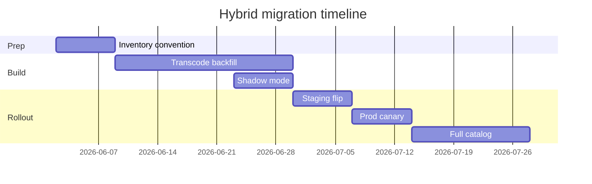

# 08 — Migration Plan

**Goal:** Zero-downtime, incremental rollout of hybrid master + stream architecture.

---

## Phase gates

| Gate | Scope | Exit criteria |
|------|-------|---------------|
| **5a — Design + readiness** | This audit | Stakeholder sign-off, score ≥75 |
| **5b — Ingest** | Transcode + R2 upload | ≥95% catalog entities have `.m4a` |
| **5c — Resolver** | Stream-first + flag | Staging HAR entitled 200 OK |
| **5d — Prod canary** | `STREAM_PLAYBACK_PREFERRED=1` | p95 tap→audible ≤ target |
| **5e — HLS optional** | Adaptive Safari | iOS device validation |

---

## Numbered migration steps

### Step 1 — Inventory & convention (week 0)

1. Add `STREAM_ROOT = "streaming"` to `storage-domains.js` (implementation).
2. Add `resolveStreamPath()` mirroring `resolveStoragePath()` in `canonical-paths.js`.
3. Run read-only R2 inventory script listing `digital-assets/` entity folders.
4. Map folders → `products.slug` via `storage_path` and canonical catalog.
5. **No production behavior change.**

### Step 2 — Transcode backfill (week 1–3)

1. Batch FFmpeg per entity folder (36+ folders per catalog).
2. Output: `streaming/{type}/{path}/{slug}.m4a` with `-movflags +faststart`.
3. Validate duration ±50 ms vs master (FFprobe).
4. Loudness −14 LUFS integrated (optional QA gate).
5. **Masters untouched.**

### Step 3 — Metadata linkage (week 2, parallel)

1. Optional: insert `media_assets` rows with `asset_role: stream_audio`.
2. Optional: `metadata.stream_path` via admin sync.
3. Resolver discovers by folder if DB row missing (fallback).

### Step 4 — Shadow mode (week 3)

1. Extend `resolvePlaybackKey` to compute stream key.
2. Log `{ streamKey, masterKey, wouldPreferStream }` — do not serve stream.
3. Extend `admin/media-diagnostics` to surface stream availability.
4. Compare shadow keys vs manual spot checks (5 slugs).

### Step 5 — Resolver implementation (week 3–4)

1. Implement stream-first with `STREAM_PLAYBACK_PREFERRED` env flag (default `0`).
2. Extend `normalizePlaybackR2Key` for `streaming/` prefix.
3. Add `masterKey` / `streamKey` to resolver return shape.
4. Harden stream URL cache key to include resolved key hash.
5. Unit/integration tests for fallback chain.

### Step 6 — Staging validation (week 4)

1. Set `STREAM_PLAYBACK_PREFERRED=1` on staging.
2. Phase 4.7 matrix: entitled 200, preview guest, Server-Timing.
3. iOS `dumpPlaybackTiming()` — fill pending browser marks.
4. Download token still serves WAV/FLAC master.
5. Compare CDN/proxy byte metrics before/after.

### Step 7 — Production canary (week 5)

1. Enable flag for allowlist: `hour-glass`, `love-hz-vol-1`, `w2d`.
2. Monitor `MEDIA_UNAVAILABLE` 422/404 rate (<0.5% target).
3. Monitor Server-Timing `cdn` segment duration drop.
4. 48h soak before expand.

### Step 8 — Full catalog rollout (week 6+)

1. 100% slugs on stream-first.
2. Update ops docs: masters for download, streams for play.
3. Maintain 90-day dual-read minimum.

### Step 9 — Post-rollout optimization (week 8+)

1. Optional HQ tier for collector.
2. Optional HLS (Phase 5e).
3. Optional preview regeneration from stream stems.

---

## Zero-downtime guarantees

| Concern | Mechanism |
|---------|-----------|
| Fans mid-session | New play resolves fresh key; cache TTL ≤55 min |
| Missing stream file | Master fallback — degraded latency, not outage |
| Flag rollback | `STREAM_PLAYBACK_PREFERRED=0` <5 min |
| Master availability | Never deleted in migration |
| Guest previews | Independent `previews/` layer — unchanged |

*Dates illustrative — adjust to team capacity.*

---

## Catalog priority order (backfill)

| Priority | Slugs | Rationale |
|----------|-------|-----------|
| P0 | hour-glass, turnt-me-2-dis, love-hz-vol-1 | Storefront prominence, Phase 4.7 probes |
| P1 | w2d, artificial, ad, tbh | High traffic catalog |
| P2 | features (i-dont-believe-you, 2-heavy) | WAV preview / master weight |
| P3 | Remaining album tracks | Batch overnight |

---

## Validation matrix (from Phase 4.7 P0)

| Persona | Action | Pass criteria |
|---------|--------|---------------|
| Guest | Preview play | Unchanged CDN path |
| Subscriber | Entitled stream | 200 redirect, AAC audible |
| Purchaser | Download token | Master WAV/FLAC |
| Collector | Full catalog play | Stream with same entitlement |
| Admin | Diagnostics | stream + master keys logged |

---

## Out of scope

- Supabase Storage cutover
- UI / cinematic changes
- Entitlement schema redesign
- Dependency bumps

---

## Verdict

Migration plan is **non-destructive, flag-gated, and rollback-ready**. Proceed after Phase 5b transcode infrastructure is provisioned.
