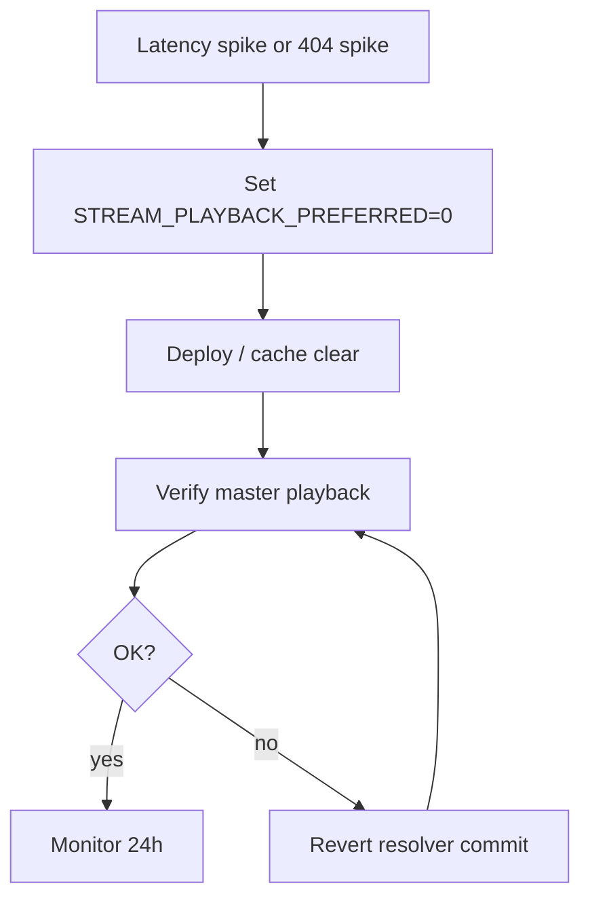

# 09 — Rollback Plan

**Principle:** Disable stream resolution → master resumes immediately. **No data restore required.**

---

## Instant runtime rollback

| Control | Action | Effect | Time |
|---------|--------|--------|------|
| `STREAM_PLAYBACK_PREFERRED=0` | Vercel env toggle | Skip stream discovery; master-only | <5 min propagate |
| `STREAM_PLAYBACK_SLUG_DENYLIST` | Per-slug env | Master fallback for corrupt transcodes | <5 min |
| Redeploy prior resolver | Git revert deploy | Same as flag off | ~10 min |
| Cache clear | `clearPlaybackKeyCache()` on deploy | Cold resolve picks master | Immediate post-deploy |

Phase 4.8 server caches (preview fast path, Server-Timing) — **keep**; independent of hybrid.

---

## Rollback flow



---

## Data rollback

| Action | Required? | Notes |
|--------|-----------|-------|
| Delete `streaming/` objects | **No** | Orphaned objects harmless when flag off |
| Restore masters | **No** | Masters never deleted |
| Revert Supabase `stream_audio` rows | Optional | Ignored when flag off |
| Restore DB backup | **No** | No schema breaking changes MVP |

---

## Failure modes & response

| Symptom | Likely cause | Rollback action |
|---------|--------------|-----------------|
| 404 `MEDIA_UNAVAILABLE` spike | Bad stream key mapping | Global flag off or slug denylist |
| Audible glitches / wrong track | Transcode mapping error | Denylist slug + re-transcode |
| Download serves AAC | Token route regression | **Hotfix** — token must use `products.storage_path` master only |
| Higher latency than master | CDN misconfig on stream | Flag off; investigate |
| Stale master presign in cache | Cache key missing hash | Flag off + wait ≤55 min TTL |

---

## Partial rollback (per slug)

```
STREAM_PLAYBACK_SLUG_DENYLIST=hour-glass,corrupt-slug
```

Resolver skips stream for listed slugs; other catalog continues stream-first.

Use when single transcode artifact is corrupt without full rollback.

---

## Phase 4.8 cache interaction

If stream-first causes unexpected 404s:

1. `STREAM_PLAYBACK_PREFERRED=0`
2. `clearMediaResolverCaches()` (dev) or deploy hook
3. Stream URL cache auto-expires ≤55 min (`stream-url-cache.js`)

---

## Verification after rollback

- [ ] Guest preview unchanged (public CDN)
- [ ] Entitled play uses master WAV/FLAC (higher latency acceptable)
- [ ] Server-Timing `resolve` segment stable
- [ ] No entitlement 403 regression
- [ ] Purchase download token serves lossless master
- [ ] `git status --short src/` clean on rollback deploy

---

## Communication

| Audience | Message |
|----------|---------|
| Internal | "Stream layer disabled; masters active; no fan data impact." |
| Fans | No message if rollback <1 hr |

---

## Post-mortem triggers

- p95 tap→audible **worse** than master baseline for 24h
- Error rate >0.5% on `/api/library/stream`
- Collector download serves wrong format

Link Phase 4.8 `rollback-paths.md` for Server-Timing-only rollback (orthogonal).

---

## Verdict

Rollback is **low-risk and fast** — env flag + master fallback designed in from Phase 5. No backup restore path needed.
