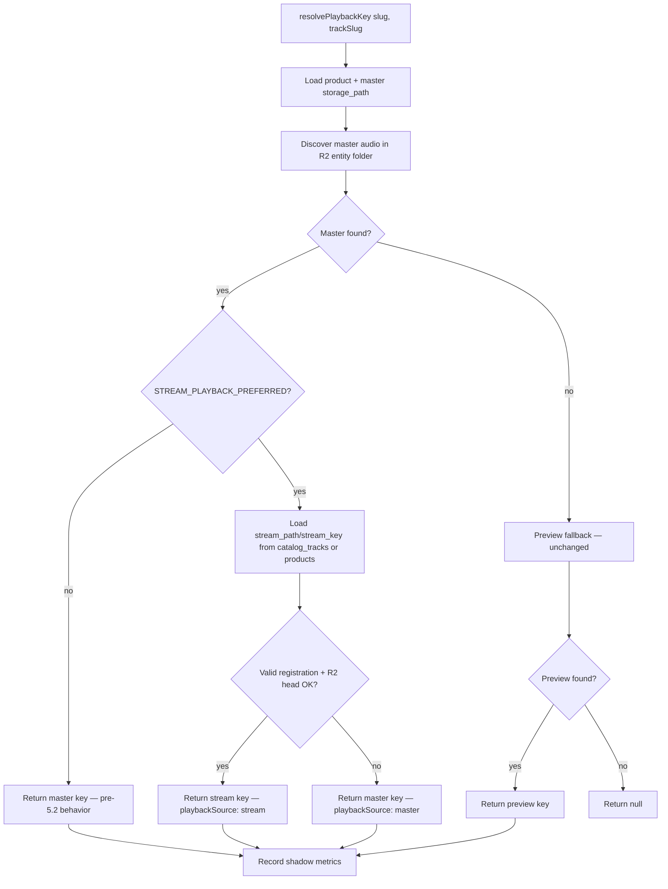
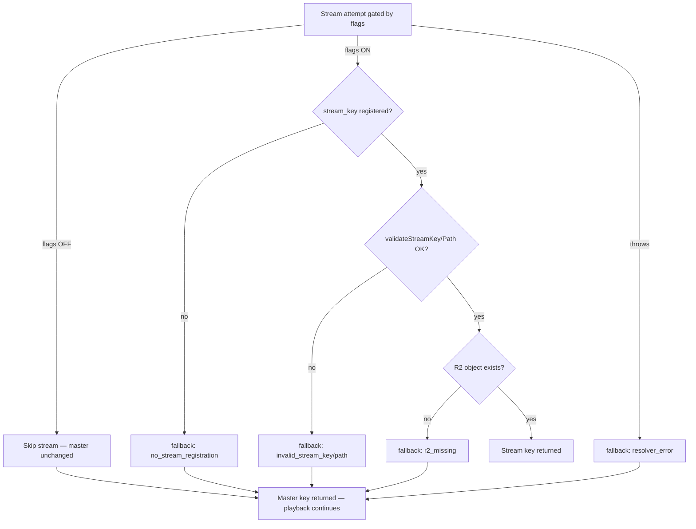

# Phase 5.2 — Stage 4: Playback Resolver Extension

**Date:** 2026-05-30  
**Phase:** HYBRID MASTER / STREAM IMPLEMENTATION — Stage 4 only  
**Repository:** `/Users/recharge/artist-platform`  
**Recovery anchor:** `bac9eb71f93dcbc0bee4099bf6d80ddaac29e049` (`bac9eb7`) — unchanged

---

## Executive summary

Stage 4 extends the **server-side playback resolver** with optional stream-first routing. When `HYBRID_STREAMING_ENABLED=1` **and** `STREAM_PLAYBACK_PREFERRED=1` **and** a valid registered stream asset exists in R2, the resolver returns the stream key. **Any** stream resolution failure immediately falls back to the master asset — playback is never interrupted.

**Default (flags OFF):** resolver behavior is **identical to pre–Stage 4** — master-only path, no stream DB reads beyond existing product query columns (unused when flags OFF).

No client playback changes. No global stream rollout. Flags remain default OFF.

---

## Files modified / created

| File | Action | Purpose |
|------|--------|---------|
| `src/lib/playback/resolve-stream-playback.js` | **Created** | Stream candidate resolution: DB fields → validation → R2 head check; never throws |
| `src/lib/playback/playback-resolver-diagnostics.js` | **Created** | Shadow metrics: result counts, fallback rate, avg duration |
| `src/lib/playback/resolve-playback-key.js` | **Modified** | Stream-first gate after master resolve; master fallback; resolver timing |
| `src/lib/media/entity-resolver.js` | **Modified** | `resolveStreamAssetKey()` — R2 existence check for registered stream keys |
| `src/app/api/library/stream/route.js` | **Modified** | Server-Timing `resolve` desc (stream/master/preview); `X-Playback-Resolver` dev header |
| `scripts/test-playback-resolver-fallback.mjs` | **Created** | Unit/logic tests: stream miss → fallback; flags off → skip |
| `scripts/alias-loader.mjs` | **Created** | Test harness `@/` path alias for standalone Node scripts |
| `scripts/register-alias.mjs` | **Created** | Registers alias loader for test scripts |

**Not modified (prohibited):** `AudioContext.js`, client playback startup, queue/player architecture, `GlobalAudioPlayerBar`, media session, audiovisual systems, entitlement overrides, backfill tooling, recovery anchors.

---

## Resolver flow diagram



---

## Fallback flow diagram



**Critical:** Resolver never throws on stream failures. Releases without stream assets behave exactly as today.

---

## Shadow validation metrics

| Metric | Source | When visible |
|--------|--------|--------------|
| Resolver result (`stream` / `master` / `preview`) | `recordPlaybackResolverOutcome()` | Dev log when `R2_STREAM_DEBUG=1` or `NODE_ENV=development` |
| Resolver duration (ms) | `resolvePlaybackKey` → `resolverDurationMs` | `X-Playback-Resolver` header, Server-Timing `resolve` segment |
| Fallback rate | `getPlaybackResolverDiagnostics().fallbackRate` | `X-Playback-Resolver` aggregate (dev/debug) |
| Stream hit rate | `getPlaybackResolverDiagnostics().streamHitRate` | Same |
| Fallback reasons | `fallbacksByReason` map | Same |

**Server-Timing:** `resolve;dur=…;desc="stream"|"master"|"preview"` via existing `createServerTiming` pattern (Phase 4.8).

**Response header (dev/debug only):** `X-Playback-Resolver` JSON:

```json
{
  "result": "master",
  "durationMs": 42.3,
  "fallbackReason": "r2_missing",
  "flags": { "hybridStreamingEnabled": false, "streamPlaybackPreferred": false },
  "aggregate": { "total": 1, "streamHitRate": 0, "fallbackRate": 1 }
}
```

No polling loops. Counters are in-process (server-side shadow validation).

---

## Rollback

Set env and redeploy — no code change required:

```bash
STREAM_PLAYBACK_PREFERRED=0
# or
HYBRID_STREAMING_ENABLED=0
```

Resolver immediately reverts to master-only behavior.

---

## Validation results

| Check | Result |
|-------|--------|
| `npm run build` | **PASS** |
| `npm run test:foundation` | **PASS** |
| `npm run verify:foundation -- --quick` | **PASS** |
| `node --import ./scripts/register-alias.mjs scripts/test-playback-resolver-fallback.mjs` | **PASS** |

Unit tests cover: stream field picking, validation rejection, R2 miss → `r2_missing` fallback, stream hit with mock head, flags off → `flags_off`, diagnostics counters.

---

## STOP — awaiting Stage 5 approval

Stage 4 complete. **Do not proceed** to Stage 5 (backfill), Stage 6, or global rollout without operator approval.

Flags remain **default OFF** — no production env changes made.
