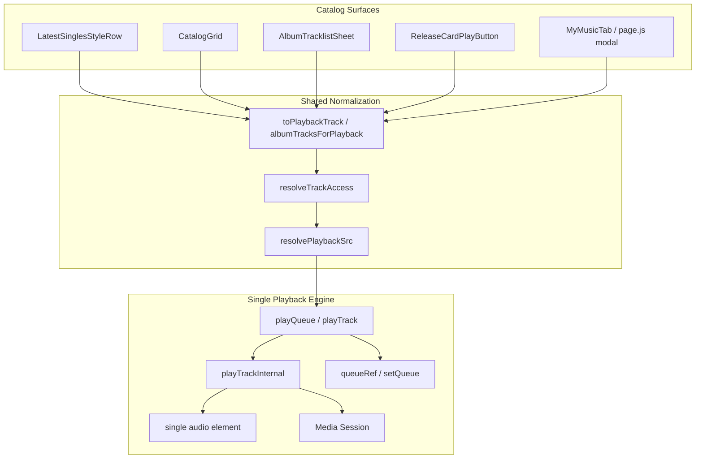
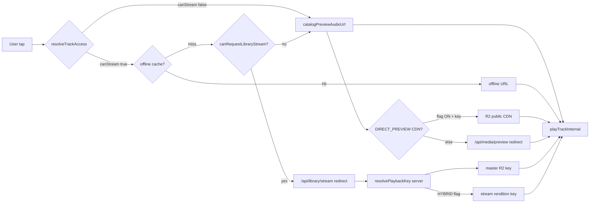
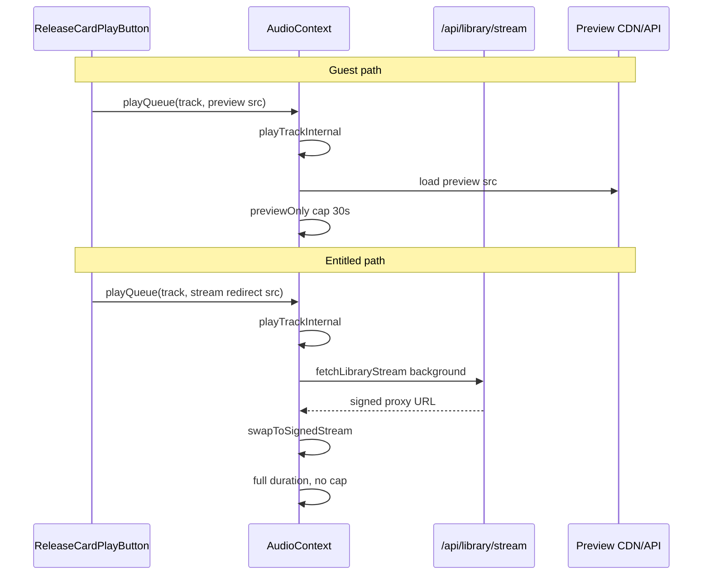
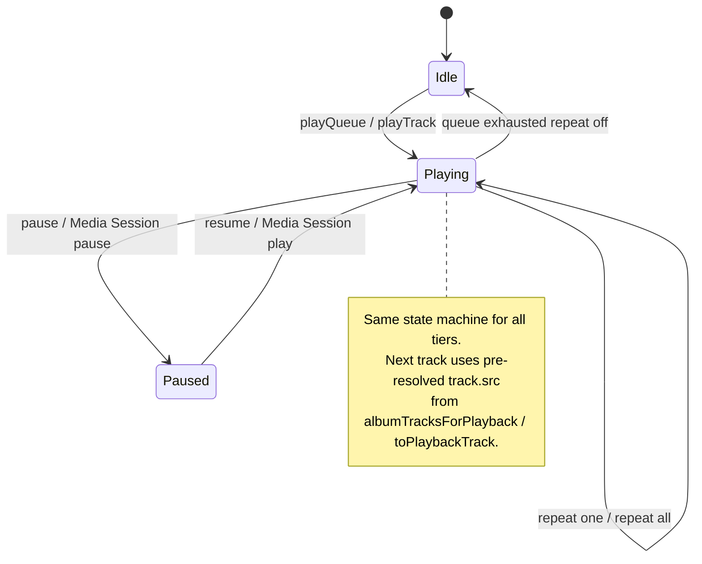
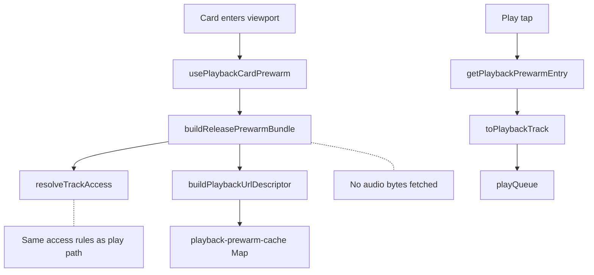

# Playback Flow Diagrams

**Phase 5.2.14** | Mermaid diagrams for unified entitlement playback

---

## 1. High-level unified engine



---

## 2. Asset resolution by entitlement



---

## 3. Guest vs entitled playTrackInternal



---

## 4. Queue lifecycle (all user types)



---

## 5. Prewarm (no entitlement fork)



---

## 6. Hybrid streaming (future, flag-gated)

```mermaid
flowchart TB
  REQ[Entitled stream request] --> RPK[resolvePlaybackKey]
  RPK --> MASTER[Discover master in R2 folder]
  MASTER --> FLAG{isStreamPlaybackPreferred?}
  FLAG -->|OFF default| SIGN_M[Sign master key]
  FLAG -->|ON| TRY[tryResolveStreamPlaybackKey]
  TRY -->|hit| SIGN_S[Sign stream key]
  TRY -->|miss| SIGN_M

  GUEST[Guest] --> PREV[Preview resolver only]
  COLL_DL[Collector offline download] --> OFFLINE[getOfflinePlaybackUrl first in resolvePlaybackSrc]

  PREV -.->|never| RPK
  OFFLINE -.->|bypasses| RPK when cached
```
