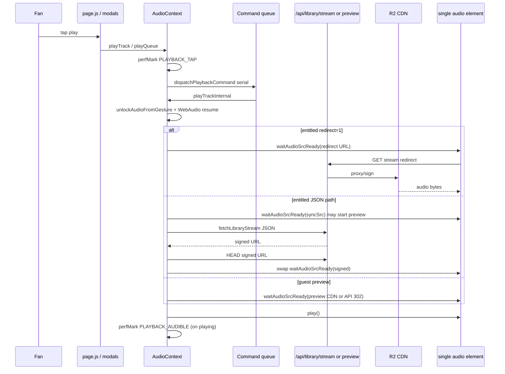

# Playback Readiness Audit — Tap → Audible

**Phase:** 5.2.4  
**Date:** 2026-05-31  
**Target:** https://www.2mrrw.com  
**Mode:** Read-only

---

## Pipeline (as-built)

**Key files:** `src/context/AudioContext.js` (`playTrack`, `playTrackInternal`, `waitAudioSrcReady`), `src/lib/playback/stream-client.js`, `src/app/api/library/stream/route.js`, `src/lib/dev/performanceMarks.js`.

---

## Production curl — this session [M]

Captured: **2026-05-31T16:08:10Z** (see `curl-measurements.txt`).  
**Note:** No `Server-Timing` response headers observed on production (instrumentation may be undeployed or stripped at edge).

| Probe | HTTP | TTFB | Total | vs Phase 4.7 prod |
|-------|------|------|-------|-------------------|
| `GET /api/guest/session` (1st) | 200 | **579 ms** | 579 ms | Improved vs 7877 ms cold outlier |
| `GET /api/guest/session` (2nd) | 200 | **168 ms** | 168 ms | Improved vs 484 ms |
| `GET /api/media/preview?folder=previews/singles/hour-glass/` | 302 | **215 ms** | 215 ms | Improved vs **602 ms** |
| `GET /api/library/stream?slug=hour-glass` (JSON) | 401 | **258 ms** | 258 ms | Improved vs 451 ms |
| `GET /api/library/stream?slug=hour-glass&redirect=1` | 401 | **192 ms** | 192 ms | Improved vs **513 ms** |
| `GET /api/library/stream?slug=love-hz-vol-1&redirect=1` | 401 | **174 ms** | 174 ms | Improved vs **804 ms** |
| CDN preview `Range: 0-65535` | 206 | **182 ms** | 206 ms | Improved vs **954 ms** TTFB |

**Interpretation:** Production API segments are materially faster than the Phase 4.7 baseline (consistent with Phase 4.8 fast-path deployment). **401 probes do not measure** entitlement → resolve → sign → proxy for entitled 200 streams.

---

## Client-stage estimates [Est. / Pending]

From Phase 4.7 sample (`dumpPlaybackTiming` localhost, dev-only) and code review:

| Stage | Est. (warm) | Evidence |
|-------|-------------|----------|
| Tap → request (queue + gesture unlock) | 2–40 ms | Command queue, `unlockAudioFromGesture`, `resumeWebAudioContextIfSuspended` |
| Request → resolver start | 0–5 ms | `perfMark` chain |
| Resolver (redirect path) | **174–258 ms [M]** prod 401; entitled 200 **Pending** | Single GET when `redirect=1` |
| Resolver (JSON path) | API JSON + **HEAD** on signed URL | `fetchLibraryStream` + `assertSignedAudioUrl` — **+1 RTT** vs redirect |
| Src assign → first byte | 100–800 ms | `waitAudioSrcReady` → `loadeddata` |
| First byte → canplay | 20–400 ms | Buffer / decode (mobile higher) |
| Canplay → audible | 5–80 ms | `audio.play()` + first-listen volume swell (up to ~3s on first listen) |
| Cross-track fade (switch while playing) | **up to ~300 ms** | `setInterval` fade in `playTrackInternal` |
| **Tap → audible (end-to-end)** | **Pending device** | `dumpPlaybackTiming()` is `NODE_ENV === "development"` only |

`waitAudioSrcReady` timeout: **12 s** (`AUDIO_SRC_READY_TIMEOUT_MS`).

---

## Path ranking (largest contributors)

| Rank | Contributor | Type | Impact |
|------|-------------|------|--------|
| **1** | **Audio buffer + decode (`waitAudioSrcReady` → canplay)** | Client + CDN | Dominates perceived delay after `src` set; mobile Safari worst case |
| **2** | **Stream/preview API + CDN first byte** | Network [M] improved on prod but still 170–580 ms API + ~180 ms CDN range | Entitled 200 path adds resolve/sign/proxy (not in 401 curl) |
| **3** | **Client work before `src` assign** | Client | Cross-track fade (~300 ms), serial command queue, WebAudio unlock, optional JSON+HEAD stream resolve |
| 4 | JSON stream path (non-redirect) | Client+server | Extra `fetchLibraryStream` + HEAD vs redirect fast path |
| 5 | Background stream resolve + swap | Client | Entitled tracks without `redirect=1` may start then swap URL |
| 6 | First-listen volume swell | Client | ~3 s ramp on first play per slug |

---

## Redirect vs JSON fast path

| Path | Client RTTs before play | When used |
|------|-------------------------|-----------|
| **Redirect `redirect=1`** | 0 prefetch; browser follows on `audio.src` | `isLibraryStreamRedirectSrc(nextTrack.src)` |
| **JSON + HEAD** | `fetch` + `HEAD` + assign | Entitled, `canStream`, not redirect URL |
| **Preview CDN / 302** | 0–1 API hop + CDN | Guest / preview-only |

Phase 4.7/4.8 confirmed redirect wiring is correct; remaining delay is server+CDN+`waitAudioSrcReady`, not missing client fast path.

---

## Instrumentation gaps

| Tool | Prod | Dev |
|------|------|-----|
| `dumpPlaybackTiming()` | No-op | Full 9-stage table |
| `Server-Timing` on stream/preview | **Not observed** this curl | Present in Phase 4.8 local build |
| Entitled 200 stream TTFB | **Pending** (needs session cookie) | — |

**P0 validation:** HAR on staging/prod with fan cookie; iOS 375px `dumpPlaybackTiming` on localhost.
