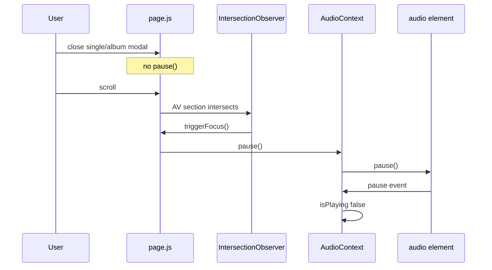

# Scroll Trace — Play → Close Modal → Scroll → Stop

**Reproduction:** Release modal (single/album) → playback works → close modal → scroll → stop + UI refresh feel  
**Method:** Static reachability only (no runtime trace)

---

## Path validity

| Step | Reachable? | Evidence |
|------|------------|----------|
| Open single/album modal | Yes | `openSingleModal` / `openAlbumModal` `page.js` |
| Play via catalog | Yes | `playCanonicalCatalogItem` / `playAlbumTracks` |
| Close modal without pause | Yes | `closeSingleModal` L1368–1372, `closeAlbumModal` L1374–1377 — **no `pause()`** |
| Scroll main column | Yes | `mainScrollRef` listeners L803+ |
| Audio Visuals section exists on home | Yes | `AudioVisualsSection` rendered in home tab content |
| IO fires on scroll into AV | Yes | `IntersectionObserver` L408–421, threshold 0.4/0.5 |
| `pause()` on first focus | Yes | `handleAudioVisualsFocused` L760–762 |

---

## Call chain (single/album — primary)

```
User scrolls main column
  → IntersectionObserver (AudioVisualsSection) entry.isIntersecting
  → triggerFocus() [page.js L383-391]  (once: firedFocusRef)
  → onAudioVisualsFocused()
  → handleAudioVisualsFocused() [L760-762]
  → if (isPlaying) pause()
  → dispatchPlaybackCommand(PAUSE) [AudioContext L2904]
  → pauseInternal() [L2557-2559]
  → audio.pause()
  → onPause [L1096-1109]
  → patchState({ isPlaying: false })
```

**First bad line:** `src/app/page.js:761`

---

## Alternate path — feature modal

```
closeFeatureModal [L1334-1338]
  → pause() immediately (before scroll)
```

**First bad line:** `src/app/page.js:1338`

---

## Concurrent UI refresh (not playback cause)

| Mechanism | Lines | Effect |
|-----------|-------|--------|
| `liveCountdown` 1 Hz | L1078–1092 | Full `Page()` re-render |
| Hero parallax DOM | L776–800 | Direct style mutation — "refresh" feel |
| `setHasEntered(true)` on AV IO | L390, L452 | YouTube iframe mount |
| Mobile `setHomeScrollSection` | L825–832 | Nav highlight |
| `CatalogGrid` unmemoized | Pass-through props | Cover/admin/gift repaint |

---

## Not reachable on this repro

| Path | Why |
|------|-----|
| `refreshAccountState` on scroll | No caller |
| `entitlements:updated` on scroll | Only checkout/success dispatch |
| `stopInternal` | No scroll caller |
| `AudioProvider` remount | Stable layout |
| Tab `tabKey` remount | Tab switch only, not scroll |

---

## Auto-resume after AV pause?

**No.** Prior audit `docs/reports/audio-logic-audit-20260525.md` §E — intentional AV handoff; user must resume manually.

---

## mermaid


