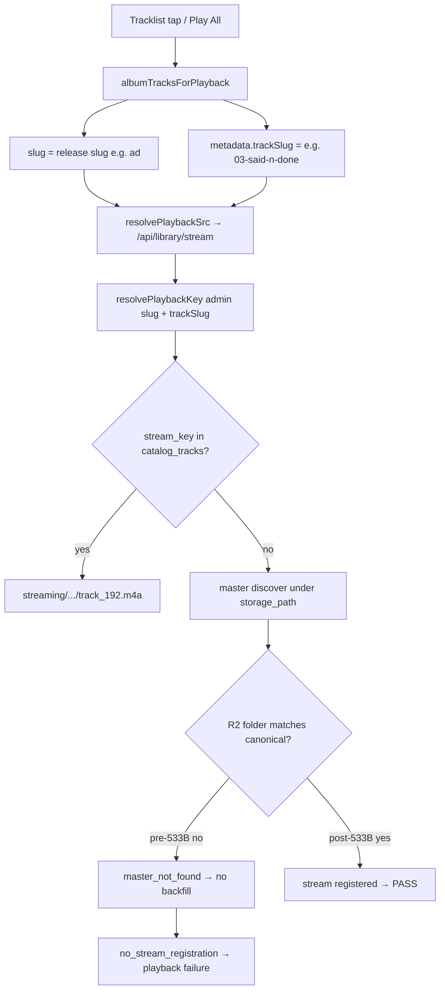

# Correlation Analysis — Path Mismatch vs Tracklist Playback

## Question

Do Phase 5.3.3A R2 path mismatches also affect track-level asset resolution, tracklist playback resolution, and release playback mapping?

## Answer

**Yes for entitled full-stream playback; largely no for preview-only tracklist rows and for client slug/catalog mapping.**

---

## Causal chain (entitled subscriber / owner)

---

## Per mismatch category (9 remediated tracks)

| Track | Pre-533B mismatch | Failed master lookup? | Failed stream registration? | Wrong trackSlug in client? | Tracklist entitled fail? |
|-------|-------------------|----------------------|----------------------------|---------------------------|-------------------------|
| ad/03-said-n-done | Trailing space folder | Yes | Yes | No | **Yes** (related) |
| ad/04-a-d-d | `04-a.d.d` vs `04-a-d-d` | Yes | Yes | No | **Yes** |
| ad/08-life-changes-ft-gwendolyn | Spaces vs kebab | Yes | Yes | No | **Yes** |
| love-hz-vol-1/02-w-2-d | `02-w2d` compact | Yes | Yes | No | **Yes** |
| love-hz-vol-1/07-stayed-2-long | Wrong track number folder | Yes | Yes | No | **Yes** |
| love-hz-vol-1/08-knock-on-wood | Off-by-one number | Yes | Yes | No | **Yes** |
| love-hz-vol-1/09-hour-glass | Off-by-one number | Yes | Yes | No | **Yes** |
| tbh/03-unxpcted | `03-unxpected` spelling | Yes | Yes | No | **Yes** |
| tbh/08-2late | `08-2late?` punctuation | Yes | Yes | No | **Yes** |
| love-hz-vol-1/01-roll-call | **No master in R2** | Yes (absent) | Yes | No | **Yes** (**unrelated** to slug mismatch) |

Post-533B: all rows except `01-roll-call` pass master + stream + `resolvePlaybackKey` (live probe).

---

## Release playback mapping

| Concern | Related to path mismatch? | Evidence |
|---------|---------------------------|----------|
| Release `slug` used as stream product slug | No bug | `resolveAlbumTrackPlaybackItem` sets `slug: albumSlug`, `trackSlug` separate — matches `resolvePlaybackKey(admin, slug, { trackSlug })` |
| Queue start index / wrong track | Unrelated (fixed 5.2.1) | `resolveReleaseQueueStartIndex` uses `metadata.trackIndex` |
| All tracks show release title | Unrelated (fixed 5.2.3) | `mergeCanonicalMetadata` preserves track titles |
| Play All skips some tracks | **Partially related** | `playableReleaseQueue` keeps any row with `src`; entitled rows always get stream URL even if server later fails — can feel “inconsistent” when one track errors |

---

## Preview / guest tracklist

Preview paths live under `previews/mixtapes-and-eps/{album}/{track}/` and do not depend on `digital-assets/` master folder names. Static simulation shows **all sampled tracklist rows `ready`** for guests with preview CDN `src`.

Path mismatches **did not** block preview folder resolution for the nine remediated tracks in this audit.

---

## Correlation verdict

| Scope | Verdict |
|-------|---------|
| Entitled stream failures on mismatched tracks | **RELATED** — direct cause |
| `01-roll-call` failure | **UNRELATED** — missing upload, not slug drift |
| Client tracklist slug / queue mapping | **UNRELATED** — correct; failures were backend asset layer |
| Guest preview tracklist | **Mostly UNRELATED** — separate preview tree |
| **Overall** | **PARTIAL** — one dominant infra cause + one independent gap + minor client “always ready” UX gap |
