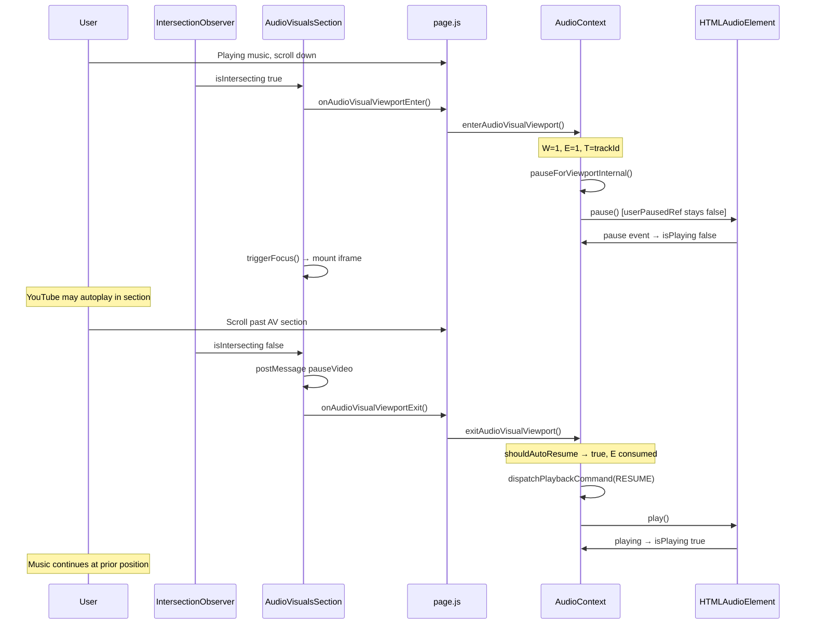
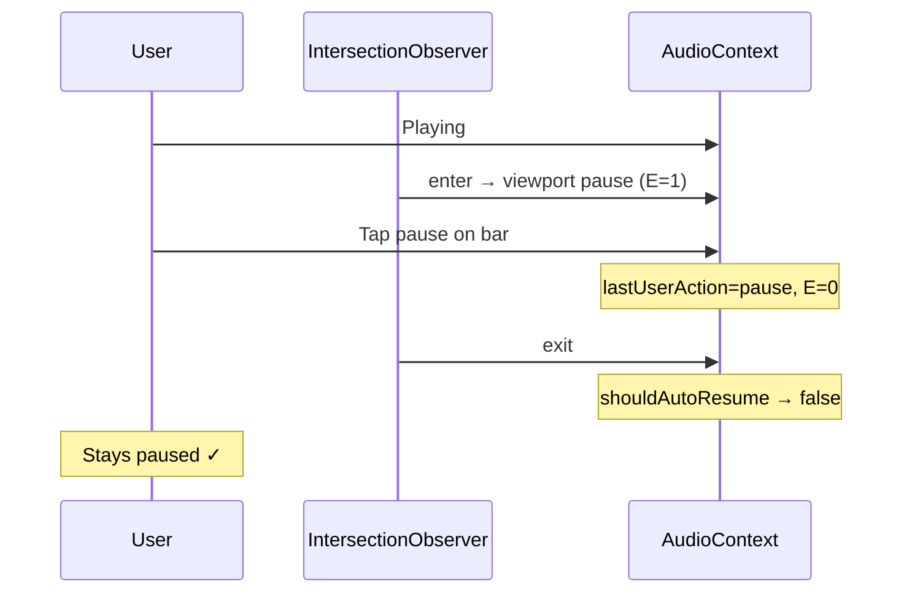

# Intersection Observer Resume Flow

**Phase 6B design artifact**  
**Files:** `src/app/page.js` (`AudioVisualsSection`), `src/context/AudioContext.js`

---

## Current IO architecture

```
AudioVisualsSection (memo)
├── sectionRef          → observed root
├── iframeRef           → YouTube postMessage target
├── firedFocusRef       → first-enter latch (iframe mount)
├── hasBeenInView       → local IO closure flag (YouTube re-play)
└── IntersectionObserver
    ├── threshold: [0, 0.4 desktop | 0.5 mobile]
    ├── root: viewport (default)
    └── callback: enter/exit → triggerFocus + YouTube cmds ONLY
```

**Page-level hook (today):**

```
handleAudioVisualsFocused()
  └── if (isPlaying) pause()    // called ONCE via triggerFocus → firedFocusRef
```

**Gap:** No exit callback; pause uses user pause path (`userPausedRef = true`).

---

## Target IO architecture

```
AudioVisualsSection
├── onAudioVisualViewportEnter  → enterAudioVisualViewport()  [every intersect]
├── onAudioVisualViewportExit   → exitAudioVisualViewport()   [every leave]
├── triggerFocus()              → iframe mount ONLY (no music pause)
└── IntersectionObserver        → unchanged YouTube postMessage behavior
```

---

## Sequence: happy path (play → enter AV → exit AV → resume)



---

## Sequence: manual pause cancels resume



---

## IO callback pseudocode (target)

```javascript
// Inside AudioVisualsSection useEffect — page.js ~L408
const obs = new IntersectionObserver(
  ([entry]) => {
    if (entry.isIntersecting) {
      triggerFocus(); // iframe lazy mount — unchanged

      onAudioVisualViewportEnter?.(); // NEW — every enter

      if (hasBeenInView) {
        sendCmd("playVideo"); // YouTube re-enter — unchanged
      }
      hasBeenInView = true;
    } else if (hasBeenInView) {
      sendCmd("pauseVideo"); // YouTube exit — unchanged

      onAudioVisualViewportExit?.(); // NEW — every exit
    }
  },
  { threshold: [0, threshold] }
);
```

---

## First-enter vs subsequent-enter timeline

| Scroll position | IO event | YouTube | Global music |
|-----------------|----------|---------|--------------|
| Above AV | — | not mounted | playing |
| AV 40% visible (1st) | enter | iframe mounts, autoplay | **viewport pause**, E armed |
| Below AV | exit | pauseVideo | **auto-resume** if eligible |
| Scroll back up, AV 40% (2nd) | enter | playVideo | viewport pause again if playing |
| Scroll away (2nd) | exit | pauseVideo | auto-resume again if eligible |

---

## triggerFocus decoupling

**Today:** `triggerFocus` calls `onAudioVisualsFocused()` once → pause.

**Target:** `triggerFocus` only:
1. Sets `firedFocusRef = true`
2. Calls `setHasEntered(true)` for iframe render

Music pause moves exclusively to `onAudioVisualViewportEnter` to avoid double-fire on first intersect.

| First intersect call order | Action |
|----------------------------|--------|
| 1 | `triggerFocus()` — DOM/iframe |
| 2 | `onAudioVisualViewportEnter()` — audio focus |
| 3 | `hasBeenInView = true` |

---

## Page wiring

```javascript
// page.js — replace L759-762
const { enterAudioVisualViewport, exitAudioVisualViewport } = useAudio();

const handleAudioVisualViewportEnter = useCallback(() => {
  enterAudioVisualViewport();
}, [enterAudioVisualViewport]);

const handleAudioVisualViewportExit = useCallback(() => {
  exitAudioVisualViewport();
}, [exitAudioVisualViewport]);

// JSX — L2133, L2226
<AudioVisualsSection
  isMobile={isMobile}
  onAudioVisualViewportEnter={handleAudioVisualViewportEnter}
  onAudioVisualViewportExit={handleAudioVisualViewportExit}
/>
```

**Remove dependency on `isPlaying` and `pause` in page handler** — eligibility logic moves to AudioContext.

---

## Dual mount note

`AudioVisualsSection` appears twice in home layout (mobile block L2133, desktop L2226) but only one renders per breakpoint. Both share the same callbacks — safe.

If tab switch remounts home (`tabKey`), IO re-initializes:
- `hasBeenInView` resets in new observer closure
- Viewport refs in AudioContext persist (provider stable)
- **Mitigation:** On IO disconnect/unmount, call `exitAudioVisualViewport()` in cleanup if `isInAudioVisualViewport` to avoid stale `V=1`

```javascript
// AudioVisualsSection useEffect cleanup — recommended
return () => {
  onAudioVisualViewportExit?.(); // safe no-op if not in view
  obs.disconnect();
};
```

---

## Threshold and rootMargin recommendations

| Parameter | Current | Phase 6B recommendation |
|-----------|---------|-------------------------|
| threshold | `[0, 0.4/0.5]` | Keep — matches product "section focused" feel |
| rootMargin | none | Optional: `"0px 0px -5% 0px"` to reduce edge flicker |
| debounce | none | Add 50ms trailing debounce on **exit only** if flicker observed in QA |

**Enter:** immediate (fan expects pause as soon as AV is prominent).  
**Exit:** may defer resume 1 frame (`requestAnimationFrame`) to coalesce IO bounce.

---

## Integration with existing scroll systems

| System | Interaction with viewport audio |
|--------|--------------------------------|
| Hero parallax (`L776–809`) | None — DOM only |
| Home section IO (`L825–832`) | None — nav highlight only |
| Singles carousel videos (`L738–757`) | None — separate `<video>` elements |
| `liveCountdown` 1Hz re-render | None on logic — avoid adding IO state-space state |
| Feature modal pause | Clears resume via `lastUserAction` |

---

## Diagnostic events (optional implementation)

Log via `playback-diagnostics.js`:

| Code | When |
|------|------|
| `VIEWPORT_AUDIO_ENTER` | enter handler, include W/E/T/A snapshot |
| `VIEWPORT_AUDIO_EXIT` | exit handler, include resume decision |
| `VIEWPORT_AUDIO_RESUME_DISPATCHED` | RESUME enqueued |
| `VIEWPORT_AUDIO_RESUME_SKIPPED` | guard failed, reason enum |

---

## File:line change map (implementation checklist)

| File | Lines (current) | Change |
|------|-----------------|--------|
| `page.js` | L383–391 | Remove pause from `triggerFocus` callback chain |
| `page.js` | L408–421 | Add enter/exit prop calls |
| `page.js` | L760–762 | Replace with enter/exit handlers |
| `page.js` | L2133, L2226 | Update props |
| `AudioContext.js` | ~L553 | Add `viewportAudioFocusRef` |
| `AudioContext.js` | L2557–2560 | Split viewport vs user pause |
| `AudioContext.js` | L3281+ | Export new API |
