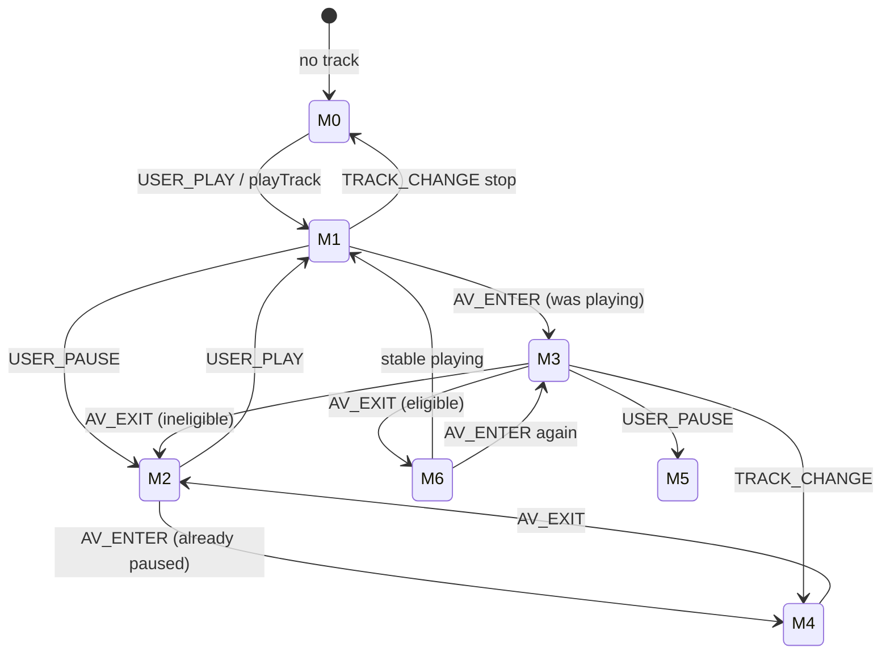

# Viewport Audio State Machine

**Phase 6B design artifact**  
**Scope:** Global music engine (`AudioContext`) ↔ Audio Visuals viewport (`AudioVisualsSection` IO)

---

## State variables

| Symbol | Type | Meaning |
|--------|------|---------|
| `V` | boolean | `isInAudioVisualViewport` |
| `W` | boolean | `wasPlayingBeforeViewportPause` |
| `E` | boolean | `resumeEligible` |
| `A` | enum | `lastUserAction`: `null` \| `"play"` \| `"pause"` \| `"track_change"` \| `"stop"` |
| `T` | string\|null | `lastTrackId` |
| `P` | boolean | `state.isPlaying` (React state) |
| `AP` | boolean | `!audio.paused` (element truth) |

---

## Composite playback modes

These are **derived views** for reasoning — not separate stored enums.

| Mode ID | V | P | W | E | A | Description |
|---------|---|---|---|---|---|-------------|
| **M0 — Idle** | 0 | 0 | 0 | 0 | * | No active playback or never started |
| **M1 — Playing normal** | 0 | 1 | 0 | 0 | play/null | Music playing, AV not in view |
| **M2 — User paused** | * | 0 | 0 | 0 | pause | User explicitly paused |
| **M3 — AV handoff paused** | 1 | 0 | 1 | 1 | ≠pause | Viewport paused music; resume armed |
| **M4 — AV in view, was already paused** | 1 | 0 | 0 | 0 | pause/null | Scrolled into AV while music already stopped |
| **M5 — AV in view, ineligible** | 1 | 0 | 0 | 0 | pause/stop | Inside AV but resume blocked |
| **M6 — Post-resume playing** | 0 | 1 | 0 | 0 | play | Exited AV and auto-resumed |

---

## Events

| Event | Source |
|-------|--------|
| `USER_PLAY` | Bar, modal, media session play |
| `USER_PAUSE` | Bar, modal, media session pause, feature modal close |
| `TRACK_CHANGE` | playTrack, skip, queue advance, stop |
| `AV_ENTER` | IntersectionObserver intersecting |
| `AV_EXIT` | IntersectionObserver not intersecting |
| `VIS_HIDDEN` | document.visibilityState → hidden |
| `VIS_VISIBLE` | document.visibilityState → visible |

---

## Transition table

### From M1 (playing normal, outside AV)

| Event | Actions | Next mode |
|-------|---------|-----------|
| `AV_ENTER` + `AP` + `A≠pause` | `W←1, E←1, T←trackId`, viewport-pause | **M3** |
| `AV_ENTER` + `¬AP` | `W←0, E←0` | M4 |
| `USER_PAUSE` | `A←pause, E←0, W←0`, user pause | M2 |
| `TRACK_CHANGE` | `A←track_change, E←0`, new track | M0/M1 |

### From M3 (AV handoff paused, resume armed)

| Event | Actions | Next mode |
|-------|---------|-----------|
| `AV_EXIT` + all resume guards pass | `E←0, W←0`, dispatch RESUME | **M6** |
| `AV_EXIT` + guard fail | `E←0, W←0` | M2/M4 |
| `USER_PAUSE` | `A←pause, E←0, W←0` | M5 |
| `TRACK_CHANGE` | `A←track_change, E←0, W←0` | M4/M5 |
| `AV_ENTER` (flicker) | idempotent — no re-pause if already paused | M3 |

### From M2 (user paused)

| Event | Actions | Next mode |
|-------|---------|-----------|
| `AV_ENTER` | `W←0, E←0` (no pause — already stopped) | M4 |
| `USER_PLAY` | `A←play`, resume | M1 |
| `AV_EXIT` | no-op | M2 |

### From M4 (in AV, was already paused)

| Event | Actions | Next mode |
|-------|---------|-----------|
| `AV_EXIT` | no resume (`E=0`) | M2/M0 |
| `USER_PLAY` while in AV | `A←play`, music plays in AV zone | special: **M7** (playing inside AV) |

### M7 — Playing inside AV (edge)

User resumes music while scrolled into Audio Visuals (YouTube may also play).

| Event | Actions | Next mode |
|-------|---------|-----------|
| `AV_EXIT` | **No auto-resume** — user chose to play inside AV; `W=0, E=0` at enter time | M1 |
| `AV_ENTER` (again) | Re-evaluate: if `AP`, capture W/E again | M3 |

**Rule:** Auto-resume only restores playback that **viewport enter** took away. User-initiated play while inside AV is not viewport-paused state.

### Visibility orthogonality

| Event | Viewport ref impact |
|-------|---------------------|
| `VIS_HIDDEN` while M3 | No change to W/E/T; defer exit resume |
| `VIS_VISIBLE` while M3 | Still M3 — wait for `AV_EXIT` |
| `AV_EXIT` while hidden | Clear E/W OR defer resume until visible (implementation choice: **defer** — check visible at exit) |

---

## State diagram (Mermaid)



---

## Invariants

1. **`E → W`:** `resumeEligible === true` implies `wasPlayingBeforeViewportPause === true`
2. **`E → T`:** `resumeEligible === true` implies `lastTrackId !== null`
3. **User pause dominance:** `lastUserAction === "pause"` implies `resumeEligible === false`
4. **Track fidelity:** Auto-resume only when `currentTrack.id === lastTrackId`
5. **No React state:** V/W/E/A/T live in refs — IO frequency must not re-render Page
6. **Single audio element:** Resume uses existing `RESUME` command, never second `<audio>`

---

## Guard function (pseudocode)

```javascript
function shouldAutoResumeViewport(vf, state) {
  if (!vf.wasPlayingBeforeViewportPause) return false;
  if (!vf.resumeEligible) return false;
  if (vf.lastUserAction === "pause" || vf.lastUserAction === "stop") return false;
  if (!state.currentTrack || state.currentTrack.id !== vf.lastTrackId) return false;
  if (!state.hasStarted) return false;
  if (typeof document !== "undefined" && document.visibilityState !== "visible") return false;
  const audio = audioRef.current;
  if (!audio || !audio.paused) return false;
  return true;
}
```

---

## Comparison: visibility vs viewport machines

| Aspect | Visibility (`wasPlayingBeforeHideRef`) | Viewport (`viewportAudioFocusRef`) |
|--------|--------------------------------------|-------------------------------------|
| Trigger | Tab background/foreground | Scroll IO |
| Capture | `!audio.paused` on hide | `isPlaying && !paused && A≠pause` on enter |
| Resume | `RECOVER` on visible | `RESUME` on AV exit |
| User pause | Not tracked via lastUserAction | Explicit `lastUserAction` gate |
| Track change | Implicit (element state) | Explicit `lastTrackId` match |

**Independence:** Both may be true in sequence (scroll into AV while tab hidden). Exit resume requires visible tab; visibility recover must not fire viewport resume and vice versa.
