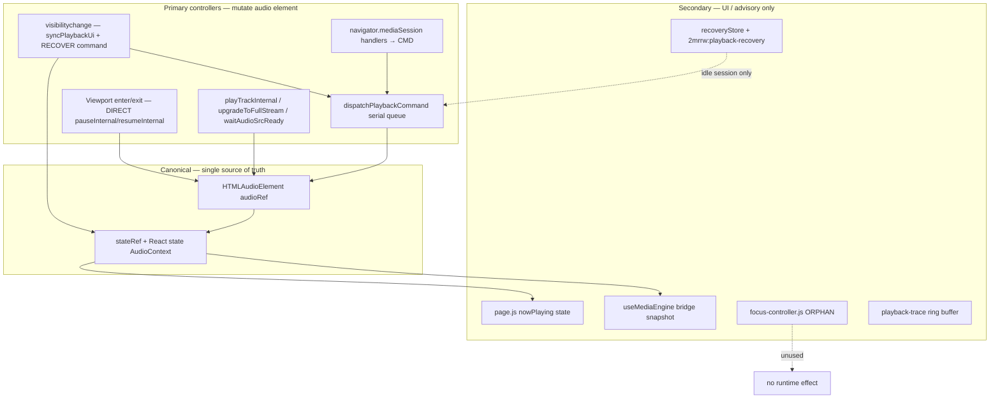

# Playback Controller Authority Graph

**HEAD:** `34df134` | **Audit:** Phase 7 read-only

---

## Authority hierarchy (who wins)

---

## Controller detail

### 1. AudioContext `stateRef` + React `state` — **owner of playback truth**

- **Owns:** `currentTrack`, `isPlaying`, `playbackState`, queue, CS mode, errors, stream conflict UI state.
- **Files:** `src/context/AudioContext.js` — `patchState`, `setState`, `stateRef` sync effect L1018–1033.
- **Exports:** `useAudioPlayer()` context value.

### 2. `dispatchPlaybackCommand` — **owner of user-intent serialization**

- **Owns:** ordering of play/pause/resume/seek/queue/stop/recover; `activeCommandRef`, watchdog, circuit breaker.
- **Does not own:** viewport pause/resume (bypass).
- **Entry points:** `playTrack`, `pause`, `resume`, `toggle`, `seek`, `playNext`, `playPrevious`, `stop`, visibility `RECOVER`.

### 3. Viewport controller (`enterAudioVisualViewport` / `exitAudioVisualViewport`) — **owner of AV-scroll policy**

- **Owns:** `wasPlayingBeforeViewportPauseRef`, `resumeEligibleRef`, `viewportPauseRef`, `isInAudioVisualViewportRef`.
- **Bypasses:** command queue (calls `pauseInternal` / `resumeFromViewport` → `resumeInternal` directly).
- **Triggered by:** `page.js` `AudioVisualsSection` IntersectionObserver + placeholder click.
- **Approved:** Phase 6B product behavior.

### 4. Visibility / lifecycle — **owner of background foreground reconciliation**

- **Owns:** `wasPlayingBeforeHideRef`, position persist on hide, stream meta prefetch.
- **On visible:** `syncPlaybackUiFromAudioElement`; may dispatch `PLAYBACK_COMMANDS.RECOVER` (queued).
- **Conflict:** concurrent with viewport resume (both may call play paths).

### 5. Stream resolver — **owner of `audio.src` for library streams**

- **Owns:** `streamMetaRef`, `activeStreamAbortRef`, signed URL refresh.
- **Triggered by:** `playTrackInternal`, `upgradeToFullStream`, `resumeInternal` refresh branch, visibility hide refresh.

### 6. Media Session — **owner of OS transport mapping**

- Maps hardware/lock-screen buttons → `pause`/`resume`/`seek`/`stop` (queued).
- Metadata from `updateMediaSession`.

### 7. Auth / entitlements — **owner of access metadata, not transport**

- **Owns:** `accountState`, `loading`, `useEntitlementAccountState()` EMPTY sentinel.
- **Influences:** track `metadata.access`, `upgradeToFullStream` on `entitlements:updated`.
- **Does not:** call `pause()` on refresh (verified Phase 5B; still true).

### 8. page.js shell — **owner of cinematic UI only**

- **Owns:** `nowPlaying`, modals, `tabKey`, carousel videos, YouTube iframe.
- **Must not be treated as:** playback authorization or transport state.

### 9. Recovery subsystem — **owner of persisted snapshot, conditional applier**

- `useSessionRecovery` → event → `AudioPhase10Bridge` → `setQueue` **only if** `!hasStarted && queue.length === 0`.
- `usePlaybackRecovery` persists; does not drive transport directly.

### 10. focus-controller.js — **no authority (dead code)**

- Module-level `activeFocus` / `snapshot`; superseded by AudioContext viewport refs.

---

## Call-path comparison (pause)

| Path | Function chain | Sets `userPausedRef`? | Sets `viewportPauseRef`? | Uses queue? |
|------|----------------|----------------------|--------------------------|-------------|
| User pause button | `pause` → `dispatch` → `pauseInternal({userInitiated})` | Yes | No | Yes |
| Media session pause | same | Yes | No | Yes |
| Viewport enter | `enterAudioVisualViewport` → `pauseForViewport` → `pauseInternal({fromViewport})` | No | Yes | **No** |
| Modal close | `closeFeatureModal` → `pause()` | Yes | No | Yes |
| Stop | `stopInternal` | Yes | Clears viewport | Via STOP command |
| Preview cap | `onTime` → `audio.pause()` | No | No | No |
| Src swap | `skipPauseInterruptionRef` + pause | No | No | No |

---

## Call-path comparison (resume)

| Path | Function chain | Uses queue? |
|------|----------------|-------------|
| User play / toggle | `resume` → `dispatch` → `resumeInternal` | Yes |
| Viewport exit | `exitAudioVisualViewport` → `resumeFromViewport` → `resumeTrackAtPosition` / `resumeInternal` | **No** |
| Visibility return | `dispatch(RECOVER)` → `resumeInternal` | Yes |
| onPause interrupt heal | `audio.play()` in `canplay` listener | **No** |
| Media session play | `resume` → queue | Yes |

---

## Recommended single-writer model (analysis only — no implementation)

For stability, all transport mutations should funnel through **one mutex** (the existing command queue) with viewport/visibility enqueuing `PAUSE`/`RESUME` variants that set the same refs. Current split (queue vs direct internal) is the primary architectural conflict at HEAD.
