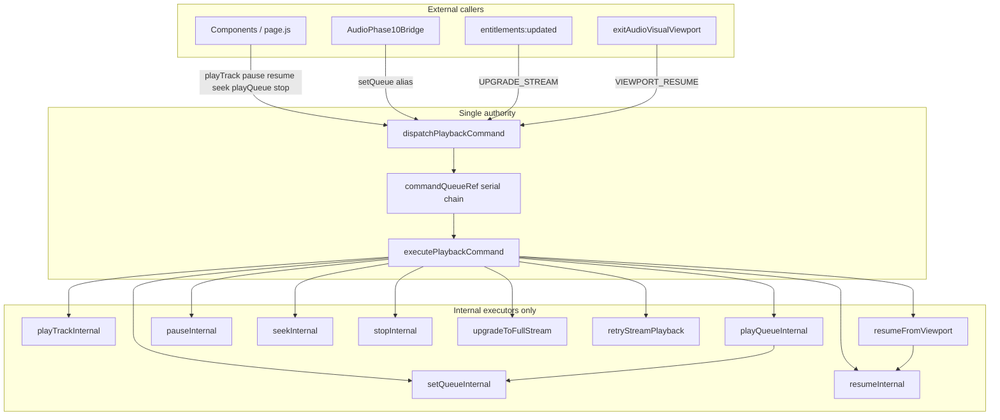

# Playback Authority Enforcement Map — Phase 8

## Authority tiers

| Tier | Role | May mutate `<audio>` / queue? |
|------|------|------------------------------|
| **1 — Command queue** | `dispatchPlaybackCommand` | Yes (serialized) |
| **2 — Element listeners** | `onPause`, `onPlay`, stall recovery | Reactive only; may call `dispatchPlaybackCommand(RECOVER)` |
| **3 — Viewport (6B)** | `enterAudioVisualViewport` / `exit` | Pause/resume via **Tier 1** (`VIEWPORT_*` commands) after Phase 8 |
| **4 — UI shadow state** | `page.js` `nowPlaying` | Display only — not authoritative |

## Enforcement mechanism

1. All new mutations should use `dispatchPlaybackCommand` or public wrappers.
2. `*Internal` functions log `[PLAYBACK-AUTH-VIOLATION]` when called with `commandExecutionDepthRef === 0` and trace enabled.
3. No runtime blocking — soft migration + observability only.
