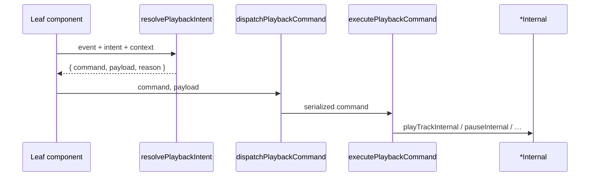

# Playback Intent Architecture — Phase 9

## Purpose

`src/lib/playback/resolve-playback-intent.js` maps **intent events** to recommended `dispatchPlaybackCommand` types without executing playback. Keeps Auth/account refresh read-only; UI handlers resolve then dispatch.

## Event types

| Event | Examples |
|-------|----------|
| `user_action` | play_track, play_queue, pause, resume, toggle, seek, stop, set_queue |
| `scroll_action` | viewport_pause, viewport_resume |
| `entitlement_event` | upgrade_stream, recover |
| `route_event` | stop_on_navigate, set_queue_restore |

## Flow



## Usage

```javascript
import { resolvePlaybackIntent, PLAYBACK_INTENT_EVENTS } from "@/lib/playback/resolve-playback-intent";

const resolved = resolvePlaybackIntent(
  PLAYBACK_INTENT_EVENTS.USER_ACTION,
  "play_queue",
  { tracks, startIndex: 0 }
);
if (resolved) {
  void dispatchPlaybackCommand(resolved.command, resolved.payload);
}
```

## AudioContext integration

- `entitlements:updated` → `dispatchPlaybackCommand(UPGRADE_STREAM)` (already Phase 8)
- Viewport exit → `VIEWPORT_RESUME` via command ref
- Intent resolver is optional for new UI; existing wrappers remain valid during soft migration
