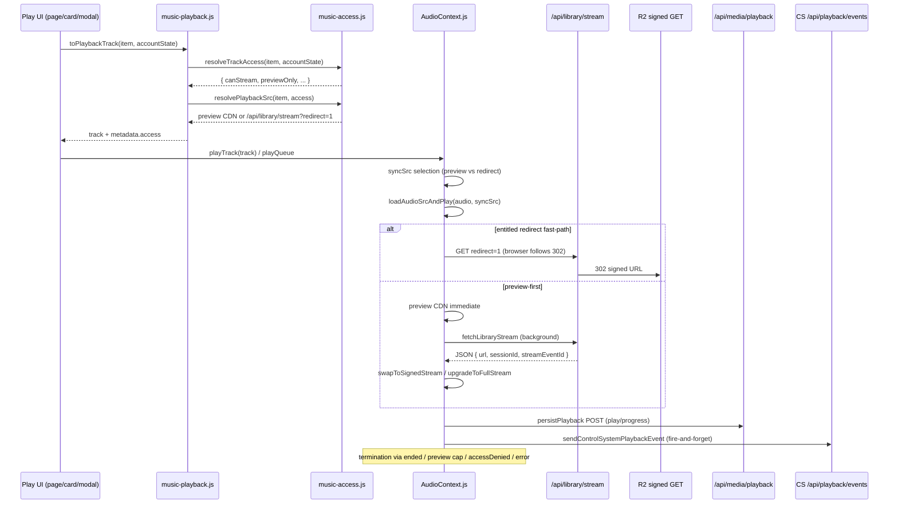

# Phase 1 — Playback Authorization Lifecycle

## Flow: play click → entitlement → stream grant → session → events → continuation → termination



## Entitlement resolution (client)

**File:** `src/lib/music-playback.js`

```10:46:src/lib/music-playback.js
export function toPlaybackTrack(item, accountState, source = "library", overrides = {}) {
  const access = resolveTrackAccess(item, accountState);
  // ...
  return {
    // ...
    src: resolvePlaybackSrc(item, access, { userId }),
    metadata: {
      access,
      // ...
    },
  };
}
```

**File:** `src/lib/music-access.js` — full-stream gate:

```175:200:src/lib/music-access.js
  const isSubscriber =
    subscriptionActive &&
    Boolean(accountState.subscriberActive) &&
    Boolean(permissions.subscriber);
  const canStreamFull = owned || isSubscriber || collectorCardOwner;
  // ...
  return {
    // ...
    previewOnly: !canStreamFull,
    canStream: canStreamFull,
```

**File:** `src/lib/music-access.js` — URL selection:

```214:227:src/lib/music-access.js
export function resolvePlaybackSrc(track, access, { userId } = {}) {
  if (access?.canStream && track.slug) {
    return libraryStreamRedirectSrc(track.slug);
  }
  const previewPath = track.preview || track.preview_path || track.previewPath;
  if (previewPath) {
    return catalogPreviewAudioUrl(previewPath);
  }
  return track.preview || track.src || track.audio || "";
}
```

## Entitlement validation (server)

**File:** `src/app/api/library/stream/route.js`

```40:46:src/app/api/library/stream/route.js
async function validateStreamEntitlement(user, slug) {
  const canStream = await userCanStreamProduct(user.id, slug, user);
  if (!canStream) {
    return NextResponse.json({ error: "Not entitled to stream this item" }, { status: 403 });
  }
  return null;
}
```

**File:** `src/lib/commerce/entitlements.js`

```94:122:src/lib/commerce/entitlements.js
export async function userCanStreamProduct(userId, productSlug, user = null) {
  if (!userId || !productSlug) return false;
  // admin, owned, membership OR collector
  const entitled =
    membershipHasPremiumAccess(membership) || collector.hasCollectorAccess;
  if (!entitled) return false;
  // digital product check
  return Boolean(product && isDigitalProduct(product));
}
```

**Client/server mismatch note:** Server `userCanStreamProduct` accepts active membership without requiring `permissions.subscriber`. Client `resolveTrackAccess` requires `subscriberActive && permissions.subscriber` for subscription path. Server may grant stream when client metadata still says `previewOnly`.

## playTrack src selection (AudioContext)

**File:** `src/context/AudioContext.js`

```1061:1071:src/context/AudioContext.js
    if (usesLibraryStream && streamSlug) {
      const entitledFullStream = Boolean(nextTrack.metadata?.access?.canStream);
      if (previewSrc && !entitledFullStream) {
        syncSrc = previewSrc;
        backgroundStreamResolve = true;
      } else if (redirectFastPath) {
        syncSrc = nextTrack.src;
      } else {
        backgroundStreamResolve = true;
      }
    }
```

| User state | First `audio.src` | Background resolve |
|------------|-------------------|--------------------|
| `canStream: false` | Preview CDN | `fetchLibraryStream` (usually 403) |
| `canStream: true`, redirect | `/api/library/stream?redirect=1` | None (unless non-redirect src) |
| `canStream: true`, non-redirect | Library stream URL | `resolveLibraryStreamForTrack` → `swapToSignedStream` |

## Session grant

**File:** `src/app/api/library/stream/route.js`

```58:79:src/app/api/library/stream/route.js
  if (!force) {
    const active = await findActiveStreamSession(admin, user.id, productId);
    if (active?.session_id) {
      await clearStreamSessionsForUserProduct(admin, user.id, productId);
    }
  }
  const sessionId = await createStreamSession(admin, user.id, productId);
  const streamEventId = await insertStreamEvent(admin, user.id, productId);
  const url = await getOrCreateStreamSignedUrl(user.id, slug, () =>
    createR2SignedGetUrl(resolved.key, STREAM_SIGNED_URL_TTL_SECONDS)
  );
```

Redirect fast-path (`redirect=1`) still runs session creation on each GET; JSON body includes `sessionId` / `streamEventId`. Redirect-only playback does **not** populate `streamMetaRef` in AudioContext until an explicit JSON fetch.

## Auth inputs to lifecycle

**File:** `src/context/AuthContext.js`

- Boot: Supabase session → `refreshAccountState()` or guest session
- `onAuthStateChange`: SIGNED_IN → `applySessionUser` → `refreshAccountState`
- `refreshAccountState` 401 → clears user + `EMPTY_ACCOUNT_STATE` (does **not** call `AudioContext.stop()`)

**File:** `src/app/page.js` — modal play deferred until auth ready:

```1106:1111:src/app/page.js
    if (authLoading) {
      modalPlaySlugRef.current = single.slug;
      return;
    }
    modalPlaySlugRef.current = null;
    if (playbackTrack?.src) void playTrack(playbackTrack);
```

## Code paths that can stop or reset playback

| Trigger | File:line | Effect |
|---------|-----------|--------|
| Preview 30s cap | `AudioContext.js:647-666` | pause, `currentTime=30`, `playbackState: ended_preview` |
| Native `ended` (full) | `AudioContext.js:690-775` | `playbackState: ending` → idle / next track after 2s |
| Stream ACCESS_DENIED | `AudioContext.js:866-876`, `1103-1117` | pause, `accessDenied: true` |
| Stream 401 + preview fallback | `AudioContext.js:837-863`, `1074-1100` | swap to preview, `previewOnly: true` |
| `stop()` | `AudioContext.js:1734-1764` | pause, clear src, reset state |
| `upgradeToFullStream` failure | `AudioContext.js:1391-1395` | `accessDenied` on ACCESS_DENIED only |
| Release card 2s upgrade | `ReleaseCardPlayButton.js:59-62` | calls `upgradeToFullStream()` |
| `entitlements:updated` | `AudioContext.js:1399-1408` | `upgradeToFullStream` if `previewOnly && isPlaying` |
| Device unplug | `AudioContext.js:914-920` | user pause |
| Stream error (exhausted retry) | `AudioContext.js:887-892` | pause, `streamRetryable: true` |

**Not a stop path:** `/api/playback/events` failure — see Phase 2.
