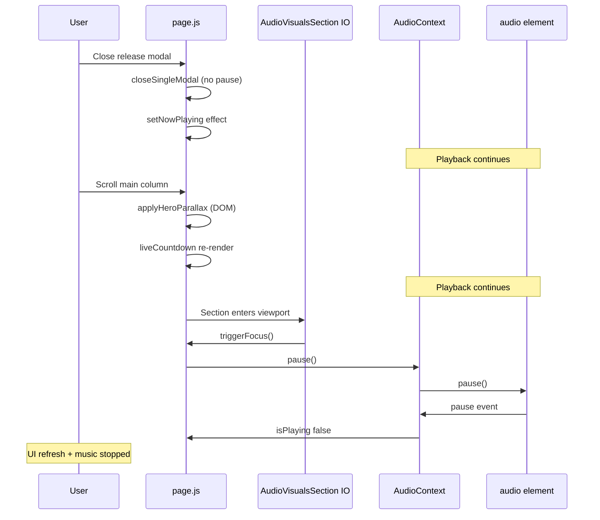

# Event Chain — Modal Close → Scroll → Playback Stop

**Reproduction:** Release modal (single/album path) → playback working → close modal → scroll → UI refresh + playback stopped  
**Mode:** READ-ONLY forensic trace  

---

## Phase A — Modal open & playback start (WORKING)

| # | Event | File:line | Notes |
|---|-------|-----------|-------|
| A1 | User taps catalog card | `CatalogGrid.js` L91–100 → `onCardClick` | Opens modal |
| A2 | `openSingleModal(single)` or `openAlbumModal(album)` | `page.js` L1272–1290 or L1341–1348 | Sets modal state |
| A3 | `playCanonicalCatalogItem` or `playAlbumTracks` | `page.js` L1196–1204, L1163–1184 | Builds playback track(s) |
| A4 | `playTrack` / `playQueue` dispatched | `AudioContext.js` L2904+, command queue | Single `<audio>` element |
| A5 | `audio.play()` succeeds | `AudioContext.js` play pipeline | `isPlaying: true`, `playbackState: "playing"` |
| A6 | Modal renders `ImmersivePreviewModal` / `AlbumModalView` | `ImmersivePreviewModal.js` L537–556, L832+ | Shares engine via `useMediaEngine` |
| A7 | `usePlayerBodyState({ modalOpen: true })` | `ImmersivePreviewModal.js` L520; `usePlayerBodyState.js` L19 | Body gets `modalOpen` class |
| A8 | `registerModal(...)` | `ImmersivePreviewModal.js` L522–524 | Modal stack tracking |

**State:** PLAYBACK WORKING ✓

---

## Phase B — Modal close (still WORKING for single/album)

| # | Event | File:line | Notes |
|---|-------|-----------|-------|
| B1 | User closes modal (tap backdrop / close) | `ImmersivePreviewModal.js` L552–556 → `onClose` | 340ms exit anim |
| B2 | `closeSingleModal()` or `closeAlbumModal()` | `page.js` L1368–1377 | Clears modal flags only — **no pause()** |
| B3 | `AnimatePresence` unmounts modal | `page.js` L1730–1806 | Modal tree removed |
| B4 | `usePlayerBodyState` cleanup | `usePlayerBodyState.js` L22–28 | Removes `modalOpen`, `navDim` body classes |
| B5 | `useEffect` — `shouldShowNowPlaying` true | `page.js` L1136–1150 | `setNowPlaying(currentTrack)` — mini player shell appears |
| B6 | `unregisterModal` | `ImmersivePreviewModal.js` L524 cleanup | Modal stack pop |

**Exception — feature modal path:**

| # | Event | File:line | Notes |
|---|-------|-----------|-------|
| B2′ | `closeFeatureModal()` | `page.js` L1334–1338 | **`pause()` called here** — FIRST BAD EVENT for feature path |
| B2″ | → `dispatchPlaybackCommand(PAUSE)` | `AudioContext.js` L2904 | Stops before scroll |

**State (single/album):** PLAYBACK STILL WORKING ✓  
**State (feature):** PLAYBACK STOPPED at B2′

---

## Phase C — First scroll (UI side effects begin)

| # | Event | File:line | Notes |
|---|-------|-----------|-------|
| C1 | `mainScrollRef` `scroll` event fires | `page.js` L803–809 | Passive listener |
| C2 | `applyHeroParallax(scrollTop)` | `page.js` L776–800 | **Direct DOM** — hero opacity/scale/filter; feels like refresh |
| C3 | (mobile, home tab) home-section IO callback | `page.js` L825–832 | May call `setHomeScrollSection(section)` → React re-render |
| C4 | (coincident) `liveCountdown` 1s tick | `page.js` L1078–1092 | `setLiveCountdown(...)` → full `Page()` re-render |
| C5 | Re-render propagates to catalog | `page.js` L1978–2103 | `CatalogGrid`, `LatestSinglesStyleRow` repaint — admin/gift/cover flash |

**State:** PLAYBACK STILL WORKING (single/album) — scroll alone does not pause ✓

---

## Phase D — Audio Visuals enters viewport (FIRST BAD EVENT — single/album)

| # | Event | File:line | Notes |
|---|-------|-----------|-------|
| D1 | `IntersectionObserver` fires `isIntersecting: true` | `page.js` L408–415 | Threshold 0.4 desktop / 0.5 mobile |
| D2 | `triggerFocus()` | `page.js` L383–391 | First time only (`firedFocusRef`) |
| D3 | **`onAudioVisualsFocused()` → `handleAudioVisualsFocused()`** | `page.js` L386–387, L760–762 | AV handoff hook |
| D4 | **`if (isPlaying) pause()`** | `page.js` L761 | **← FIRST BAD EVENT (playback)** |
| D5 | `dispatchPlaybackCommand(PAUSE)` | `AudioContext.js` L2904 | Queued command |
| D6 | `pauseInternal()` → `audioRef.current.pause()` | `AudioContext.js` L2557–2559 | Element pause |
| D7 | `audio` `"pause"` event → `onPause` | `AudioContext.js` L1096–1109 | `patchState({ isPlaying: false })` |
| D8 | `updateMediaSession(..., { playing: false })` | `AudioContext.js` L1112–1114 | Lock screen state |
| D9 | `setHasEntered(true)` (same IO callback) | `page.js` L390, L452–462 | YouTube iframe mounts — layout activity |
| D10 | YouTube `postMessage playVideo` (if re-enter) | `page.js` L412–414 | Only affects iframe, not global music |

**State:** PLAYBACK STOPPED ✗

---

## Phase E — Aftermath (symptoms, not causes)

| # | Event | File:line | Notes |
|---|-------|-----------|-------|
| E1 | `GlobalAudioPlayerBar` shows paused UI | `GlobalAudioPlayerBar.js` | Subscribes to `isPlaying` |
| E2 | `AmbientPlaybackBackground` may still show cover | `page.js` L1865–1871 | Condition uses `hasStarted`, not `isPlaying` |
| E3 | No auto-resume on scroll away from AV | `page.js` L416–418 | Only YouTube `pauseVideo` on exit |
| E4 | Track/time preserved on element | `AudioContext.js` pause path | Not `stopInternal` — user can tap resume |

---

## Causal diagram

---

## Line reference quick map

| Concern | Primary file:line |
|---------|-------------------|
| AV IO observer | `page.js` L408–421 |
| Pause hook | `page.js` L760–762 |
| Modal close (no pause) | `page.js` L1368–1377 |
| Modal close (pause) | `page.js` L1334–1338 |
| pause command | `AudioContext.js` L2904, L2557–2559 |
| onPause state sync | `AudioContext.js` L1096–1109 |
| Provider mount | `layout.js` L43–57 |
| Recovery guard | `AudioPhase10Bridge.js` L41–48 |
