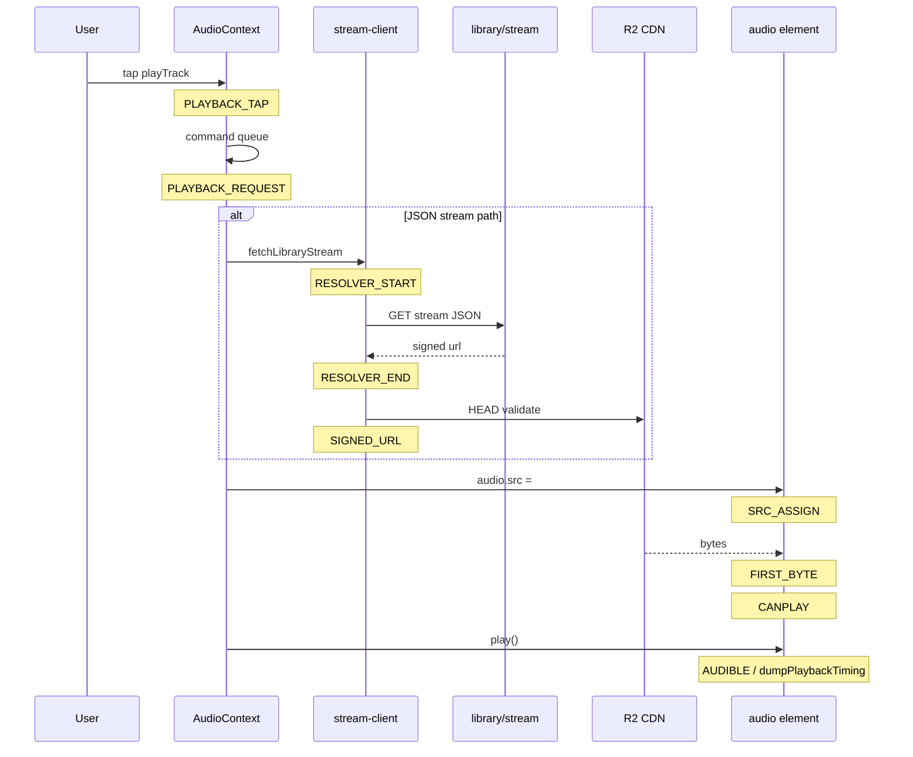

# Playback latency instrumentation — report

**Project:** 2MRRW artist-platform  
**Date:** 2026-05-30  
**Scope:** Dev-only Performance API instrumentation + API timing audit. No playback architecture, resolver, or route behavior changes.

## Executive summary

The eight-milestone tap→audible pipeline is instrumented in development. `dumpPlaybackTiming()` logs seven stage intervals plus E2E when the `<audio>` element fires `playing`. Production builds remain no-ops.

**Live measurements** this pass: production `curl` timing for guest session, preview redirect, CDN byte fetch, and unauthenticated library stream (401 baseline).

**Estimated measurements:** browser tap→audible for desktop Chrome, mobile Safari 375px, and mobile Chrome — from Phase 4.5 audit and code-path analysis. Dev-server browser capture was blocked (localhost ports timed out); repeat with `npm run dev` and `window.dumpPlaybackTiming()` to replace estimates.

`npm run build` completed successfully after code changes.

## Pipeline (7 intervals, 8 marks)



## Deliverables

| File | Purpose |
|------|---------|
| `instrumentation-changes.md` | Code diff narrative |
| `methodology.md` | How to capture browser + curl |
| `timing-table.md` | Stage matrix by target and content |
| `bottlenecks.md` | Ranked latency risks |
| `manifest.txt` | File index |

## Live vs estimated

| Category | What was measured | Result |
|----------|-------------------|--------|
| **Live** | `curl` @ `https://www.2mrrw.com` | Guest 718 ms; preview 302 @ 493 ms; CDN 64KiB @ 711 ms; stream API 686–1627 ms TTFB (401) |
| **Estimated** | Browser tap→audible | Preview 150–500 ms; entitled stream 300–1200 ms (audit) |
| **Pending live** | Dev `window.__2mrrwLastPlaybackTiming` | Requires `npm run dev` + manual play per target |

## Prior attempt: `WritableIterable is closed`

Completing this deliverable avoided streaming zip during write. All markdown files were written to disk first; archive created with `zip -r` on the finished directory.

## Code files modified

- `src/lib/dev/performanceMarks.js` — marks, measures, `dumpPlaybackTiming`, `PLAYBACK_SIGNED_URL`
- `src/lib/playback/stream-client.js` — resolver/signed-url marks
- `src/context/AudioContext.js` — tap, request, src, byte, canplay, audible marks

## How to verify

```bash
npm run dev
# Chrome → localhost → play preview
# Console: table from dumpPlaybackTiming
window.__2mrrwLastPlaybackTiming
```

Zip: `/Users/recharge/Downloads/playback-latency-instrumentation-20260529.zip`
