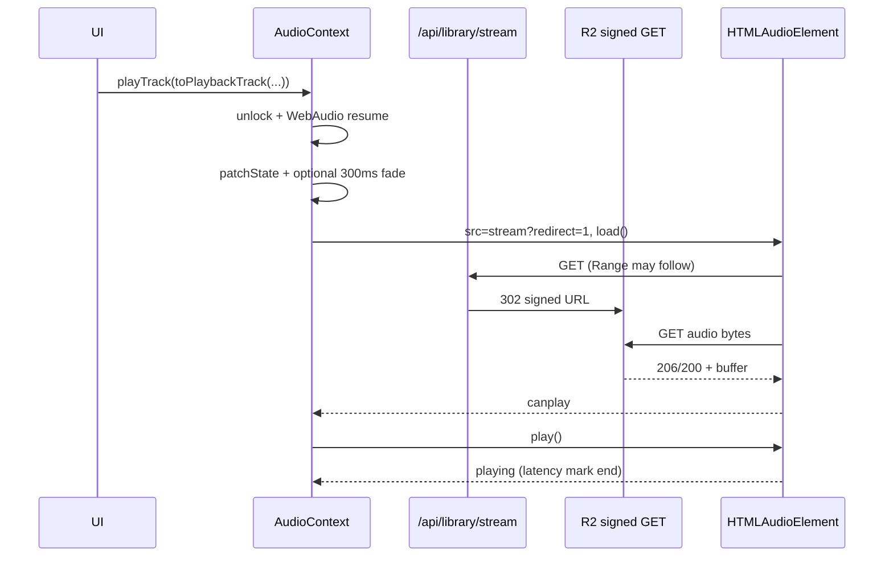

# 1. Complete playback flow map

## Architecture (single engine)

```
User tap (page.js / ReleaseCardPlayButton / ImmersivePreviewModal)
  → toPlaybackTrack() [music-playback.js + music-access.js]
  → playTrack() | playQueue() [AudioContext.js]
  → <audio ref> (one element, layout AudioProvider)
  → GlobalAudioPlayerBar / ImmersivePreviewModal via useMediaEngine bridge
```

## Hot path: `playTrack(track, options)` (entitled subscriber)

| Step | Location | Sync/async | Typical cost |
|------|----------|------------|--------------|
| 1 | `unlockAudioFromGesture` | await play/pause @ vol 0 | 0–50ms (Safari unlock) |
| 2 | `initWebAudio` + `resumeWebAudioContextIfSuspended` | await | 0–30ms |
| 3 | `normalizeTrack` + `resolvePlaybackPresentation` | sync | &lt;1ms |
| 4 | `preloadCoverImage` → ImagePipeline hint | sync kickoff | 0ms blocking; network parallel |
| 5 | `perfMark(AUDIO_START_LATENCY_START)` | sync | dev only |
| 6 | Stream routing: `syncSrc = /api/library/stream?slug=X&redirect=1` | sync | — |
| 7 | `patchState` (currentTrack, hasStarted) | sync + React commit | 1–16ms |
| 8 | `preloadCsAssets` (optional CS media) | sync + extra Audio/video | 0–200ms if CS assets |
| 9 | Cross-track fade (if switching while playing) | await up to **300ms** | 0–300ms |
| 10 | `loadAudioSrcAndPlay` → `waitAudioSrcReady` | await | **dominant** |
| 11 | `audio.play()` | await | after canplay |
| 12 | `updateMediaSession` (void) | async artwork preload | parallel post-play |
| 13 | `onPlay` listener: `/api/media/playback` POST, telemetry, RAF progress | async | non-blocking |

### `waitAudioSrcReady` (lines 89–108 AudioContext.js)

- Sets `audio.src`, calls `audio.load()`, resolves on `canplay` | `canplaythrough` | `error` | **3s timeout**.
- **Blocks `audio.play()`** until first buffer signal or timeout.
- Measured end: `playing` event → `perfMeasure("audio-start-latency")`.

## Hot path: guest / preview-only

| Step | Difference |
|------|------------|
| `resolvePlaybackSrc` | CDN URL via `catalogPreviewAudioUrl` (no `/api/library/stream`) |
| No server signing | Direct R2 public GET |
| `metadata.access.previewOnly` | 30s cap + fade in `timeupdate` |

## Hot path: entitled with `backgroundStreamResolve` (legacy non-redirect src)

Only when `isLibraryStreamSrc` **without** `redirect=1` and `canStream`:

1. Start playback on placeholder src (rare today — `resolvePlaybackSrc` always emits `redirect=1`).
2. Parallel `resolveLibraryStreamForTrack` → `fetchLibraryStream` JSON.
3. `swapToSignedStream` → **second** `waitAudioSrcReady` + seek preserve.

Current production path uses redirect fast path; double-load risk is mainly **error retry** and **upgradeToFullStream**.

## Server: `GET /api/library/stream?redirect=1`

```
Client GET (cookies)
  → getFanSessionUser | getGuestUser
  → userCanStreamProduct (Supabase entitlements)
  → resolveProductIdBySlug
  → clear/create stream_sessions + stream_events
  → resolvePlaybackKey (R2 object key)
  → getOrCreateStreamSignedUrl (8min in-process cache)
  → createR2SignedGetUrl (3600s TTL)
  → 302 Location: signed R2 URL (+ Range passthrough)
```

## Bottleneck map (ranked in report summary)

1. **waitAudioSrcReady** gates `play()` on network + decode (up to 3s fallback).
2. **Redirect chain** for entitled: API RTT + 302 + R2 TTFB (cold signed URL).
3. **Large preview assets** (feature WAV ~5–6.5MB vs single MP3 ~0.8–1.2MB).
4. **Cross-track fade** up to 300ms before load on track change.
5. **Media Session artwork** `await preloadArtwork` inside `updateMediaSession` (on `play` event path).
6. **Concurrent telemetry** deduped but still fetch on play/progress.
7. **Web Audio graph** init on first gesture (one-time).
8. **Modal open** (`page.js`): `playTrack` + `getControlSystemReleaseDetail` in parallel (detail fetch not blocking play).

## Mermaid: tap → sound (entitled)


