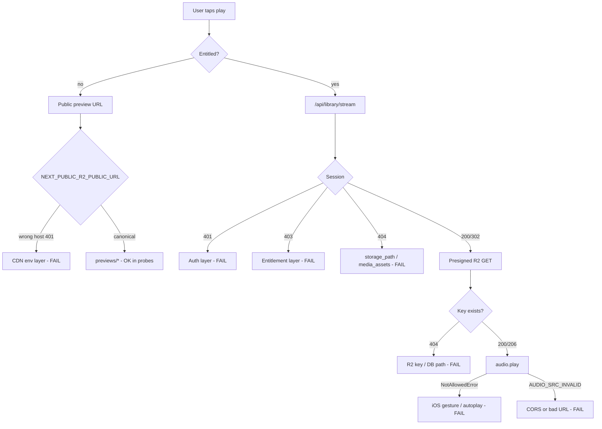

# R2 CORS + Media Source Validation Audit

**Date:** 2026-05-28  
**Scope:** Read-only — R2 CORS, signed URLs, media path resolution, audio init diagnostics, Range/streaming. **No playback orchestration changes.**

---

## Executive summary

On the canonical public R2 CDN (`pub-643e4a94e0184b1fabf6522cfbb16f75.r2.dev`), **CORS is correctly configured** for both `https://www.2mrrw.com` and `https://2mrrw.com` on public previews and on full masters under `digital-assets/singles/` (lowercase). **Range requests return 206** with exposed `Content-Range` headers. The codebase’s path normalization matches **live object keys** (lowercase `singles/`), not capitalized `Singles/`, `Features/`, or `Albums/` — probes to those capital paths return **404**.

Signed full-track playback was **not exercised live** (requires entitled session + R2 credentials), but the signing pipeline is wired correctly; failures below the CDN layer are most likely **401/403 entitlement**, **404 missing `storage_path`**, or **wrong `NEXT_PUBLIC_R2_PUBLIC_URL`** (legacy host returns **401**).

---

## 1. Is R2 CORS fully working?

**Yes — on the canonical public CDN host**, for storefront origins.

| Check | Result |
|-------|--------|
| GET `previews/hourglass-preview.mp3` + `Origin: https://www.2mrrw.com` | **200**, `Access-Control-Allow-Origin: https://www.2mrrw.com`, `Vary: Origin` |
| GET same + `Origin: https://2mrrw.com` | **200**, ACAO matches origin |
| OPTIONS preflight | **204**, `Access-Control-Allow-Methods: GET, HEAD`, `Access-Control-Allow-Headers: Range` |
| Range `bytes=0-1023` | **206**, `Content-Range` present, ACAO present |
| GET `digital-assets/singles/hour-glass/audio.mp3` (Range) | **206** + CORS |
| OPTIONS on master path | **204** + CORS |
| Legacy host `pub-992d4f5d…r2.dev` | **401** (no CORS useful — object inaccessible) |

Policy in repo (`docs/reports/r2-cors-policy-recommended.json`) matches observed behavior (GET/HEAD, Range header, expose Accept-Ranges/Content-Range).

**Caveat:** Presigned URLs use the **S3 API endpoint** (`CLOUDFLARE_R2_ENDPOINT`), not r2.dev. Bucket CORS must also allow storefront origins if the browser performs `fetch`/HEAD on signed URLs (`stream-client.js` does HEAD). Media-element playback of signed URLs often works without CORS; HEAD/fetch validation can still fail CORS if bucket policy is missing — **not probed** (no signing credentials in audit environment).

---

## 2. Do signed URLs successfully load?

**Not live-tested end-to-end** (no session cookie / service role in this pass). Code path is complete and consistent with prior signed GET reports.

### Generation flow

1. `GET /api/library/stream?slug=…` — `src/app/api/library/stream/route.js`
2. Auth: `getFanSessionUser()` ?? `getGuestUser()` → **401** if absent (confirmed: prod probe **401**)
3. Entitlement: `userCanStreamProduct` → **403** if denied
4. Key: `resolvePlaybackKey(admin, slug)` → `normalizePlaybackR2Key(storage_path)` — `src/lib/playback/resolve-playback-key.js`, `normalize-r2-key.js`
5. Sign: `createR2SignedGetUrl(resolved.key, TTL)` — `src/lib/storage/r2.js` (AWS SDK presigner)
6. Response: JSON `{ url, expiresIn }` or `redirect=1` → **302** to presigned URL (forwards client `Range` header on redirect only — **not** a byte proxy)

### Client validation

`fetchLibraryStream` → `assertSignedAudioUrl` (HEAD, `credentials: "omit"`) expects `audio/*` or `application/octet-stream`.

### What would 403 / 404 and why

| Status | Cause |
|--------|--------|
| **401** | No session |
| **403** | Not entitled to stream product |
| **404** | Product slug unknown; or no `storage_path` / no `media_assets` link after `resolvePlaybackKey` |
| **500** | Missing `CLOUDFLARE_R2_*`, signing failure, Supabase error |

E2E script: `scripts/test-library-stream-e2e.mjs` — optional live DB entitlement check + HTTP stream with `E2E_SESSION_COOKIE`.

---

## 3. Do media paths resolve correctly?

**Yes for seeded singles and features** when DB matches `src/lib/commerce/catalog.js` and migration `20260528071100_backfill_feature_storage_paths.sql`.

| Slug | DB `storage_path` | Resolved signed key | Public preview |
|------|-------------------|---------------------|----------------|
| `hour-glass` | `singles/hour-glass/audio.mp3` | `digital-assets/singles/hour-glass/audio.mp3` | `previews/hourglass-preview.mp3` |
| Features | `digital-assets/singles/{slug}/audio.wav` | unchanged | `previews/{slug}-preview.wav` |

`resolvePlaybackKey` also walks `products.content_id` → `tracks` → `release_media` / `media_assets` for Control System releases (albums).

See `path-resolution-matrix.md` for full table.

---

## 4. Are exact folder names respected?

**Partial mismatch with stated capital layout.**

| Folder (stated) | Code / migration | Live CDN probe |
|-----------------|------------------|----------------|
| `digital-assets/Singles/` | Uses `digital-assets/singles/` | Capital **404**, lowercase **206** |
| `digital-assets/Features/` | Features masters under `digital-assets/singles/` | Capital **404** |
| `digital-assets/Albums/` | Not in seed paths; albums via CS media | Not probed |
| `digital-assets/Mixtapes & EPs/` | No `src/` references | Inconclusive (listing probe) |

`buildR2Key` only joins prefix + path — **no case folding**. Wrong casing in DB → signed GET **404** at S3.

`catalogPreviewAudioUrl` maps `/audio/previews/foo.wav` → `previews/foo.wav` (no `digital-assets` prefix) — correct for public bucket layout.

---

## 5. Do audio elements initialize successfully?

### Code-level (`AudioContext.js`)

- Single `<audio>` with `crossOrigin="anonymous"` (line ~2842) — enables Web Audio / canvas paths; requires CORS on cross-origin media (public CDN provides ACAO).
- Load gate: `waitAudioSrcReady` → `audio.load()`; failures → `AUDIO_SRC_INVALID` / `AUDIO_SRC_READY_TIMEOUT`.
- `play()` rejection → `reportPlaybackDiagnostic` with code `AUDIO_PLAY_FAILED` or `AUDIO_RESUME_FAILED`; logs `error.name` / `error.message` (e.g. **`NotAllowedError`** = autoplay/gesture policy, **not** CORS).
- Stream errors → `[stream] playback error` + retry via `fetchLibraryStream` (`onError` handler ~1063).
- Diagnostics: `src/lib/playback/playback-diagnostics.js` — structured `[playback-diagnostic]` console payload.

### Live probes vs `<audio>`

| Source type | Probe | Implication for `<audio src>` |
|-------------|-------|-------------------------------|
| Public preview MP3/WAV | **200/206** + ACAO | Should load/play when URL is canonical CDN |
| Public master (lowercase path) | **206** on CDN | Object exists; entitled play uses signed URL, not public URL |
| Wrong CDN host | **401** | `audio.error` / silent failure if env points at `pub-992d4f5d…` |

CORS errors on media elements typically surface as `AUDIO_SRC_INVALID` (element error), not `NotAllowedError`.

---

## 6. Exact failing layer if playback still fails

Use this order:

**Most likely failing layers (from evidence):**

1. **CDN env** — `NEXT_PUBLIC_R2_PUBLIC_URL` set to non-public `pub-992d4f5d…` → **401** on all previews/covers.
2. **Entitlement / session** — stream API **401/403** before signing.
3. **DB path** — missing or wrong-case `storage_path` → signed **404**.
4. **Mobile autoplay** — `NotAllowedError` on `audio.play()` (diagnostic `AUDIO_PLAY_FAILED`), distinct from CORS.

**Unlikely primary cause:** R2 CORS on canonical host for public objects (proven working).

---

## 7. Range + streaming

| Layer | Range support |
|-------|----------------|
| Public CDN | **206** with `Accept-Ranges: bytes`, `Content-Range` exposed via CORS |
| `/api/library/stream` | Does not proxy bytes; `redirect=1` passes client `Range` header to **302** Location (S3 honors Range on presigned GET) |
| Content-Type | Probes: `audio/mpeg` (MP3), `audio/wav` (WAV previews) |
| `stream-client.js` | Validates audio content-type on HEAD of signed URL |

---

## Minimal remediation (only if issues persist)

1. **Vercel env:** Set `NEXT_PUBLIC_R2_PUBLIC_URL=https://pub-643e4a94e0184b1fabf6522cfbb16f75.r2.dev` (verify previews return **200**, not **401**).
2. **Do not** rewrite paths to `Singles/` / `Features/` unless objects are uploaded at those keys; keep lowercase `digital-assets/singles/` to match bucket.
3. **Features/albums 404 on stream:** Run seed/backfill; confirm `products.storage_path` and Control System `media_assets` for album slugs.
4. **Silent mobile preview:** Ensure tap handler calls `play()` in gesture; check console for `AUDIO_PLAY_FAILED` + `NotAllowedError`.
5. **Optional:** `R2_STREAM_DEBUG=1` on server to log R2 env presence in stream route (no secrets).
6. **Bucket CORS:** Apply `docs/reports/r2-cors-policy-recommended.json` on **both** public access and S3 API bucket settings if HEAD on presigned URLs fails in browser.

---

## Files referenced

- `src/lib/storage/r2.js` — `buildR2Key`, `createR2SignedGetUrl`, `getPublicR2Url`
- `src/app/api/library/stream/route.js` — entitlement + signing
- `src/lib/playback/stream-client.js` — HEAD validation of signed URL
- `src/lib/music-access.js` — `resolvePlaybackSrc`, `libraryStreamRedirectSrc`
- `src/lib/media-urls.js` — preview path mapping
- `src/lib/commerce/catalog.js` — canonical `storage_path` seeds

Raw probes: `curl-probes.txt`
