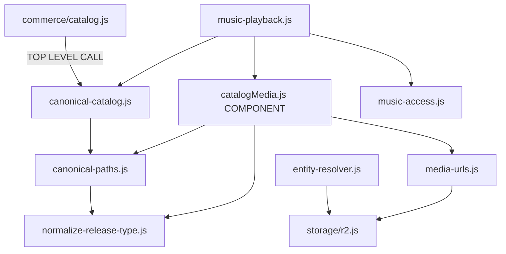
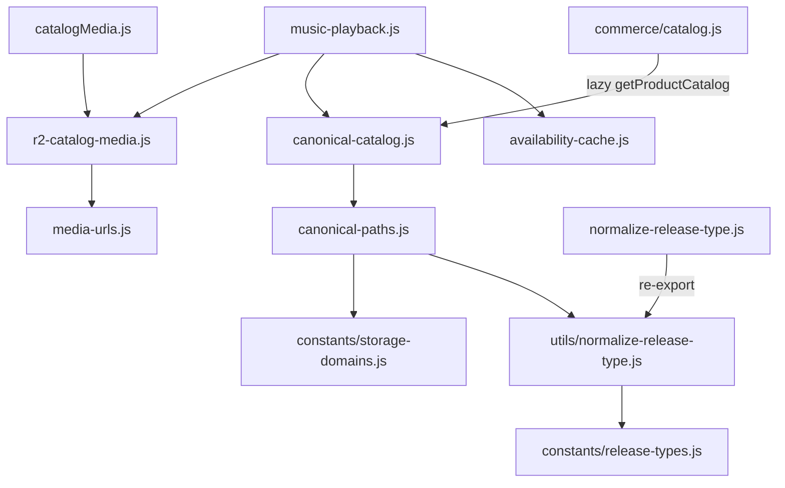

# Phase 1 — TDZ / Circular Dependency Audit

**Date:** 2026-05-28  
**Tool:** `npx madge --circular --extensions js,jsx src/` (321→326 files after fixes)

## Madge result

```
✔ No circular dependency found!
```

Madge reports **zero formal cycles**, but 162–166 path-resolution warnings (`@/` aliases not fully traced). Manual import-chain audit below identifies **init-order risks** that can still produce `ReferenceError: Cannot access uninitialized variable` during hydration.

---

## Scoped module inventory

| Module | Role |
|--------|------|
| `src/lib/media/*` | Canonical paths, catalog, resolver, availability |
| `src/lib/music-playback.js` | Client playback normalization |
| `src/lib/commerce/*` | Product catalog, entitlements |
| `src/components/home/catalogMedia.js` | Cover/display helpers (component layer) |
| `src/context/AudioContext.js` | Global audio player |
| `src/context/AuthContext.js` | Auth + account state |

---

## Risk chains found (before fix)

### Chain A — lib → component inversion (HIGH)

```
music-playback.js
  └─► components/home/catalogMedia.js   ← lib importing component
        ├─► lib/media/canonical-paths.js
        │     └─► lib/media/normalize-release-type.js
        ├─► lib/media-urls.js
        │     └─► lib/storage/r2.js
        └─► lib/media/release-date.js
```

**Risk:** Bundler evaluates `music-playback` before `catalogMedia` finishes init; any future back-import from catalogMedia to playback creates TDZ.

### Chain B — canonical catalog at boot (MEDIUM)

```
music-playback.js
  └─► lib/media/canonical-catalog.js
        └─► lib/media/canonical-paths.js
              └─► normalize-release-type.js
```

Lazy `indexCatalog()` inside functions — safe unless called at module top level elsewhere.

### Chain C — commerce eager init (HIGH — TDZ trigger)

```
lib/commerce/catalog.js
  const CANONICAL_DIGITAL = getCanonicalProductRows();  ← TOP LEVEL
    └─► canonical-catalog.indexCatalog()
          └─► enrichRelease() → canonical-paths.*
```

**Risk:** If `catalog.js` loads while `canonical-paths` or `normalize-release-type` bindings are still in TDZ, crash at import time.

### Chain D — entity-resolver (server-only, not in client playback path)

```
entity-resolver.js
  └─► lib/storage/r2.js (AWS SDK)
```

Used by: `media-availability.js`, `resolve-playback-key.js`, API routes.  
**Not imported by** `music-playback.js` or `AudioContext.js` ✓

### Chain E — AuthContext (clean)

```
AuthContext.js
  └─► lib/auth/constants.js
  └─► lib/supabase/auth-storage-key.js
```

No media/catalog imports ✓

### Chain F — AudioContext (clean of music-playback)

```
AudioContext.js
  └─► lib/media-urls.js (catalogPreviewAudioUrl)
  └─► lib/media/preload.js
  └─► lib/playback/stream-client.js
```

Does **not** import `music-playback.js` or `entity-resolver.js` ✓

---

## Prior fixes referenced

| Commit | Fix |
|--------|-----|
| `22af588` | availability-cache.js, release-date.js split |
| `cd7bf9b` | AppAuthRoot hydration guard |
| `24f5f9a` | auth readiness guards |

---

## Cycle diagram — BEFORE



## Cycle diagram — AFTER (target)



No lib → component edge. No top-level catalog init. Constants layer has zero imports.
