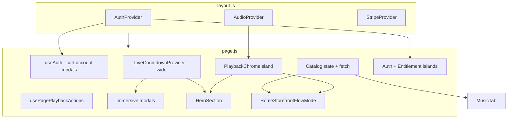

# Phase 17C — Pre-Implementation Review

**Date:** 2026-06-01  
**Repo:** `/Users/recharge/artist-platform`  
**Lineage:** Phase 17 render island audit, 17A (`d817d1e`), 17B (`fd20b34`), `RENDER_PROVIDER_LEAK_AUDIT.md`, checkpoint `checkpoint-20260601-1427`

---

## Executive summary

Phase 17C closes the remaining **production render architecture gaps** after 17A (home persistence) and 17B (playback/auth/entitlement islands). The dominant costs are still the monolithic `Page` reconcile path, **page-wide `LiveCountdownProvider`**, and **catalog `setState` on `Page`**. This pass narrows countdown blast radius, hardens island boundaries, optionally isolates catalog subscriptions, and documents conflict/regression surfaces before code changes.

**Score (pre-17C):** render isolation **6.5 / 10** → target **9 / 10** post-17C.

---

## Findings (current state)

| ID | Finding | Severity | Evidence |
|----|---------|----------|----------|
| F1 | `LiveCountdownProvider` wraps full `Page` return (modals, Stripe, mobile chrome) | P1 | `page.js` L1374–2339 |
| F2 | Catalog fetch `setState` on `Page` reconciles hero shell siblings | P1 | `page.js` L578–652, trace L456–468 |
| F3 | `useAuth()` remains on `Page` for cart/account/commerce | P2 (accepted) | `page.js` L276–288 |
| F4 | `useAudioPlayer` / `useEntitlementAccountState` removed from `Page` chrome path | ✅ 17B | `PlaybackChromeIsland`, surface islands |
| F5 | Home persistence + scroll restore | ✅ 17A | `data-home-storefront` `display:none`, scroll refs |
| F6 | IO bumps `homeNavSyncEpoch` on section change | ✅ 17A fix | `page.js` L500–502 |
| F7 | `setHomeScrollSection` stale call removed from `switchTab` | ✅ 17A | `switchTab` L1213+ |
| F8 | `useMediaEngine` on `Page` | ✅ removed | Phase 15B / leak audit |
| F9 | `HeroSection` only needs `isMobile` + `mobileHeroHeight` + refs | P2 | `HeroSection.js` L23–36 |
| F10 | `HomeStorefront` memo broken by unstable inline handlers | P2 partial | `handleDonateOpen` stable; catalog props churn |

---

## Dependency map

**External APIs (unchanged in 17C):** `/api/catalog/releases`, `/api/account/state`, Stripe checkout, Supabase auth.

---

## Provider map (render ownership)

| Layer | Owner | Subscribes | Re-render scope |
|-------|--------|------------|-----------------|
| `AuthProvider` | `layout.js` | session, library, entitlements | All `useAuth` consumers |
| `AudioProvider` | `layout.js` | playback `state` (not RAF time on value) | `useAudioPlayer` consumers |
| `PlaybackChromeIsland` | `page.js` | `useAudioPlayer` | Island + context for flow mode |
| `EntitlementSurfaceIsland` | per surface | `useEntitlementAccountState` | Island subtree only |
| `AuthSurfaceIsland` | per surface | `useAuth` admin slice | Island subtree only |
| `LiveCountdownProvider` | **page return (gap)** | 1 Hz snapshot | All provider descendants reconcile |
| `CatalogSurface` | **Page state (gap)** | fetch pages | Full `Page` today |

**Post-17C target:** countdown provider only on home countdown subtree + live tab; catalog provider/island so `Page` shell does not own `catalogLoading` ticks; `HeroIsland` documents hero-only props.

---

## Render ownership (targets T1–T10)

| Target | Owner after 17C |
|--------|-----------------|
| T1 Home persistence | `page.js` wrapper `data-home-storefront` (verify 17A) |
| T2–T4 Chrome hooks | `PlaybackChromeIsland`, surface islands — **no** `useAudioPlayer`/`useEntitlement` on `Page` |
| T5 Countdown | `HomeStorefront` + live tab local `LiveCountdownProvider` |
| T6 Hero | `HeroIsland` → `HeroSection` (`isMobile` only) |
| T7 Catalog | `CatalogSurfaceProvider` + `useCatalogSurface` in consuming subtrees |
| T8 Nav IO | `homeScrollSectionRef` + `setHomeNavSyncEpoch` on IO match |
| T9 Home memo | stable callbacks + catalog via context |
| T10 Playback/Stripe | no `AudioContext`/checkout edits |

---

## Risk matrix

| Risk | Likelihood | Impact | Mitigation |
|------|------------|--------|------------|
| Countdown UI missing provider | Med | High | Two scoped providers (home + live) same `targetDate` |
| Catalog context not available in modals | Low | Med | Keep `catalogPlaybackLookup` on `Page` via hook in same tree |
| Home tab scroll restore regression | Low | Med | Retain 17A refs/effects; manual tab QA |
| Hero video carousel desync | Low | Med | No change to `syncSinglesCarouselVideos` |
| Playback chrome bridge break | Low | High | No `AudioContext` edits; grep bridge |
| Stripe modal z-index/focus | Low | Med | No checkout logic changes |

---

## Conflict matrix summary

See `PHASE17C_CONFLICT_MATRIX.md` for full remount/regression matrix. Summary:

- **Safe:** narrow countdown, HeroIsland, catalog provider extraction, memo props.
- **Watch:** live tab countdown (second provider), album tracklist `catalogPlaybackLookup`.
- **Forbidden:** audio engine, Stripe payment paths, hero/catalog UX redesign.

---

## Implementation order

1. `CatalogSurfaceProvider` + hook (T7)  
2. Narrow `LiveCountdownProvider` (T5) — `HomeStorefront` + live tab  
3. `HeroIsland` (T6)  
4. Grep verify T2–T4, IO epoch T8, 17A T1  
5. `PHASE17C_PRODUCTION_VALIDATION.md` + build + guardrails + commit
