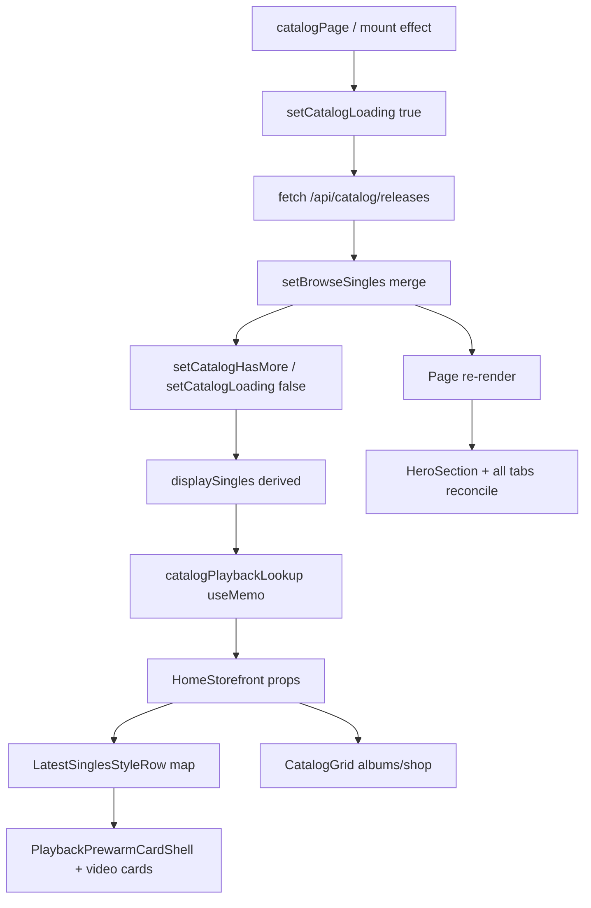
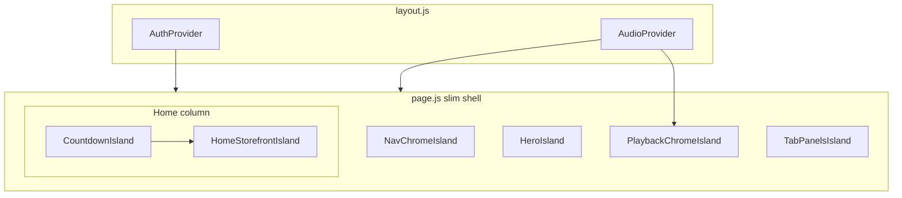

# Phase 17 — Render Island Audit

**Date:** 2026-06-01  
**Repo:** `/Users/recharge/artist-platform`  
**Scope (read-only):** `src/app/page.js`, `src/components/home/HomeStorefront.js`, `HeroSection.js`, `LiveCountdownContext.js`, `src/app/layout.js`, Auth/Audio consumers on `Page`  
**Lineage:** Phase 14C scroll/churn, `RENDER_PROVIDER_LEAK_AUDIT.md`, Phase 16 themes (stale `setHomeScrollSection`, LiveCountdown isolation, `HomeStorefront` tab gate, `useAudioPlayer` on `Page`, hero carousel sync)

---

## OVERALL SCORE CURRENT / TARGET

| Metric | Current | Target (post-islands) |
|--------|---------|------------------------|
| Render isolation (hero vs home vs playback) | **3.5 / 10** | **8 / 10** |
| Homepage “refresh” on tab return | **Poor** | Stable mount + scroll restore |
| Countdown 1 Hz impact on hero | **Good** (isolated consumers) | **Excellent** (provider below hero only) |
| Playback-driven full-`Page` churn | **Improved** (no `useMediaEngine` on `Page`) | **Good** (split playback shell) |
| Mobile home nav ↔ scroll section sync | **Partial** (ref-only IO) | **Good** (epoch or DOM-driven nav) |

**Net:** Phase 16 removed countdown state from `Page` and `useMediaEngine` from `Page`; the monolith, tab unmount, and context subscriptions remain the dominant cost.

---

## ROOT CAUSE RANKING (#1–5)

| Rank | Root cause | Confidence | Evidence |
|------|------------|------------|----------|
| **#1** | **Monolithic `Page` (~2.3k lines, 45+ `useState`)** — any state update reconciles hero, tab shell, modals parent, mobile chrome | **95%** | Single default export; hero + `data-tab-panel` siblings under same tree |
| **#2** | **`useAudioPlayer()` + `useAuth()` / `useEntitlementAccountState()` on `Page`** — discrete playback/auth patches re-render entire tree | **90%** | `page.js` L272–308, L286; `AudioContext` `value` depends on full `state` (L4511–4606) |
| **#3** | **`HomeStorefront` unmount when `activeTab !== "home"`** — remount replays videos, `catalog-card-enter` / `FeaturesRail` `opacity:0` animations | **88%** | `page.js` L1595–1642 |
| **#4** | **`LiveCountdownProvider` wraps full `Page` return** — 1 Hz re-render of provider subtree (mitigated by `memo`, not eliminated) | **75%** | `page.js` L1386–2337; `LiveCountdownContext.js` L29–49 |
| **#5** | **`syncSinglesCarouselVideos` + hero `<video>` DOM pause/play on carousel scroll** — hero flash during home scroll | **80%** | `page.js` L394–413, L668–693; `HeroSection.js` L37–55 |

**Regression / bug (P0):** `switchTab` still calls **`setHomeScrollSection(null)`** (L1226) but **no `useState` for `homeScrollSection` exists** — only `homeScrollSectionRef` (L393). IO writes ref only (L507–508). Likely **ReferenceError on tab switch** or dead code from incomplete Phase 16 cleanup.

---

## MOST LIKELY CAUSE OF HOMEPAGE “REFRESH” SYMPTOM

**Returning to the Home tab after visiting Music/Shop/etc.**

1. `{activeTab === "home" && <HomeStorefront … />}` **destroys** the home subtree on leave (L1595–1642).  
2. On return, **new mount**: carousel `<video>` elements restart, `LatestSinglesStyleRow` / `FeaturesRail` entrance animations run again, layout shifts (`mobileScrollPadding` may change if `nowPlaying` changed).  
3. **Not** primarily catalog refetch: catalog `useEffect` keys on `catalogPage` (L529–603), not `activeTab`.  
4. If user was **playing audio**, `nowPlaying` / `AmbientPlaybackBackground` / mini player padding updates add a second visual shift (L1377–1381, L1527–1534).

Secondary: any **`Page` re-render** during home scroll (auth, playback state, `setIsMobile`, `homeNavSyncEpoch` on tab change) re-renders **always-mounted `HeroSection`** (L1583–1590) even when user is scrolled past hero.

---

## STEP 1: Page state ownership table

**Context hooks (not `useState`):**

| Hook | Source | Triggers `Page` re-render when |
|------|--------|--------------------------------|
| `useAuth()` | `AuthContext` | `user`, `library`, `accountState`, `loading`, `sessionHydrated`, `entitlementSnapshotVersion`, … |
| `useEntitlementAccountState()` | `AuthContext` | Entitlement snapshot bumps |
| `useAudioPlayer()` | `AudioContext` | `patchState` → `state` identity change (`isPlaying`, `playbackState`, `currentTrack`, buffering, …) — **not** RAF `currentTime` on context value (`syncProgressTime` uses `stateRef`, L815–818) |

**`useState` on `Page` (grouped):**

| Domain | State keys | Notes |
|--------|------------|--------|
| Commerce | `cart`, `checkingOut`, `checkoutError`, `clientSecret`, `addedFlash` | Cart persisted L758–760 |
| Navigation | `activeTab`, `musicSubTab`, `expandedGroup`, `mobileNavOpen/Closing`, `mobileNavExpandedGroups`, **`homeNavSyncEpoch`** | Tab switch bumps epoch L518–523 |
| Modals / sheets | `previewModalOpen`, `selectedSingle`, `featureModal*`, `albumModal*`, `exclusiveModal`, `selectedEvent`, `blogPost`, `innerCirclePost`, `donateOpen`, `giftSheetRelease`, `membershipUpsellOpen`, … | Many drive `Page` + overlay tree |
| Hero / singles UI | `singleIndex`, `slideDir`, `animating`, `soundOn` | Music tab carousel |
| Radio / flow | `radioIndex`, `flowConversionActive`, **`nowPlaying`** | `nowPlaying` synced from `currentTrack` L790–809; drives `activeFlowMode`, mini player, padding |
| Catalog | `browseSingles`, `catalogPage`, `catalogHasMore`, `catalogLoading` | Fetch L529–603 |
| Content | `printfulProducts`, `printfulLoading`, `inventory`, `exclusiveCatalog`, `publicVault` | Tab-gated effects |
| Calendar / community | `calMonth`, `calYear`, `circle*`, `blogComment(s)` | Tab-scoped UI |
| Device / chrome | **`isMobile`**, `mobileCartOpen` | Resize L425–434 |
| Deep link | `giftHighlightSlug` | Session L1271–1276 |

**`useRef` (no React re-render):** `homeScrollSectionRef`, hero refs, `mainScrollRef`, `singlesRowRef`, scroll trace refs.

**`useEffect` count:** **28** on `Page`.

**Phase 16 delta (home scroll section):** IO updates **`homeScrollSectionRef` only** (L477–516); **`setHomeScrollSection` removed from IO** but **stale call remains** in `switchTab` (L1226). Nav reads ref via `isMobileNavTabActive` + `void homeNavSyncEpoch` (L1287–1295) — **IO does not bump epoch**, so mobile nav highlight for vault/cards/shows may stay stale until another `Page` render.

---

## STEP 2: Hero render trigger matrix

`HeroSection` is **`memo`**, mounted **above** `data-tab-panel`, **always** when `Page` renders (not gated by `activeTab`).

| Trigger | Re-renders `HeroSection`? | Mechanism |
|---------|---------------------------|-----------|
| `isMobile` / resize | **Yes** | Prop `isMobile`, `mobileHeroHeight` (L1377, L1583–1589) |
| `activeTab` change | **Yes** | Full `Page` re-render; props may be unchanged → memo **may** bail out |
| `useAudioPlayer` playback | **Yes** if `Page` re-renders | Memo bail if only unrelated state changed but same props |
| `nowPlaying` / mini player | **Indirect** | `mobileHeroHeight` not tied to `nowPlaying`; padding on parent `motion.div` changes (L1381) |
| LiveCountdown 1 Hz | **Unlikely** | `HeroSection` does not use `useLiveCountdown`; memo props stable if `Page` didn’t re-render |
| `syncSinglesCarouselVideos` | **No React** | Direct `heroVideoRef` pause/play (L406–410) — **GPU repaint / flash** |
| Scroll (parallax) | **Disabled** | Phase 14C comment L436 |

**Hero props (all from `Page`):** `isMobile`, `mobileHeroHeight`, `heroContainerRef`, `heroVideoRef`, `heroTextRef`, `heroSocialsRef` — refs stable; **only `isMobile` / `mobileHeroHeight` affect memo compare**.

---

## STEP 3: HomeStorefront island analysis

| Aspect | Assessment |
|--------|------------|
| **Boundary** | `memo(HomeStorefront)` — good leaf (`HomeStorefront.js` L19–348) |
| **Mount policy** | **Conditional** `activeTab === "home"` — **full unmount** off home |
| **Prop count** | **30+** props from `Page` (L1596–1641) |
| **Memo breakers** | Inline handlers: `onDonateOpen={() => setDonateOpen(true)}` (L1599); stable: `setFlowConversionActive`, `setSelectedEvent`, etc. |
| **Countdown** | Consumers inside storefront: `LiveCountdownDesktopPanel`, `LiveCountdownMobileHomeStrip`, `LiveCountdownHomeSection` — **1 Hz isolated to those subtrees** |
| **Catalog** | `displaySingles`, `catalogLoading`, `catalogPlaybackLookup` from parent — parent churn → new props → **HomeStorefront re-renders** even when mounted |
| **Heavy children** | `LatestSinglesStyleRow` (not memo), `CatalogGrid`, `FeaturesRail` (`opacity:0` + fadeIn), `RadioCarousel` (memo), `FlowState` (memo) |

**Verdict:** Extraction helped organization; **tab gate + unstable props** prevent a true “island.”

---

## STEP 4: LiveCountdownProvider blast radius (critical)

**Placement:** Inside `Page` return, wraps **entire** UI fragment (modals, layout, mobile chrome, CSS) — `page.js` L1386–2337.

```text
Page (re-renders on auth/playback/tab/state)
└─ LiveCountdownProvider (re-renders 1 Hz)
   ├─ HeroSection [memo]
   ├─ data-tab-panel
   │  └─ HomeStorefront [memo, tab-gated]
   │     └─ LiveCountdown* displays [useLiveCountdown → 1 Hz]
   ├─ Other tab panels (null when not active)
   ├─ Mobile nav / cart / modals
   └─ LiveCountdownLiveTab (live tab only)
```

| Subscriber | 1 Hz re-render? |
|------------|-----------------|
| `LiveCountdownMobileHomeStrip` | Yes |
| `LiveCountdownDesktopPanel` | Yes |
| `LiveCountdownHomeSection` | Yes |
| `LiveCountdownLiveTab` | Yes (live tab) |
| `HeroSection` | No (no context) |
| `Page` | No (provider is child of `Page`, not parent) |

**Issue:** Provider still **re-renders its child element tree** every second. React reconciles children; **`memo` on `HeroSection` / `HomeStorefront`** should skip if props unchanged. **Cost:** reconciliation walk + any non-memoized descendant under the same parent fragment.

**layout.js:** Does **not** include `LiveCountdownProvider` — only Auth/Audio/Stripe (`layout.js` L44–60). Countdown is **page-scoped**, not app-scoped.

**Improvement vs Phase 14C:** Countdown **removed from `Page` state** (`LiveCountdownContext.js` L26–28 comment).

---

## STEP 5: Catalog render cascade



| Stage | setState? | Blast radius |
|-------|-----------|--------------|
| Initial / page load | `catalogLoading`, `browseSingles` | Full `Page` |
| Load more | `catalogPage++` → fetch | Full `Page` |
| `displaySingles` change | Derived | Home row + lookup + radio enrichment |
| Tab away from home | Unmount `HomeStorefront` | Videos torn down |
| Tab back home | Remount | **Visible “refresh”** |

**Diagnostics:** `logUiChurn("catalog-rerender")` when `browseSingles` / `catalogLoading` changes (L463–475).

---

## STEP 6: Provider blast radius (ranked)

| Rank | Provider | Location | What updates | Who hurts on `Page` |
|------|----------|----------|--------------|---------------------|
| 1 | **AudioProvider** | `layout.js` L46 | `patchState` / `state` | `useAudioPlayer` on `Page` — hero, home, tabs |
| 2 | **AuthProvider** | `layout.js` L44 | session, library, account | `useAuth` + `useEntitlementAccountState` on `Page` |
| 3 | **LiveCountdownProvider** | `page.js` return | 1 Hz snapshot | Countdown UI + reconcile under provider |
| 4 | **AuthGateProvider** | layout | Mostly static | Low |
| 5 | **StripeProvider** | layout | Checkout | When `clientSecret` open |
| 6 | **SessionRecoveryRoot** | layout | Scroll recovery (window) | No direct `Page` state |

**Removed leak:** `useMediaEngine` on `Page` (per `RENDER_PROVIDER_LEAK_AUDIT` — **no longer present**).

---

## STEP 7: Render island design

**Proposed islands:**

| Island | Owns | Subscribes to | Sits under |
|--------|------|---------------|------------|
| **HeroIsland** | Hero MP4, socials | `isMobile` only (narrow context) | Above scroll / outside countdown |
| **CountdownIsland** | `LiveCountdownProvider` + strips | Internal 1 Hz | Inside home column only |
| **HomeStorefrontIsland** | Catalog rows, radio, AV | Catalog + entitlements slice | `activeTab` display:none or persistent mount |
| **PlaybackChromeIsland** | Mini player, ambient bg | `useAudioPlayer` subset | Sibling, not parent of catalog |
| **TabPanelsIsland** | Music/shop/vault tabs | Tab id + lazy data | Separate from hero |



**Key moves:**  
1. Move `LiveCountdownProvider` to wrap **only** countdown + optional live strip — not modals/global chrome.  
2. Keep `HomeStorefront` **mounted** (`hidden` / `content-visibility`) on tab switch.  
3. Split `Page` into `HomeRoute` + `usePlaybackChrome()` so catalog doesn’t subscribe to `isPlaying` ticks.

---

## STEP 8: Impact scores and % reduction estimates

| Change | Est. full-Page re-renders cut | Est. home “refresh” fix | Effort |
|--------|------------------------------|-------------------------|--------|
| Remove stale `setHomeScrollSection` + fix nav epoch on IO | — | — | **S** (bugfix) |
| Persist `HomeStorefront` mount (`display:none`) | 0% on other tabs | **60–80%** perceived refresh | **M** |
| Move `LiveCountdownProvider` under home column only | **~5%** reconcile CPU | Low | **S** |
| Playback chrome split (no full `useAudioPlayer` on catalog parent) | **25–40%** during playback | Low | **L** |
| Stable callbacks / `useMemo` props to `HomeStorefront` | **10–20%** when `Page` does render | Medium flash reduction | **M** |
| `HeroIsland` + ref-based carousel sync moved inside hero | **15–25%** scroll paint | **30–50%** hero flash | **M** |
| Remove `FeaturesRail` / card `opacity:0` on parent re-render | — | **20%** flash on churn | **S** |

**Cumulative (P0+P1):** ~**40–55%** fewer unnecessary subtree commits during typical home + playback session; **60–80%** improvement on tab-return “refresh” if mount persisted.

---

## STEP 9: P0–P3 execution plan (no implement)

### P0 — Correctness / highest symptom
1. **Delete or replace `setHomeScrollSection(null)`** in `switchTab` (L1226); align with ref-only IO.  
2. On home section IO match, **`setHomeNavSyncEpoch(n => n+1)`** (or subscribe nav to ref via layout effect) so mobile nav highlights vault/cards/shows.  
3. **Persist `HomeStorefront`** across tabs (`hidden` + preserve scroll) — primary fix for “homepage refresh.”

### P1 — Render islands
4. Narrow `LiveCountdownProvider` to countdown descendants only (not full page fragment).  
5. Extract **PlaybackChromeIsland** (`nowPlaying`, mini player, `AmbientPlaybackBackground`) — slim `Page` subscription.  
6. Stabilize `HomeStorefront` props (`useCallback` for `onDonateOpen`, etc.).

### P2 — Scroll / media churn
7. Coalesce **hero video** control with `syncSinglesCarouselVideos` (debounce, avoid play/pause fight).  
8. Replace **fadeIn `opacity:0`** on catalog cards with CSS that doesn’t reset on parent re-render (`FeaturesRail.js` L17).  
9. Optional: **`content-visibility`** on below-fold home sections.

### P3 — Structural
10. Split `page.js` into route-level segments (`HomeShell`, `MusicTab`, …) with shared layout.  
11. Entitlement context slice for card rows only.  
12. Instrument: render reason tags (`playback` | `auth` | `tab` | `catalog`).

---

## Phase 16 follow-through checklist

| Theme | Status in repo |
|-------|----------------|
| Stale `setHomeScrollSection` | IO → ref **done**; **`switchTab` call stale / broken** |
| LiveCountdown blast | Provider **inside Page return** — consumers isolated, wrapper still wide |
| HomeStorefront unmount on tab | **Still `activeTab === "home"`** |
| `useAudioPlayer` on Page | **Still full hook** |
| Hero carousel sync | **Still `syncSinglesCarouselVideos`** on home tab |
| `useMediaEngine` on Page | **Removed** (improvement) |

---
