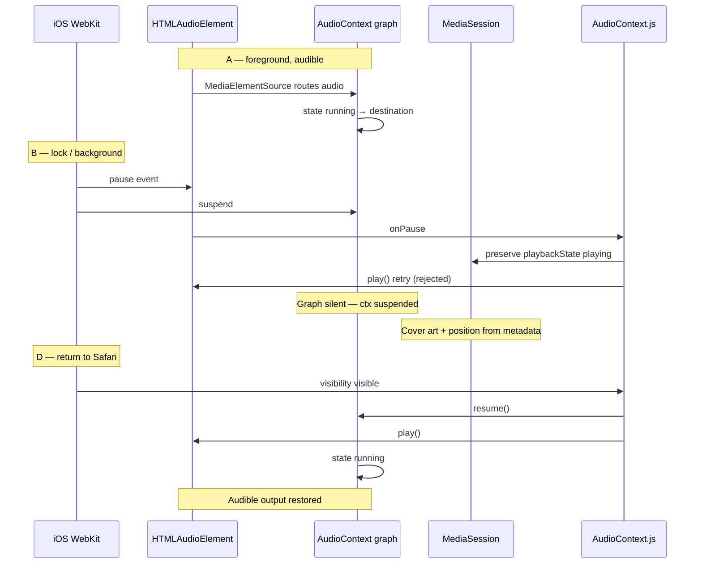

# Phase 21 — Audible output divergence forensic audit

**Date:** 2026-06-01  
**Mode:** Audit only (read-only analysis + observation trace hooks). No fixes, no PlaybackStateMachine changes, no `recoverAudioHard` behavior changes.  
**Baseline:** Phase 20C (`bfef7cb`)  
**Prior audits read:** `PHASE19_TRUE_BACKGROUND_AUDIO_CONTINUITY.md`, `PHASE20B_PLAYBACK_SUBSYSTEM_REHYDRATION_FORENSIC_AUDIT.md`, `PHASE20C_LIFECYCLE_RECOVERY_ELIMINATION.md` (PHASE20D not present in repo).

---

## Executive summary

| Field | Answer |
|--------|--------|
| **Root cause (one-liner)** | WebKit suspends the **Web Audio output graph** (`AudioContext.state → suspended`) and OS-pauses `HTMLMediaElement` on lock/background, while **Media Session is deliberately kept `playing`** — transport (`src`) stays intact so **state looks active but the MediaElementSource→destination path produces no sound**. |
| **Primary subsystem (exact object)** | **`AudioContext` Web Audio graph** — `createMediaElementSource(audio)` in `initWebAudio` routes all audible output through `source → analyser → stereoPanner → bassFilter → ctx.destination`; when `ctx.state !== "running"`, output is silent even if metadata/session state says playing. |
| **Q8 silence cause** | **Suspended AudioContext** (primary) + **OS-paused HTMLAudioElement** (secondary), with **Media Session mismatch** (intentional preserve) — not invalid stream, not graph disconnect, not entitlement refresh, not source swap (unless hard recovery escalates). |

---

## Observed divergence

| Layer | During background (silent) | On Safari return |
|-------|---------------------------|------------------|
| Media Session | `playbackState: playing`, metadata + position | Synced to actual element state |
| HTMLAudioElement | `paused: true` (OS) | `play()` succeeds → `paused: false` |
| AudioContext | `state: suspended` | `resume()` → `running` |
| Transport (`src`) | Intact | Intact |
| React `isPlaying` | `false` (cleared on OS pause) | Restored via lightweight resume |
| Audible output | **Silent** | **Restored** |

---

## Timeline A → B → C → D

### A — Immediately before lock (audible, foreground)

| Signal | Expected state | Citation |
|--------|----------------|----------|
| `HTMLAudioElement.paused` | `false` | `onPlay` sets playing state — `AudioContext.js:onPlay:1723` |
| `AudioContext.state` | `running` | `ensureWebAudioRunning` gate — `AudioContext.js:ensureWebAudioRunning:501` |
| `isAudioActuallyAudible` | `true` | Requires `!paused`, `readyState ≥ 2`, `ctx.state === running`, time advancing — `audibility.js:isAudioActuallyAudible:102` |
| `mediaSession.playbackState` | `playing` | `updateMediaSession` — `AudioContext.js:updateMediaSession:1365` |
| Transport | Intact (`src` bound) | `hasIntactPlaybackTransport` — `AudioContext.js:hasIntactPlaybackTransport:426` |
| Output path | MediaElementSource → graph → destination | `initWebAudio` + `connectWebAudioDownstream` — `AudioContext.js:initWebAudio:1423`, `connectWebAudioDownstream:1402` |

### B — Immediately after lock (silent begins)

| Signal | Expected state | What changed first |
|--------|----------------|-------------------|
| **First change** | iOS WebKit **`pause` event** on detached `<audio>` | `onPause` handler — `AudioContext.js:onPause:1749` |
| `HTMLAudioElement.paused` | `true` | OS-initiated pause; `onPause` runs — `AudioContext.js:onPause:1749` |
| `AudioContext.state` | `suspended` (WebKit background policy) | Checked in health/audibility — `AudioContext.js:evaluateLifecyclePlaybackHealth:872`, `audibility.js:isAudioActuallyAudible:105` |
| `isAudioActuallyAudible` | `false` | Paused element OR suspended ctx — `audibility.js:isAudioActuallyAudible:103-105` |
| `mediaSession.playbackState` | **Still `playing`** (preserved) | `preserveLockScreenPlaying` — `AudioContext.js:onPause:1828-1833` |
| Transport | **Still intact** | `hasIntactPlaybackTransport` unchanged — `AudioContext.js:hasIntactPlaybackTransport:426` |
| React `isPlaying` | `false` | `patchState` on pause — `AudioContext.js:onPause:1824` |
| `playbackIntentBeforeHideRef` | `true` | Intent capture — `AudioContext.js:onPause:1767` |
| OS `play()` retry | Rejected (background) | `audio.play().catch` — `AudioContext.js:onPause:1790-1793` |
| Hard recovery | **Suppressed** (Phase 20C) | Transport intact + lifecycle intent — `AudioContext.js:recoverAudioHard:3211-3218`, `runCoalescedLifecycleRecovery:3643-3653` |

**Phase 21 trace (when `NEXT_PUBLIC_PLAYBACK_TRACE=1`):** `BACKGROUND_AUDIO_SILENCE_DETECTED` fires when `playbackIntent || ms.playing` but `isAudible === false` — `playback-trace.js:captureAudibleOutputSnapshot`.

### C — Immediately after phone unlock (may still be off-Safari)

| Signal | Expected state | Notes |
|--------|----------------|-------|
| Document visibility | May still be `hidden` if user unlocked phone but did not foreground Safari | `isDocumentPlaybackHidden` — `AudioContext.js:isDocumentPlaybackHidden:418` |
| `lifecycleInBackgroundRef` | May remain `true` until `visibilitychange → visible` | Set on hidden — `AudioContext.js:onVisibility:4848` |
| Element + ctx | Likely still paused + suspended | No user gesture yet for `ctx.resume()` — `AudioContext.js:resumeWebAudioContextIfSuspended:491` |
| Media Session | Still shows playing + last position | Metadata persisted independently — `AudioContext.js:updateMediaSession:1359-1376` |
| `currentTime` | **Frozen** while paused | `updateAudibilitySample` skips when paused — `audibility.js:updateAudibilitySample:34` |

### D — Immediately after returning to Safari (audible restored)

| Signal | Expected state | Mechanism |
|--------|----------------|-----------|
| `visibilitychange → visible` | `lifecycleInBackgroundRef = false` | `AudioContext.js:onVisibility:4894` |
| Lightweight resume | `initWebAudio` + `ctx.resume()` + `audio.play()` | `attemptLightweightPlaybackResume` — `AudioContext.js:attemptLightweightPlaybackResume:1487` |
| Hard recovery | **Skipped** when transport intact (Phase 20C) | `AudioContext.js:onVisibility:4929-4942` |
| Audible output | Restored | Graph running + element playing — `audibility.js:isAudioActuallyAudible:102` |
| Position | Resumes from frozen `currentTime` | No src reload on intact transport |
| Media Session | Re-synced | `syncMediaSessionAfterLifecycle` — `AudioContext.js:syncMediaSessionAfterLifecycle:1387` |



---

## Subsystem audit

### HTMLAudioElement

| Property | Lock/background role | Citation |
|----------|---------------------|----------|
| `paused` | OS sets `true` on lock — primary audibility gate | `audibility.js:isAudioActuallyAudible:103`, `onPause:1749` |
| `ended` | Unchanged during lock | `hasIntactPlaybackTransport:428` |
| `muted` / `volume` | Not mutated on lifecycle | Detached element — `audio-engine-runtime.js:ensureDetachedAudioElement:75-86` |
| `readyState` | Typically `≥ 2` (HAVE_CURRENT_DATA) — transport valid | `audibility.js:isAudioActuallyAudible:104` |
| `currentTime` | **Frozen while paused** — position preserved, not advancing | `audibility.js:updateAudibilitySample:34` |
| `src` / `currentSrc` | **Intact** — no teardown on lifecycle (Phase 20C) | `hasIntactPlaybackTransport:426-430` |

### AudioContext (Web Audio)

| Concern | Lock/background behavior | Citation |
|---------|-------------------------|----------|
| `state` | Becomes `suspended` — **blocks all graph output** | `audibility.js:isAudioActuallyAudible:105` |
| `resume()` | Requires foreground/gesture on Safari | `resumeWebAudioContextIfSuspended:491-498` |
| Graph lifecycle | **Not torn down** on lifecycle (only on hard recover) | `initWebAudio:1423`, `recoverAudioHard:3258-3267` |
| Output path | `MediaElementSource → analyser → panner → filter → destination` | `connectWebAudioDownstream:1402-1415` |

**Critical Web Audio fact:** After `createMediaElementSource(audio)` (`AudioContext.js:1449`), element audio is routed **only** through the Web Audio graph. Suspended `AudioContext` = **zero speaker output** regardless of element play state.

### Media Session

| Concern | Behavior | Citation |
|---------|----------|----------|
| `playbackState` | **Kept `playing`** on OS interrupt | `onPause:1828-1833`, `updateMediaSession:1365` |
| Metadata / artwork | Independent of audibility — survives | `updateMediaSession:1359-1364`, `persistMediaSessionTrack:1371` |
| Position | `setPositionState` from last element time | `syncPositionState:1308-1316` |
| Handlers | Unchanged on lock | Media session effect ~L4380+ (Phase 20B) |

### Audio transport

| Check | Lock/background | Citation |
|-------|-----------------|----------|
| `hasIntactPlaybackTransport` | `true` | `AudioContext.js:426-430` |
| `evaluatePlaybackTransportHealth` | `transport_intact` | `AudioContext.js:439-453` |
| Signed URL refresh | Optional async on hidden — does not swap `src` unless expired | `onVisibility:4868-4890` |
| `recoverAudioHard` | **Blocked** when transport intact + lifecycle interrupt | `recoverAudioHard:3185-3218` |

---

## Q1–Q8 (file:function:line)

| # | Question | Answer |
|---|----------|--------|
| **Q1** | At silence moment, what changed first? | **iOS WebKit `pause` event on `HTMLAudioElement`** — `AudioContext.js:onPause:1749` (concurrent with or immediately before `AudioContext` suspend). |
| **Q2** | HTMLAudioElement still "playing" state? | **No** — `paused === true` after OS pause. Element is not in playing state; React `isPlaying` cleared — `AudioContext.js:onPause:1824`. |
| **Q3** | AudioContext suspended? | **Yes** — `ctx.state === "suspended"` in background; audibility gate — `audibility.js:isAudioActuallyAudible:105`, health check — `AudioContext.js:evaluateLifecyclePlaybackHealth:872`. |
| **Q4** | `currentTime` advancing while silent? | **No** (typical) — sample updates skipped when paused — `audibility.js:updateAudibilitySample:34`. Position appears preserved on lock screen via last `setPositionState`, not live advancement. |
| **Q5** | `mediaSession.playbackState` still playing? | **Yes** — intentionally preserved — `AudioContext.js:onPause:1828-1833`, trace — `logLockscreenMediaSessionActive:1834-1837`. |
| **Q6** | Transport valid? | **Yes** — `hasIntactPlaybackTransport` true; `evaluatePlaybackTransportHealth` returns `transport_intact` — `AudioContext.js:426-430`, `439-453`. |
| **Q7** | Can audio restore without `recoverAudioHard`? | **Yes** — `attemptLightweightPlaybackResume` (`AudioContext.js:1487-1524`): `initWebAudio` + `resumeWebAudioContextIfSuspended` + `audio.play()` with no `src` teardown. Used on `visibility_return` — `AudioContext.js:onVisibility:4929`. |
| **Q8** | Silence cause | **Suspended AudioContext (Web Audio graph output path)** + **OS-paused HTMLAudioElement**, with **Media Session mismatch** (deliberate `playing` preserve). Not: invalid stream, graph disconnect, entitlement refresh, or source swap (unless hard recovery escalates on genuine failure). |

---

## Why cover art survives while audio disappears

1. **Media Session metadata** (`title`, `artist`, `artwork`) is written to `navigator.mediaSession.metadata` and persisted via `persistMediaSessionTrack` — independent of Web Audio graph state (`AudioContext.js:updateMediaSession:1359-1376`).
2. On OS pause, **`preserveLockScreenPlaying`** keeps `playbackState: "playing"` so lock-screen controls remain active (`AudioContext.js:onPause:1828-1833`).
3. **Position** comes from last `syncPositionState` / frozen `currentTime` — not from live audibility (`AudioContext.js:syncPositionState:1308-1316`).
4. Cover art URLs are resolved asynchronously and cached — no dependency on `AudioContext.state`.

---

## Why return to Safari restores playback immediately

1. **`visibilitychange → visible`** clears background flag and runs transport-intact path (`AudioContext.js:onVisibility:4893-4942`).
2. **`attemptLightweightPlaybackResume`** runs in foreground context where `ctx.resume()` and `audio.play()` succeed (`AudioContext.js:1487-1524`).
3. **No `src` reload** required — transport intact, position preserved on element (`hasIntactPlaybackTransport:426`).
4. **`syncMediaSessionAfterLifecycle`** aligns session state with actual element (`AudioContext.js:1387-1399`).
5. Phase 20C **suppresses `recoverAudioHard`** for lifecycle-only interrupts — no stream/graph teardown delay.

---

## Smallest possible fix plan (no implementation)

| Priority | Action | Rationale |
|----------|--------|-----------|
| **P0** | Confirm on device with `NEXT_PUBLIC_PLAYBACK_TRACE=1`: expect `BACKGROUND_AUDIO_SILENCE_DETECTED` at B with `ctxState: suspended`, `elementPaused: true`, `hasIntactTransport: true` | Validates audit without code changes |
| **P1** | On `visibility_hidden`, attempt **`resumeWebAudioContextIfSuspended` + `audio.play()`** before OS fully suspends (already best-effort — `AudioContext.js:onPause:1790`, `onVisibility:4856`) | May reduce silence window; iOS may still reject |
| **P2** | Evaluate **fallback direct element output** when `ctx.state !== "running"` and lifecycle intent set (bypass graph temporarily) | Addresses MediaElementSource exclusive routing; requires careful analyser/EQ tradeoff |
| **P3** | Align **Media Session `playbackState`** with audibility truth (paused when silent) OR expose in-app "interrupted" state | Removes user confusion; lock-screen UX tradeoff |
| **P4** | Do **not** expand hard recovery on lifecycle return when transport intact (Phase 20C already correct) | Avoids src reload that makes silence worse |
| **P5** | iOS native / PWA background audio capabilities audit (out of web-only scope) | WebKit policy may cap true uninterrupted background |

---

## Phase 21 trace events (gated)

Enable: `NEXT_PUBLIC_PLAYBACK_TRACE=1`

| Event | When | File |
|-------|------|------|
| `AUDIBLE_STATE` | Lifecycle snapshots | `playback-trace.js:captureAudibleOutputSnapshot` |
| `AUDIO_ELEMENT_STATE` | Lifecycle snapshots | same |
| `AUDIO_CONTEXT_STATE` | Lifecycle snapshots | same |
| `MEDIA_SESSION_STATE` | Lifecycle snapshots | same |
| `TRANSPORT_STATE` | Lifecycle snapshots | same |
| `BACKGROUND_AUDIO_SILENCE_DETECTED` | Intent/MS playing but not audible | same |

**Observation hooks added (log only):** `emitPhase21AudibleSnapshot` at `onPlay`, `onPause`, `visibility_hidden`, `visibility_visible` — `AudioContext.js:979-1007`, calls at `onPlay:1747`, `onPause:1878`, `onVisibility:4857`, `onVisibility:4902`.

---

## Files reviewed

| File | Role |
|------|------|
| `src/context/AudioContext.js` | Lifecycle, Web Audio init, Media Session, recovery gating |
| `src/lib/playback/audibility.js` | Audibility truth hierarchy |
| `src/lib/playback/audio-engine-runtime.js` | Detached `<audio>` singleton |
| `src/lib/diagnostics/playback-trace.js` | Phase 21 trace helpers |
| `docs/audits/PHASE19*.md`, `PHASE20B*.md`, `PHASE20C*.md` | Prior phase context |

**Untouched:** `PlaybackStateMachine.js`, `recoverAudioHard` behavior, `page.js`, entitlements.

---

## Validation

```bash
npm run build
npm run check:frontend-guardrails
```

| Command | Result |
|---------|--------|
| `npm run build` | **Pass** (Next.js 16.2.4) |
| `npm run check:frontend-guardrails` | **Pass** (0 errors, 3 pre-existing `page.js` warnings) |
