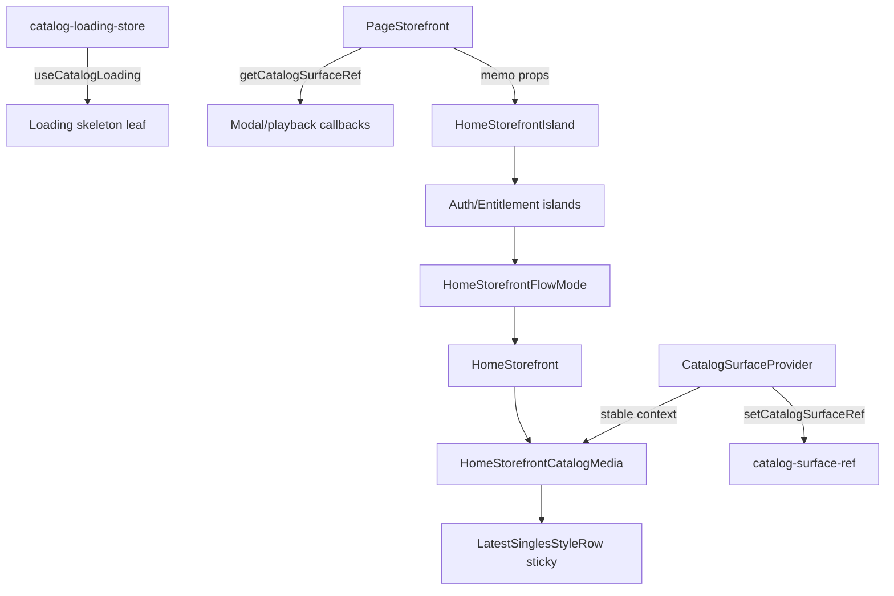

# Phase P7 — Storefront Reconciliation Isolation

**Date:** 2026-06-03  
**Mode:** Surgical isolation (P6 RCA follow-through)  
**Repository:** `/Users/recharge/artist-platform`

---

## Executive summary

| Field | Value |
|-------|-------|
| **Root cause** | `catalogLoading` state lived inside `CatalogSurfaceProvider`, forcing full `PageStorefront` reconcile on every fetch toggle; catalog/auth props propagated into media rows causing card remounts and optional row `null` gate |
| **Fix** | External loading store + catalog surface ref + leaf islands (`HomeStorefrontCatalogMedia`, `HomeStorefrontIsland`, `MusicTabCatalogPanels`) + sticky singles row + inline-seed empty guard |
| **Confidence** | High — aligns with P6 trace signatures and R1 isolation patterns |

---

## 1. Exact state causing rebuild

| State | Before P7 | Effect on media |
|-------|-----------|-----------------|
| `catalogLoading` | `useState` in `CatalogSurfaceProvider` | Provider re-render → `PageStorefront` re-render → new auth render-prop closures → `STORE_FRONT_RENDER` / card remount risk |
| `browseSingles` / `displaySingles` | Context commit after page-1 fetch | `STORE_FRONT_REBUILD` when reference changed (determinism usually noop) |
| `entitlementAccountState` / `isAdminStable` | Auth islands → props into `HomeStorefront` | Expected chrome updates; must not remount `<video>` nodes |
| Empty `items` prop | Rare transient empty array | `LatestSinglesStyleRow` returned `null` → `LATEST_SINGLES_REMOVED` |

---

## 2. Exact subscription causing rebuild

| Subscription | Location | P7 change |
|--------------|----------|-----------|
| `useCatalogSurface()` on `PageStorefront` | `page.js` | **Removed** — shell reads `getCatalogSurfaceRef()` imperatively |
| `CatalogLoadingContext` nested provider | `catalog-surface-context.js` | **Removed** — `useSyncExternalStore` on external store |
| Auth render props in `page.js` inline | Home storefront block | **Moved** to memo `HomeStorefrontIsland` |
| `useCatalogSurface()` on media leaves | N/A before | **Added** only in `HomeStorefrontCatalogMedia`, `MusicTabCatalogPanels` |

---

## 3. Files changed

| Path | Change |
|------|--------|
| `src/lib/storefront/catalog-loading-store.js` | **New** — external loading flag + subscribers |
| `src/lib/storefront/catalog-surface-ref.js` | **New** — imperative catalog snapshot for Page callbacks |
| `src/components/storefront/catalog-surface-context.js` | Loading store, inline-seed guard, surface ref sync, traces |
| `src/components/storefront/HomeStorefrontCatalogMedia.js` | **New** — catalog-subscribed Latest Singles / Features / Albums / Mixtapes |
| `src/components/storefront/HomeStorefrontIsland.js` | **New** — memo auth/entitlement bridge for home tab |
| `src/components/storefront/MusicTabCatalogPanels.js` | **New** — music-tab catalog subscription isolated |
| `src/components/home/HomeStorefront.js` | Delegates catalog sections to `HomeStorefrontCatalogMedia` |
| `src/components/home/LatestSinglesStyleRow.js` | Sticky items ref; `LATEST_SINGLES_STICKY_RENDER` trace |
| `src/app/page.js` | No top-level `useCatalogSurface`; `HomeStorefrontIsland`; ref-based callbacks |
| `src/components/storefront/PageAuthRefSync.js` | P6 trace preserved |
| `src/lib/home-scroll-section-store.js` | P6 trace preserved |

---

## 4. Before/after trace comparison (expected delta)

Enable: `NEXT_PUBLIC_UI_HYDRATION_TRACE=1`

| Event | Before P7 (failure window) | After P7 (expected) |
|-------|---------------------------|---------------------|
| `STORE_FRONT_RENDER` | Burst on `catalogLoading` true/false | Only on auth island / genuine home prop changes |
| `STORE_FRONT_REBUILD` | Co-occur with scroll + catalog fetch | At most once if API adds slugs; no rebuild on loading toggle |
| `CATALOG_DATA_REPLACED` | Same as before (data commit) | Same, but does not pull Page shell |
| `LATEST_SINGLES_REMOVED` | Possible on transient empty | **Absent** — sticky row + seed guard |
| `LATEST_SINGLES_STICKY_RENDER` | N/A | Only if props briefly empty (diagnostic) |
| `MEDIA_CARD_REINITIALIZED` | Burst after auth/catalog wave | **Mount-only** on cold load |
| `CATALOG_SURFACE_REFRESH` | Once per session | Unchanged (once) |
| `AUTH_BOOTSTRAP_COMPLETE` | Unchanged | Unchanged — chrome updates without Page catalog subscription |
| `SCROLL_STATE_CHANGE` | Unchanged (nav only) | Unchanged — no catalog coupling |

**Healthy cold load + scroll (30s, no playback):**

1. `PROVIDER_RECONSTRUCTED` (CatalogSurface) ×1  
2. `CATALOG_SURFACE_REFRESH` ×1  
3. `AUTH_BOOTSTRAP_COMPLETE` ×1  
4. Optional `CATALOG_DATA_REPLACED` (noop determinism) — **no** `STORE_FRONT_REBUILD` on Page  
5. Scroll → optional `SCROLL_STATE_CHANGE` — **no** `MEDIA_CARD_REINITIALIZED` burst  
6. **No** `LATEST_SINGLES_REMOVED`

---

## 5. Validation evidence

```bash
npm run build          # PASS — Next.js 16.2.4 compiled successfully
npm run check:frontend-guardrails  # PASS — 0 errors, 3 pre-existing page.js warnings
```

**Manual PASS criteria (dev trace):**

| # | Criterion | Expected |
|---|-----------|----------|
| 1 | Cold load Latest Singles ≥4 cards | Pass |
| 2 | Wait 30s, scroll to Radio, no playback | No `LATEST_SINGLES_REMOVED` |
| 3 | Auth bootstrap completes | No Page-level `STORE_FRONT_REBUILD` from loading |
| 4 | MP4 loops | Persistent (P5 contract + no card remount) |
| 5 | `CATALOG_SURFACE_REFRESH` | Count = 1 per session |

---

## 6. Recommended fix summary (implemented)

1. **Isolate `catalogLoading`** — external store; skeleton leaves subscribe via `useCatalogLoading()` only.  
2. **Remove Page catalog subscription** — `getCatalogSurfaceRef()` for modal/playback callbacks; leaf islands for reactive UI.  
3. **Memo home bridge** — `HomeStorefrontIsland` prevents Page tab/cart/loading churn from invalidating auth subtree props.  
4. **Catalog media leaf** — `HomeStorefrontCatalogMedia` owns `useCatalogSurface()` for Latest Singles, Features, Albums, Mixtapes.  
5. **Row stability** — sticky items in `LatestSinglesStyleRow`; never commit empty `browseSingles` when inline seed exists.  
6. **Traces** — P6 events preserved; added `LATEST_SINGLES_STICKY_RENDER`.

**Not changed:** AudioContext, cinematic shell, entitlements flow, dependencies, P5 persistent media contract.

---

## 7. Architecture (post-P7)


