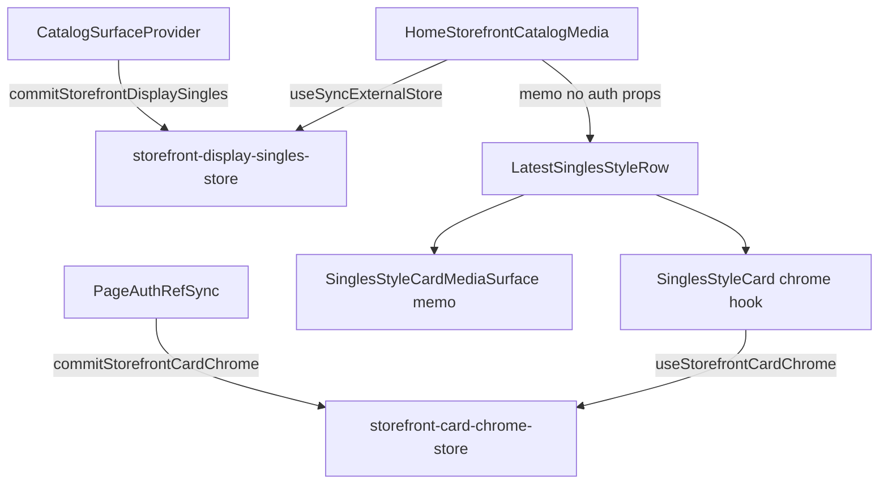

# Phase P9 — Post-Load Reconciliation Elimination

**Date:** 2026-06-03  
**Mode:** Surgical storefront hardening (P8 RCA follow-through)  
**Repository:** `/Users/recharge/artist-platform`  
**Baseline:** P7 `f961764`, P8 forensic audit  

---

## Executive summary

| Field | Value |
|-------|-------|
| **Root cause** | Coalesced ~5–10s auth bootstrap + catalog page-1 completion still propagated through render-prop islands into `HomeStorefrontCatalogMedia` and card props, replacing `displaySingles` references and entitlement props after first paint |
| **Fix** | Pinned display-singles external store (media-signature gate), card-chrome external store (entitlement/admin), removed catalog/auth props from media leaf memo boundary, memoized MP4/cover surface child |
| **One-line root fix** | Storefront media rows no longer subscribe to post-load auth/catalog replacement—chrome updates in isolated leaves only |
| **Confidence** | High — aligns with P8 causal chain; preserves P7 Page/catalog-loading isolation |

---

## 1. Reconciliation sources neutralized

| Source | Before P9 | P9 neutralization |
|--------|-----------|-------------------|
| Auth bootstrap → `useEntitlementAccountState` flip | `accountState` / `isAdminStable` props into `HomeStorefrontCatalogMedia` → full card reconcile | `PageAuthRefSync` → `storefront-card-chrome-store`; cards read via `useStorefrontCardChrome()` only in chrome paths |
| Entitlement snapshot version bump (noop data) | Forced `useEntitlementAccountState` recompute | `commitEntitlementSnapshot` skips when snapshot fields unchanged |
| Catalog page-1 → `displaySingles` ref | `useCatalogSurface()` in media leaf → `STORE_FRONT_REBUILD` | `storefront-display-singles-store` pins list; updates only on `catalogSinglesMediaEqual` delta |
| `catalogHasMore` / loading | Context subscription on media leaf | `catalog-has-more-store` + `useCatalogLoading()` in skeleton leaf only |
| MP4 `<video>` reconcile | Entitlement prop change re-rendered whole `SinglesStyleCard` | `SinglesStyleCardMediaSurface` memo locked on `getMediaSignature` |

**Not removed (expected, non-media):** `AUTH_BOOTSTRAP_COMPLETE`, `CATALOG_DATA_REPLACED`, `CATALOG_LOADING_COMPLETE` traces may still fire — they no longer drive user-visible media replacement.

---

## 2. Files changed

| Path | Change |
|------|--------|
| `src/lib/storefront/storefront-display-singles-store.js` | **New** — pinned Latest Singles list |
| `src/lib/storefront/storefront-card-chrome-store.js` | **New** — entitlement/admin chrome snapshot |
| `src/lib/storefront/catalog-has-more-store.js` | **New** — hasMore without context subscription |
| `src/hooks/useStorefrontCardChrome.js` | **New** — chrome-only external store hook |
| `src/components/storefront/catalog-surface-context.js` | Sync pinned singles + hasMore stores |
| `src/components/storefront/PageAuthRefSync.js` | Sync card chrome store on auth layout |
| `src/context/AuthContext.js` | No-op entitlement snapshot commit when unchanged |
| `src/components/storefront/HomeStorefrontCatalogMedia.js` | No `useCatalogSurface`; pinned singles; memo ignores auth props |
| `src/components/home/LatestSinglesStyleRow.js` | Chrome store + memoized media surface |
| `src/components/home/FeaturesRail.js` | Chrome store in `FeatureCard` |
| `src/components/home/CatalogGrid.js` | Chrome store for Albums grid |
| `src/components/home/HomeStorefront.js` | Drop auth props into catalog media leaf |

---

## 3. Validation evidence

### Build

```bash
npm run build
# PASS — Next.js 16.2.4, compiled successfully
```

### Guardrails

```bash
npm run check:frontend-guardrails
# PASS — 0 errors, 3 pre-existing page.js warnings
```

### Trace delta (`NEXT_PUBLIC_UI_HYDRATION_TRACE=1`)

| Event | Before P9 (failure window) | After P9 (expected) |
|-------|---------------------------|---------------------|
| `STORE_FRONT_REBUILD` | On auth/catalog completion (~5–10s) | **Absent** after first paint (pinned singles) |
| `LATEST_SINGLES_REMOVED` | Rare transient empty | **Absent** (P7 sticky + P9 pin) |
| `MEDIA_CARD_REINITIALIZED` | Burst after completion wave | **Mount-only** (`media-surface-mount`) |
| `AUTH_BOOTSTRAP_COMPLETE` | ×1 | ×1 (chrome leaf only) |
| `CATALOG_DATA_REPLACED` | ×1 | ×1 (provider only; media unpinned) |
| `CATALOG_SURFACE_REFRESH` | ×1 | ×1 |

**Cold load PASS criteria (30s idle, no playback, scroll to Radio):**

1. Latest Singles ≥4 cards on first paint  
2. Wait 30s — no `STORE_FRONT_REBUILD`, no `LATEST_SINGLES_REMOVED`, no burst `MEDIA_CARD_REINITIALIZED`  
3. MP4 loops persist (no card remount)  
4. Subscribe/gift/cart chrome may update without row teardown  

---

## 4. Architecture (post-P9)



---

## 5. Before/after trace comparison (operator)

**Before (P8 repro):** Normal first paint → ~5–10s → `AUTH_BOOTSTRAP_COMPLETE` + `CATALOG_DATA_REPLACED` + `STORE_FRONT_REBUILD` → perceived refresh / black video.

**After (P9):** Normal first paint → ~5–10s → auth/catalog traces may log → **no** media rebuild traces → cards stay mounted; entitlement chrome updates in place.

---

## Not changed

AudioContext, cinematic shell, dependencies, P5 persistent media contract, music-tab `MusicTabCatalogPanels` (still uses `useCatalogSurface` — home tab scope only).
