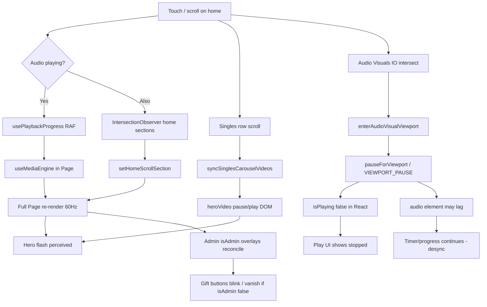

# Render + Provider Leak Audit (static)

**Repo:** `/Users/recharge/artist-platform`  
**Scope:** `src/app/page.js`, root providers, admin overlays, playback UI correlation (read-only; no audio-engine edits)

---

## 1. ROOT CAUSE PRIMARY

**`Page` subscribes to high-frequency playback progress via `useMediaEngine()`**, which internally calls `usePlaybackProgress()`. While audio is playing, progress is driven by a RAF loop in `AudioContext` that notifies progress subscribers without putting `currentTime` on the main context value—but **`useMediaEngine` still merges progress into its return value and re-renders every subscriber on every tick**.

```1194:1205:/Users/recharge/artist-platform/src/app/page.js
  const { state: { isPlaying: engineIsPlaying } } = useMediaEngine();

  useEffect(() => {
    if (!engineIsPlaying) return;
    Object.values(ambientRefs.current).forEach((a) => {
```

```171:185:/Users/recharge/artist-platform/src/media/useMediaEngine.js
export function useMediaEngine() {
  const audio = useAudioPlayer();
  const progress = usePlaybackProgress();
  useSyncExternalStore(subscribeMediaEngine, getMediaEngineSnapshot, () => null);
  return useMemo(() => {
    const mapped = mapAudioContextToMediaEngine(audio);
    return {
      ...mapped,
      state: {
        ...mapped.state,
        currentTime: progress.currentTime,
        duration: progress.duration || mapped.state.duration,
      },
    };
  }, [audio, progress.currentTime, progress.duration]);
}
```

`Page` only needs `engineIsPlaying` to pause ambient loops—it **already has `isPlaying` from `useAudioPlayer()`** (line 713). The extra `useMediaEngine()` hook forces the **entire ~3k-line storefront shell** (hero, catalog rows, admin gift overlays, framer-motion tree) to re-render at display refresh rate during playback.

**Scroll/touch adds more `setState` on the same monolith:**

| Trigger | setState? | File |
|--------|-----------|------|
| Main column scroll (dev trace only) | No (passive listener) | `page.js` ~853–864 |
| Home section `IntersectionObserver` | **`setHomeScrollSection`** (220ms debounce) | `page.js` ~902–924 |
| Singles row scroll | No React state; **DOM** `heroVideo.pause()` / `play()` | `syncSinglesCarouselVideos` ~806–824, 1080–1105 |
| `resize` → mobile breakpoint | **`setIsMobile`** | `page.js` ~837–845 |

So: **minimal scroll while playing = progress-driven full-page re-renders + optional section state + hero video DOM thrash.**

---

## 2. SECONDARY

1. **Monolithic `Page` component** — 40+ `useState` hooks; any single update re-renders hero, home catalog, account tab, modals’ parents, etc. No boundary between “shell” and “playback-sensitive” UI.

2. **`enterAudioVisualViewport` on scroll** — `AudioVisualsSection` `IntersectionObserver` calls `onAudioVisualsFocused` → `enterAudioVisualViewport()` → **`pauseForViewport`** when main player is audible (`AudioContext.js` ~3553–3572). That can flip **`isPlaying` in React** while element/RAF behavior lags → **visual pause, timer still moving** (see §7).

3. **`useEntitlementAccountState()`** on `Page` — new merged object when `entitlementSnapshotVersion` bumps; re-renders all entitlement-gated cards (not scroll-driven, but stacks with primary leak).

4. **Hero “flash”** — `syncSinglesCarouselVideos` pauses hero MP4 when carousel cards are in view (`page.js` ~818–821); combined with full-page re-renders, mobile GPUs often show a visible flash/repaint on the hero `<video>`.

5. **Providers do not remount on scroll** — `AudioProvider` / `AuthProvider` live in `layout.js`; `noteAudioProviderMount` in `audio-engine-runtime.js` tracks mounts. Scroll alone should **not** increment mount count; leak is **consumer re-render**, not provider remount.

---

## 3. INITIAL TRIGGER COMPONENT

**`/Users/recharge/artist-platform/src/app/page.js`** — default export `Page` (~686+).

First scroll/touch on home (mobile):

1. `mainScrollRef` scroll → (optional) `setHomeScrollSection` via home IO (~902–924).  
2. Horizontal singles scroll → `syncSinglesCarouselVideos` (no React state).  
3. If **Audio Visuals** block crosses threshold → `AudioVisualsSection` IO (~430–464) → viewport pause path.

If **music is playing**, the dominant trigger is **`useMediaEngine()` progress subscription**, which fires continuously—not only on scroll.

---

## 4. PROVIDER RENDER LEAK

| Provider | What updates | Blast radius | Touch/scroll coupling |
|----------|----------------|--------------|------------------------|
| **AuthProvider** | `user`, `library`, `accountState`, `isAdmin`, `loading`, `entitlementSnapshotVersion` | All `useAuth()` descendants (`Page`, `AudioProvider`, `BlackscreenTraceBootstrap`, `AppAuthRoot`) | **None direct**; indirect if scroll triggers refresh (not found in `page.js`) |
| **AudioProvider** | `patchState` → new context `value` when playback/auth fields change; progress via **separate** `usePlaybackProgress` | `useAudioPlayer()` consumers: `Page`, `GlobalAudioPlayerBar`, `ReleaseCardPlayButton`, modals | **Indirect:** viewport pause from `Page`’s `enterAudioVisualViewport`; scroll logged in trace only |
| **AppAuthRoot** | `hydrated` once; `showAuthGate` from auth | Children vs boot placeholder | None after hydrate |
| **AuthGateProvider** | Static `useMemo` noop gate | Low | None |
| **SessionRecoveryRoot** | `useSessionRecovery` / `useScrollRecovery` (window scroll → storage, no React state in root) | Children only | Passive scroll listener, no provider state |
| **StripeProvider** | Stripe `Elements` | Checkout surfaces | None |
| **LiveCountdownProvider** | 1 Hz `setSnapshot` | **Only** `useLiveCountdown()` descendants | **Isolated from Page** *if* Page didn’t re-render parent—but Page **is** parent wrapper in `page.js` ~1809 |
| **BlackscreenTraceBootstrap** | `useAuth()` + pathname effects | None (returns `null`) | None |

**Layout order** (`/Users/recharge/artist-platform/src/app/layout.js`):

```
AuthProvider → AudioProvider → AppAuthRoot → … → page.js
                          └→ GlobalAudioPlayerBar (sibling)
```

**Leak pattern:** `Page` sits under both Auth and Audio trees and **over-subscribes** (full `useAudioPlayer` + **`useMediaEngine`/progress**). Providers are doing their job; **`Page` is the blast-radius amplifier**.

---

## 5. SUBTREE IMPACTED

On each `Page` re-render (especially during playback):

- Hero `<video>` + `motion.div` chrome (~2007–2032)  
- Latest Singles / Features / Albums / Mixtapes rows (`LatestSinglesStyleRow`, `CatalogGrid`, `FeaturesRail`)  
- **Admin `GiftOverlayButton`** on every card when `isAdmin` (~111 in `LatestSinglesStyleRow.js`)  
- `AudioVisualsSection` (home tab)  
- Mobile mini player (`StorefrontMiniPlayerBar` — memoized but parent still reconciles)  
- Tab panels, nav highlight logic using `homeScrollSection` (~1713–1715)  
- **Not remounted:** `AudioProvider`, detached `<audio>` (`audio-engine-runtime.js` singleton)

---

## 6. WHY GET BUTTONS DISAPPEAR

**There are no admin UI controls literally labeled “GET” in `src/`.** Closest matches:

| User term likely means | Implementation | Why it vanishes on re-render |
|------------------------|----------------|------------------------------|
| **Admin gift controls** | `GiftOverlayButton` when `isAdmin` (`LatestSinglesStyleRow.js` ~111, `CatalogGrid`, `CarouselUI`, etc.) | `{isAdmin ? … : null}` — any frame where `isAdmin` is false or cards unmount/remount, overlays disappear |
| **“Get Tickets”** | Public shows UI (`page.js` ~2372) | **Not admin-gated**; unlikely “admin GET” unless mislabeled symptom |

**Mechanisms for admin gift overlays disappearing:**

1. **`isAdmin` flicker** — `authLoading` / `refreshAccountState` / 401 path sets `setIsAdmin(false)` (`AuthContext.js` ~321–323, 417). `accountStateReady = !authLoading` gates `CollectorCardAdminPanel` (~2574).  
2. **Full list reconciliation** — rapid `Page` re-renders during catalog fetch (`catalogLoading`, `browseSingles` ~878–887) remount card shells; overlays are **absolute-positioned children**—easy to perceive as “blink off.”  
3. **Misread “GET”** — if meaning **gift** buttons, they are admin-only overlays, not HTTP GET debug buttons.

**Hydration:** `isAdmin` starts `false` until bootstrap (`AuthContext.js` ~98, ~447–448). Admin overlays appear after session + `/api/account/state`; a churny re-render wave can look like “buttons disappeared.”

---

## 7. WHY AUDIO STOPS (correlation)

| Question | Answer |
|----------|--------|
| **AudioProvider remount on scroll?** | **No** (layout-stable). Check `window.__2MRRW_AUDIO_ENGINE_RUNTIME__.providerMountCount` in dev via existing `logPlaybackEngineLifecycle` — expect mount on route/layout load, not per scroll. |
| **UI-only `isPlaying` desync?** | **Yes — plausible.** `enterAudioVisualViewport` → `pauseForViewport` → `patchState({ isPlaying: false })` / `VIEWPORT_PAUSE` (`AudioContext.js` ~3298–3308, ~3553–3568). Progress RAF uses **element** `audio.currentTime`; UI play icon uses **React `isPlaying`**. Diagnostics already warn: `[PLAYBACK-DESYNC] render: state.isPlaying but audio.paused` (~4422–4426). **Matches “stops visually, timer continues.”** |
| **Global bar vs mini player** | `GlobalAudioPlayerBar` uses `dockIsPlaying = dockAudible ?? engineIsPlaying ?? isPlaying` (~538) — can disagree with `Page` mini player `miniPlayerPlaying` (~1476–1478). |
| **Scroll without Audio Visuals** | Viewport path not entered; if playing, symptom is still **progress-driven Page re-render** (stutter) not engine stop. |

**Correlation summary:** Scroll into **Audio Visuals** while music plays → **viewport pause** → UI shows stopped; engine/timer may still advance until command completes or desync is reconciled. Separately, **`useMediaEngine` on `Page`** is unrelated to stopping audio but **amplifies** visible glitches.

---

## 8. MINIMAL SURGICAL FIX PLAN (no audio engine)

1. **Remove `useMediaEngine()` from `page.js`** — use existing `isPlaying` from `useAudioPlayer()` for ambient pause effect (~1207–1213). **Highest impact, ~1 line deleted + use existing hook.**

2. **Extract a memoized `HomeStorefront` (or similar)** — pass stable props; keep `usePlaybackProgress` only inside `StorefrontMiniPlayerBar` / bar (already memo’d at ~122).

3. **Decouple home nav section tracking** — store `homeScrollSection` in a ref for `isTabActive()`; batch `setState` or drive nav via CSS/attribute to avoid scroll-driven full-tree updates.

4. **Admin overlay stability** — render gift overlays when `sessionHydrated && (isAdmin || accountState?.permissions?.admin)`; avoid tying to transient `authLoading` if server already confirmed admin.

5. **Audio Visuals / viewport (behavior tweak, not engine)** — narrow `enterAudioVisualViewport` so YouTube section doesn’t pause **music** unless product-intent requires it; or gate on user gesture (product decision).

6. **Optional:** Move `LiveCountdownProvider` to `layout.js` so 1 Hz ticks don’t sit inside `Page`’s reconciliation path (minor compared to #1).

### Suggested temp log points (do not commit)

- `page.js`: log render count + reason (`scroll` if `homeScrollSection` changed, `progress` if `useMediaEngine` kept).  
- `AudioContext.js` `enterAudioVisualViewport` / `pauseForViewport`: log slug + `audio.paused` + `state.isPlaying`.  
- `AuthContext.js` `setIsAdmin`: log previous/next on transitions only.

---

## PHASE 5 — Cascade map



---

## Top 2 one-liners

1. **`page.js` calls `useMediaEngine()` only for ambient pause but pulls `usePlaybackProgress`, re-rendering the entire home shell every progress tick while audio plays.**  
2. **Scroll adds `setHomeScrollSection` and Audio Visuals viewport pause on top—admin gift overlays and hero video repaint/flicker because everything lives in one `Page` tree under stable providers that are not remounting.**
