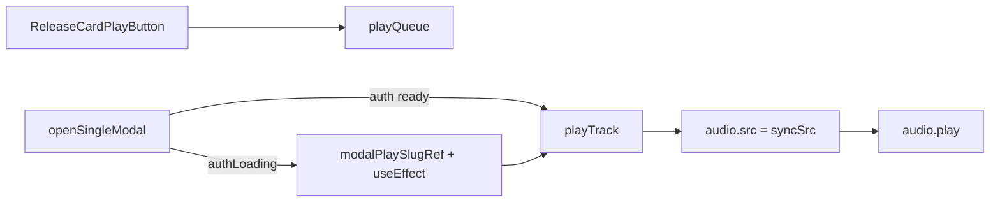

# Audio play path audit (read-only)

**Date:** 2026-05-26  
**Scope:** Playback path from UI through `AudioContext.playTrack`, preview CDN, and library stream redirect.  
**Mode:** Read-only — no code changes.

---

## 1. `AudioContext.js` — `audio.src` in `playTrack`

Primary assignment on the main playback path (`syncSrc`):

```979:984:/Users/recharge/artist-platform/src/context/AudioContext.js
    try {
      if (!isSameTrack) {
        skipPauseInterruptionRef.current = true;
        audio.pause();
        audio.src = syncSrc;
        audio.load();
```

Secondary assignment inside `playTrack` (background signed-stream swap):

```886:892:/Users/recharge/artist-platform/src/context/AudioContext.js
    const swapToSignedStream = (resolved) => {
      const signedUrl = resolved.track?.src;
      if (!signedUrl || signedUrl === syncSrc) return;
      const resumeAt = audio.currentTime || 0;
      skipPauseInterruptionRef.current = true;
      audio.src = signedUrl;
      audio.load();
```

`syncSrc` is chosen earlier from `nextTrack.src` / preview fast-path (lines 830–843).

---

## 2. `AudioContext.js` — `audio.play()` in `playTrack`

Primary call:

```1003:1019:/Users/recharge/artist-platform/src/context/AudioContext.js
      const playPromise = audio.play();
      void updateMediaSession({ ...nextTrack, src: syncSrc }, { playing: true });

      if (isReplay) {
        sendControlSystemPlaybackEvent(nextTrack, "replay", {
          mediaType: "audio",
          positionSeconds: 0,
          durationSeconds: isFinite(audio.duration) ? audio.duration : 0,
        });
      }
      patchState({ isPlaying: true, error: null, playbackState: "playing" });
      if (playPromise !== undefined) {
        playPromise.catch((err) => {
          console.error("[AUDIO PLAY ERROR]", err);
          setTimeout(() => {
            audio.play().catch((e) => console.error("[AUDIO PLAY RETRY]", e));
```

Retry on rejected promise (line 1018). `swapToSignedStream` also calls `audio.play()` at line 901 when already playing.

---

## 3. Guards / early returns in `playTrack` (before `audio.src = syncSrc`)

All of these run **before** the `try` block that sets `audio.src` at line 983:

| Lines | Condition | Effect |
|-------|-----------|--------|
| 772–775 | `!track` or non-object | `return false` |
| 777–780 | no `slug`, `id`, or `src` after normalize | `return false` |
| 795–806 | `!audioRef.current` | `patchState`, `return false` |
| 807–821 | `!nextTrack.src` | `patchState`, `return false` |

```772:821:/Users/recharge/artist-platform/src/context/AudioContext.js
    if (!track || (typeof track !== "object")) {
      console.error("[AudioContext] playTrack: invalid track", track);
      return false;
    }
    const normalized = normalizeTrack(track);
    if (!normalized.slug && !normalized.id && !normalized.src) {
      console.error("[AudioContext] playTrack: track missing identity and src", track);
      return false;
    }
    // ... presentation / preload ...
    const audio = audioRef.current;
    if (!audio) {
      // ... patchState ...
      return false;
    }
    if (!nextTrack.src) {
      // ... patchState ...
      return false;
    }
```

**Between line 983 (`audio.src = syncSrc`) and line 1003 (`audio.play()`):** no `return` statements. Intermediate steps only:

- `983–984`: `audio.load()` (when `!isSameTrack`)
- `986–988`: `else if (resumeAt)` — seek only, no src change
- `990`: `applyCsToElement(...)`
- `992–1001`: `loadedmetadata` listener if `pendingSeekRef.current`

`swapToSignedStream` early return at 888 (`!signedUrl || signedUrl === syncSrc`) is on the async path, not between the main src/play pair.

---

## 4. `ReleaseCardPlayButton.js` — onClick

Handler: `handlePlay` on the button (`onClick={handlePlay}`).

```36:58:/Users/recharge/artist-platform/src/components/music/ReleaseCardPlayButton.js
  const handlePlay = useCallback(
    (e) => {
      e.stopPropagation();
      if (onPlayClick) {
        onPlayClick(e, item);
        return;
      }
      const track = toPlaybackTrack(item, { ...accountState, userId }, source);
      if (!track.src) return;
      const sameTrack =
        hasStarted &&
        (currentTrack?.slug === track.slug || currentTrack?.id === track.id);
      if (sameTrack) {
        void toggle();
        return;
      }
      if (upgradeTimerRef.current) clearTimeout(upgradeTimerRef.current);
      void playQueue([track], 0);
      if (track.metadata?.access?.canStream) {
        upgradeTimerRef.current = setTimeout(() => {
          void upgradeToFullStream();
        }, 2000);
      }
    },
```

| Branch | Function | Arguments |
|--------|----------|-----------|
| `onPlayClick` set | `onPlayClick` | `(e, item)` |
| same track playing | `toggle()` | none |
| new track | `playQueue` | `([track], 0)` |
| entitled stream | `upgradeToFullStream` | none (after 2s timeout) |

`track` from `toPlaybackTrack(item, { ...accountState, userId }, source)` — default `source = "home_card"`.

Does **not** call `playTrack` directly.

---

## 5. `page.js` — `openSingleModal`

```1039:1065:/Users/recharge/artist-platform/src/app/page.js
  const openSingleModal = useCallback((single) => {
    if (nowPlaying) setNowPlaying(null);
    if (featureModalOpen) {
      setFeatureModalOpen(false);
      setFeatureModalItem(null);
      setFeatureReleaseDetail(null);
      featureModalPlaySlugRef.current = null;
    }
    setSelectedSingle(single);
    setPreviewModalOpen(true);
    setSelectedReleaseDetail(null);
    if (!single?.slug) return;
    const playbackTrack = toPlaybackTrack(
      single,
      { ...accountState, userId: currentUser?.id },
      "preview_modal"
    );
    if (authLoading) {
      modalPlaySlugRef.current = single.slug;
      return;
    }
    modalPlaySlugRef.current = null;
    if (playbackTrack?.src) void playTrack(playbackTrack);
    void getControlSystemReleaseDetail({ slug: single.slug, fallbackRelease: single }).then((detail) => {
      if (detail) setSelectedReleaseDetail(detail);
    });
  }, [nowPlaying, featureModalOpen, accountState, authLoading, currentUser?.id, playTrack]);
```

| Case | Behavior |
|------|----------|
| `authLoading === true` | **Defers** — sets `modalPlaySlugRef`, returns without `playTrack` |
| `authLoading === false` | **Direct** — `void playTrack(playbackTrack)` if `playbackTrack?.src` |

Deferred replay when auth finishes:

```906:926:/Users/recharge/artist-platform/src/app/page.js
  useEffect(() => {
    if (authLoading) return;
    // ... feature modal branch ...
    if (!previewModalOpen || !selectedSingle?.slug) return;
    if (modalPlaySlugRef.current !== selectedSingle.slug) return;
    modalPlaySlugRef.current = null;
    const playbackTrack = toPlaybackTrack(
      selectedSingle,
      { ...accountState, userId: currentUser?.id },
      "preview_modal"
    );
    if (playbackTrack?.src) void playTrack(playbackTrack);
  }, [
```

---

## 6. `music-playback.js` — `toPlaybackTrack` return shape

Audio URL field: **`src`** (not `audioUrl`).

```26:46:/Users/recharge/artist-platform/src/lib/music-playback.js
  return {
    id: item?.slug || item?.id,
    slug: item?.slug,
    preview: item?.preview || item?.preview_path || item?.previewPath || null,
    preview_path: item?.preview_path || item?.previewPath || item?.preview || null,
    title: item?.title || "Untitled",
    artist: item?.artist || "2MRRW",
    cover,
    coverArtType,
    src: resolvePlaybackSrc(item, access, { userId }),
    csAudio: csAudioRaw ? resolveCsMediaUrl(csAudioRaw) : null,
    csCover: csCoverRaw ? catalogCoverUrl(csCoverRaw) : null,
    csCoverType,
    source,
    metadata: {
      access,
      price: item?.price,
      albumSlug: item?.albumSlug || overrides.albumSlug,
      ...overrides,
    },
  };
```

---

## 7. `catalogPreviewAudioUrl` — hour-glass

### Catalog input (`page.js`)

```140:140:/Users/recharge/artist-platform/src/app/page.js
  { slug:"hour-glass",     title:"Hour Glass",     type:"single", cover:"/images/singles/hourglass.jpg", price:2.99, preview:"/audio/previews/hourglass-preview.mp3", tag:"NOW PLAYING", tagColor:"#00ffff" },
```

### `catalogPreviewAudioUrl` logic

```39:47:/Users/recharge/artist-platform/src/lib/media-urls.js
export function catalogPreviewAudioUrl(previewPath) {
  if (!previewPath) return "";
  const normalized = String(previewPath).replace(/^\//, "");
  if (normalized.startsWith("audio/previews/")) {
    const r2Path = `previews/${normalized.replace(/^audio\/previews\//, "")}`;
    return toCatalogCdnUrl(r2Path);
  }
  return catalogPublicMediaUrl(normalized);
}
```

For `"/audio/previews/hourglass-preview.mp3"`:

1. `normalized` → `"audio/previews/hourglass-preview.mp3"`
2. `r2Path` → `"previews/hourglass-preview.mp3"`
3. `toCatalogCdnUrl("previews/hourglass-preview.mp3")` → `getPublicR2Url(...)` (always non-empty path)

```40:55:/Users/recharge/artist-platform/src/lib/storage/r2.js
export function getPublicR2Url(path) {
  const base = getPublicCdnBase();
  // ...
  const normalized = String(path || "").replace(/^\//, "");
  if (!normalized) return base;
  return `${base}/${normalized}`;
}
```

```14:17:/Users/recharge/artist-platform/src/lib/storage/r2-public-cdn.js
export function getPublicCdnBase() {
  const env = (process.env.NEXT_PUBLIC_R2_PUBLIC_URL || "").replace(/\/$/, "");
  return env || R2_PUBLIC_CDN_FALLBACK.replace(/\/$/, "");
}
```

```1:2:/Users/recharge/artist-platform/src/lib/storage/r2-public-cdn.js
/** Documented public R2 dev URL (previews/, artwork/, images/). */
export const R2_PUBLIC_CDN_FALLBACK = "https://pub-643e4a94e0184b1fabf6522cfbb16f75.r2.dev";
```

### Constructed URL (guest / preview path)

**When `NEXT_PUBLIC_R2_PUBLIC_URL` is unset:**

`https://pub-643e4a94e0184b1fabf6522cfbb16f75.r2.dev/previews/hourglass-preview.mp3`

**When env is set:**

`{NEXT_PUBLIC_R2_PUBLIC_URL}/previews/hourglass-preview.mp3`

### Entitled full stream (not preview CDN)

If `access.canStream`, `resolvePlaybackSrc` returns library redirect instead:

```208:214:/Users/recharge/artist-platform/src/lib/music-access.js
  if (access?.canStream && track.slug) {
    return libraryStreamRedirectSrc(track.slug);
  }
  const previewPath = track.preview || track.preview_path || track.previewPath;
  if (previewPath) {
    return catalogPreviewAudioUrl(previewPath);
```

For hour-glass slug: `/api/library/stream?slug=hour-glass&redirect=1` (not the preview CDN URL).

---

## Flow summary



### Key takeaways

- Primary `audio.src` is set at line 983; `audio.play()` at 1003, with early returns only before src assignment.
- `ReleaseCardPlayButton` uses `playQueue`, not `playTrack` directly.
- `openSingleModal` calls `playTrack` when auth is ready; otherwise defers via `modalPlaySlugRef` and a `useEffect`.
- Playback tracks use field **`src`** from `resolvePlaybackSrc` / `toPlaybackTrack`.
- Hour-glass preview resolves to `{CDN_BASE}/previews/hourglass-preview.mp3` (fallback CDN when env unset); entitled users get `/api/library/stream?slug=hour-glass&redirect=1`.

No repository files were modified for this audit.
