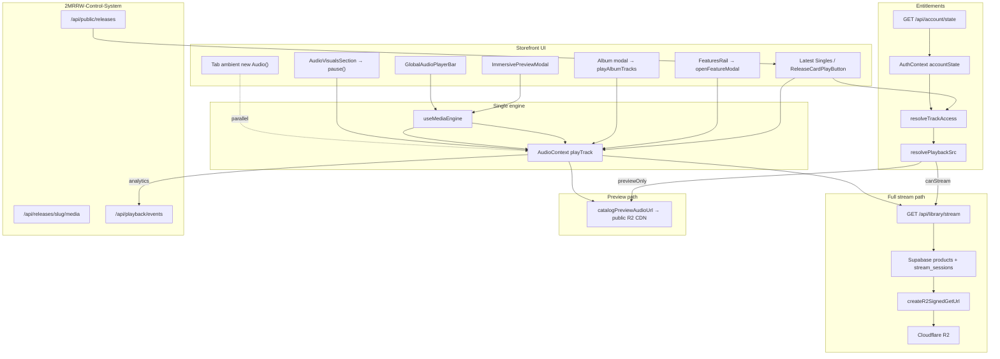

# 2MRRW Audio System — Full Audit (2026-05-25)

## Top findings (3 bullets)

- **Single music engine holds** — `AudioContext` owns one `<audio>` element; `useMediaEngine` / `GlobalAudioPlayerBar` / immersive modal are thin adapters. Post-`5b8f4fc` / `01c64a8` fixes add **preview-first** for visitors, **`redirect=1` fast path** for entitled users, **30s engine hard cap** (`PREVIEW_HARD_CAP_SEC`), and **`PreviewEndedCTA`** wired to `previewEnded`.
- **Playback URLs are storefront-local; catalog is Control-System–fed** — Entitlements resolve via **`/api/account/state` → `resolveTrackAccess` → `resolvePlaybackSrc`**. Full audio: **`/api/library/stream`** → Supabase product key → **R2 signed GET** (3600s TTL). Previews: **public R2 CDN** (`catalogPreviewAudioUrl`). Control System supplies releases/vault/hero via `NEXT_PUBLIC_CONTROL_SYSTEM_API_URL`; analytics POST to CS `/api/playback/events`.
- **Residual risks** — Legacy **`nowPlaying` state never set** (mini-player UI likely dead); **tab ambient `new Audio()`** can overlap global music; **concurrent stream 409** still blocks second device; **vault shelf has no `playTrack` integration** (display-only + separate vault SFX engine).

---

## 1. Executive summary

The 2MRRW storefront uses **one global music engine** (`/Users/recharge/artist-platform/src/context/AudioContext.js`) mounted in root layout with `GlobalAudioPlayerBar`. All catalog playback flows through **`toPlaybackTrack` → `playTrack` / `playQueue`**, with access from **`resolveTrackAccess`** (client mirror of server rules) backed by **`/api/account/state`** (Supabase entitlements, not UI toggles).

**Control System** (`/Users/recharge/2MRRW-Control-System`) is the **catalog/media CMS**: `GET /api/public/releases`, `GET /api/releases/[slug]/media`, vault content, hero, signed preview URLs. **Full-track delivery** is implemented on the **storefront** via Supabase `products` + R2 signing in `/api/library/stream` — not CS `signed-url` for library playback.

Recent commits (`5b8f4fc`, `01c64a8`, `317a4d1`) addressed entitled-preview-first bug, subscriber gate alignment, modal click-to-play, preview-end CTA, and stream-client error surfacing. An earlier audit (`docs/reports/audio-logic-audit-20260525.md`) listed critical gaps; **several are now fixed** (see §7).

---

## 2. FILE MAP (one line per file)

| File | Role |
|------|------|
| `/Users/recharge/artist-platform/src/context/AudioContext.js` | Singleton `<audio>`: `playTrack`, queue, CS mode, 30s preview cap, stream upgrade, Media Session |
| `/Users/recharge/artist-platform/src/app/layout.js` | `AudioProvider` + `GlobalAudioPlayerBar` app-wide |
| `/Users/recharge/artist-platform/src/app/page.js` | Homepage sections, modals, AV pause, tab ambient loops, play entry points |
| `/Users/recharge/artist-platform/src/components/audio/GlobalAudioPlayerBar.js` | Persistent dock/expanded player |
| `/Users/recharge/artist-platform/src/components/audio/CSModeButton.js` | Chopped/slowed toggle → `AudioContext` CS mode |
| `/Users/recharge/artist-platform/src/components/audio/PlayerControlButton.js` | Shared control chrome |
| `/Users/recharge/artist-platform/src/media/useMediaEngine.js` | Maps `AudioContext` → `{ state, play, pause, seek, toggle, setVolume }` |
| `/Users/recharge/artist-platform/src/media/mediaEngineBridge.js` | Imperative bridge from `AudioProvider` |
| `/Users/recharge/artist-platform/src/media/MediaEngine.js` | Doc/comment; no second element |
| `/Users/recharge/artist-platform/src/media/index.js` | Media module exports |
| `/Users/recharge/artist-platform/src/lib/player/useImmersivePlayback.js` | Modal/dock adapter over `useMediaEngine` |
| `/Users/recharge/artist-platform/src/lib/music-access.js` | `resolveTrackAccess`, `resolvePlaybackSrc`, `resolveContentAccess` |
| `/Users/recharge/artist-platform/src/lib/music-playback.js` | `toPlaybackTrack`, `albumTracksForPlayback` |
| `/Users/recharge/artist-platform/src/lib/media-urls.js` | `catalogPreviewAudioUrl`, cover/motion CDN helpers |
| `/Users/recharge/artist-platform/src/lib/playback/stream-client.js` | Client `fetchLibraryStream`, redirect detection, session clear |
| `/Users/recharge/artist-platform/src/lib/playback/stream-pipeline.js` | Stream sessions, R2 TTL 3600s, concurrent session |
| `/Users/recharge/artist-platform/src/lib/playback/stream-url-cache.js` | Server signed-URL cache ~8 min |
| `/Users/recharge/artist-platform/src/lib/playback/resolve-playback-key.js` | Slug → R2 object key |
| `/Users/recharge/artist-platform/src/lib/playback/playback-gate.js` | Server catalog gate vs `ownedSlugs` |
| `/Users/recharge/artist-platform/src/lib/playback/normalize-r2-key.js` | R2 key normalization |
| `/Users/recharge/artist-platform/src/lib/storage/r2.js` | `createR2SignedGetUrl` for full tracks |
| `/Users/recharge/artist-platform/src/lib/storage/r2-public-cdn.js` | `NEXT_PUBLIC_R2_PUBLIC_URL` / CDN fallback |
| `/Users/recharge/artist-platform/src/lib/vault-audio.js` | Vault UI SFX (`new Audio` / Web Audio) — not music engine |
| `/Users/recharge/artist-platform/src/lib/commerce/entitlements.js` | `userCanStreamProduct`, membership/collector |
| `/Users/recharge/artist-platform/src/lib/control-system/client.js` | `getControlSystemApiUrl`, `fetchControlSystemJson` |
| `/Users/recharge/artist-platform/src/lib/control-system/releases.js` | CS catalog fetch + media URL resolution |
| `/Users/recharge/artist-platform/src/lib/control-system/playback.js` | POST analytics to CS `/api/playback/events` |
| `/Users/recharge/artist-platform/src/lib/control-system/account.js` | Optional CS account/library fetch |
| `/Users/recharge/artist-platform/src/lib/control-system/vault.js` | CS vault content + media URLs |
| `/Users/recharge/artist-platform/src/lib/control-system/media.js` | Asset URL absolutization, entitlement hints |
| `/Users/recharge/artist-platform/src/lib/control-system/audio-visuals.js` | CS audio-visuals feed |
| `/Users/recharge/artist-platform/src/lib/control-system/circle.js` | CS circle events |
| `/Users/recharge/artist-platform/src/app/api/library/stream/route.js` | Entitlement → signed R2 URL or 302 redirect |
| `/Users/recharge/artist-platform/src/app/api/account/state/route.js` | Unified account payload (source of truth) |
| `/Users/recharge/artist-platform/src/app/api/media/playback/route.js` | Local listening analytics persistence |
| `/Users/recharge/artist-platform/src/app/api/stream/end/route.js` | Stream session end analytics |
| `/Users/recharge/artist-platform/src/app/api/catalog/hydrate/route.js` | Recovery hydration from CS catalog |
| `/Users/recharge/artist-platform/src/app/api/catalog/releases/route.js` | Storefront catalog API |
| `/Users/recharge/artist-platform/src/components/music/ReleaseCardPlayButton.js` | Card ▶ → `playQueue`; preview preload; 2s `upgradeToFullStream` |
| `/Users/recharge/artist-platform/src/components/music/MusicAccessBadge.js` | Access badge from `resolveTrackAccess` |
| `/Users/recharge/artist-platform/src/components/music/AlbumTracklistSheet.js` | Album track list playback |
| `/Users/recharge/artist-platform/src/components/music/MyMusicTab.js` | Library collection playback |
| `/Users/recharge/artist-platform/src/components/music/ContinueListening.js` | Resume playback |
| `/Users/recharge/artist-platform/src/components/music/ChoppedSlowedToggle.js` | CS toggle in music UI |
| `/Users/recharge/artist-platform/src/components/preview/ImmersivePreviewModal.js` | Immersive shell; `previewEnded` + CTA |
| `/Users/recharge/artist-platform/src/components/preview/PreviewEndedCTA.js` | Post-preview unlock/subscribe CTA |
| `/Users/recharge/artist-platform/src/components/preview/PreviewModalPlayer.js` | Modal bar via `useImmersivePlayback` |
| `/Users/recharge/artist-platform/src/components/preview/immersive/PreviewPlayerControls.js` | Scrub UI; 30s display cap; stream hint |
| `/Users/recharge/artist-platform/src/components/preview/immersive/constants.js` | `PREVIEW_DISPLAY_CAP_SEC = 30` |
| `/Users/recharge/artist-platform/src/components/preview/immersive/ImmersiveModalPanel.js` | Modal panel composition |
| `/Users/recharge/artist-platform/src/components/home/FeaturesRail.js` | Features row; opens feature modal |
| `/Users/recharge/artist-platform/src/components/home/RadioCarousel.js` | Radio slides; access labels |
| `/Users/recharge/artist-platform/src/components/home/CarouselUI.js` | Listen/Preview overlay labels |
| `/Users/recharge/artist-platform/src/components/home/AmbientPlaybackBackground.js` | Visual ambient tied to `currentTrack` (not separate audio) |
| `/Users/recharge/artist-platform/src/components/system/AudioPhase10Bridge.js` | Queue preloader + recovery events |
| `/Users/recharge/artist-platform/src/media/preloader/MediaPreloader.js` | `<link preload>`; skips library-stream URLs |
| `/Users/recharge/artist-platform/src/context/AuthContext.js` | Caches `accountState`; refresh |
| `/Users/recharge/artist-platform/docs/reports/audio-logic-audit-20260525.md` | Prior audit (partially superseded) |
| `/Users/recharge/artist-platform/docs/reports/audio-logic-fix-20260525.md` | Fix log for entitled playback |
| `/Users/recharge/2MRRW-Control-System/src/server/playback/playbackService.ts` | CS playback progress/sessions (durable optional) |
| `/Users/recharge/2MRRW-Control-System/src/app/api/playback/events/route.ts` | CS playback event ingestion |
| `/Users/recharge/2MRRW-Control-System/src/app/api/media/[assetId]/signed-url/route.ts` | CS signed URLs for artwork/preview/loop |
| `/Users/recharge/2MRRW-Control-System/src/app/api/releases/[slug]/media/route.ts` | CS release media asset list |

---

## 3. Architecture diagram



---

## 4. Section-by-section playback entry points

### Latest Singles (`page.js` ~1664–1770)
- **Cover click** → `openSingleModal` → **`playTrack` in click handler** (deferred only if `authLoading` via `modalPlaySlugRef`).
- **▶ button** → `ReleaseCardPlayButton` → `toPlaybackTrack` → `playQueue` → `playTrack`; preview preloaded on mount; entitled users get **`upgradeToFullStream` after 2s**.

### Carousel / hero singles row
- Motion cover **videos** are muted loops (not music engine).
- Playback is via modal or card actions above.

### Features (`FeaturesRail.js`)
- Card click → `onOpenFeature` → **`openFeatureModal`** → synchronous **`playTrack`** (same auth-defer pattern as singles).
- ▶ on card uses `ReleaseCardPlayButton` (`source="home_feature_card"`).

### Albums
- **`openAlbumModal`** → `playAlbumTracks` → `playQueue` with per-track `toPlaybackTrack`.
- Album modal play-all gated by `selectedAlbumAccess?.canStream`.

### 2MRRW Radio (`RadioCarousel.js`)
- Display/access only in carousel; **no direct `playTrack`** in carousel component — commerce/library actions only.

### Vault (`VaultUnlockedRoom` / `VaultUnlockedShelf`)
- **No integration with `AudioContext`** for shelf items; `contentUrl` shown as overlay label only.
- **`vault-audio.js`**: separate SFX/ambient for vault UX.

### Global bar (`layout.js` → `GlobalAudioPlayerBar`)
- Always mounted; uses `useImmersivePlayback` → persists across routes.

### Immersive modal (`ImmersivePreviewModal`)
- Controls via `PreviewPlayerControls` + `useMediaEngine`.
- **`previewEnded`** from `AudioContext` drives **`PreviewEndedCTA`** (unlock / subscribe / continue listening).

### CS mode (`CSModeButton`, `AudioContext` `applyCSModeToTrack`)
- Swaps src to `csAudio` or applies `playbackRate` 0.75; separate CS preload `Audio` elements.

### Tab ambient (`page.js` ~816–836)
- Per-tab loop URLs via **`new Audio()`** in `ambientRefs`; paused when `engineIsPlaying`.
- **Document only** — separate from music engine by design.

### AV section (`AudioVisualsSection`, `handleAudioVisualsFocused`)
- **IntersectionObserver** → **`pause()`** global music on enter; **no resume** on exit (YouTube iframe paused separately).

### My Music / library (`MyMusicTab.js`, `ContinueListening`, `PlaylistDetail`)
- All use `useAudioPlayer` → `playTrack` / `playQueue`.

---

## 5. Control-system integration

| Storefront consumer | CS endpoint | Fallback |
|---------------------|-------------|----------|
| `releases.js` | `GET /api/public/releases?type=...` | Hardcoded `page.js` catalog arrays |
| `releases.js` | `GET /api/releases/{slug}/media` | Local preview paths |
| `vault.js` | `GET /api/vault/content`, `.../media` | Static vault sections |
| `audio-visuals.js` | `GET /api/audio-visuals` | Local AV config |
| `playback.js` | `POST /api/playback/events` | No-op if URL unset |
| `account.js` | `GET /api/account/state`, `/api/library` | Storefront `/api/account/state` primary |
| `useRealtimeEvents` | `/api/sync/stream`, `/api/sync/replay` | Disabled without URL |

**Env vars (storefront):**
- `NEXT_PUBLIC_CONTROL_SYSTEM_API_URL` (or `NEXT_PUBLIC_CONTROL_SYSTEM_URL`)
- `NEXT_PUBLIC_R2_PUBLIC_URL` — preview/cover CDN
- `CLOUDFLARE_R2_*` — signed full-track GET (server only)
- `NEXT_PUBLIC_SUPABASE_URL` — entitlements DB

**Env vars (Control System `.env.example`):**
- `NEXT_PUBLIC_CONTROL_SYSTEM_API_URL` → self
- `STOREFRONT_SYNC_URL` — catalog push target
- Supabase + R2 for CMS media

**Important split:** CS **`/api/media/[assetId]/signed-url`** signs preview/artwork for **catalog hydration**. Storefront **library playback** does **not** call that route; it uses **local** `/api/library/stream` + Supabase `resolvePlaybackKey`.

---

## 6. Data flow: click → play → entitlement → src

1. **Click** (card ▶ or modal open).
2. **`toPlaybackTrack(item, accountState)`** → `resolveTrackAccess` + `resolvePlaybackSrc`.
3. **`playTrack(track)`** in `AudioContext`:
   - If `src` is `/api/library/stream?...&redirect=1` and **`metadata.access.canStream`**:
     - **Entitled:** `syncSrc = redirect URL` (browser follows 302 to signed R2).
     - **Visitor with preview path:** `syncSrc = catalogPreviewAudioUrl`; background `resolveLibraryStreamForTrack` only if entitled path misfires.
   - **`audio.src = syncSrc`**; **`await audio.play()`** (still async; preview CDN avoids stream round-trip for guests).
4. **Preview-only:** `timeupdate` clamps at **30s**, sets `previewEnded`, dispatches `preview:ended`.
5. **Entitled upgrade:** `swapToSignedStream` / `upgradeToFullStream` after JSON fetch if needed.
6. **Analytics:** local `recordListeningEvent` + optional **`sendControlSystemPlaybackEvent`**.

---

## 7. BUG/RISK list (current state, post-fix)

### CRITICAL
- None confirmed in code review for entitled-first regression (Fix 1 in `audio-logic-fix-20260525.md` is present).

### HIGH
| Issue | Location | Notes |
|-------|----------|-------|
| `await audio.play()` still after `load()` | `AudioContext.js` ~1003 | May still fail strict mobile gesture if not in direct handler |
| Concurrent stream **409** | `library/stream/route.js`, `AudioContext` | Blocks second device until `force` |
| Tab ambient overlap | `page.js` ~816–836 | Separate `Audio()`; mitigated when engine plays |
| Unauthenticated stream **401** | `library/stream/route.js` | Guests cannot hit library stream (by design) |

### MEDIUM
| Issue | Location | Notes |
|-------|----------|-------|
| **`nowPlaying` never assigned** | `page.js` | Only `setNowPlaying(null)`; mini-player UI likely **dead code** |
| Auth hydration race | Modal defer + `upgradeToFullStream` | Mitigated by refs/effects; still possible brief preview for slow state |
| Entitled background JSON fetch | `playTrack` when not `redirectFastPath` | `backgroundStreamResolve` still runs for non-redirect library URLs |
| Vault content not playable | `VaultUnlockedShelf` | No `playTrack` wiring |

### LOW
| Issue | Location | Notes |
|-------|----------|-------|
| CS catalog `playbackAccess: "preview"` default | `control-system/releases.js` | Storefront overrides via `accountState` |
| Deprecated `ModalAudioPlayer` | `src/components/media/_deprecated/` | Not in tree |
| Shareable duplicates | `shareable/component-exports/` | Unused |

### Fixed since `audio-logic-audit-20260525.md`
- Preview-first for **non-entitled only** (`AudioContext` ~833–842)
- **30s engine hard stop** (`PREVIEW_HARD_CAP_SEC`, `onTime` ~516–528)
- **PreviewEndedCTA** in modal
- **Modal click-to-play** in `openSingleModal` / `openFeatureModal`
- **Seek clamp** in `PreviewPlayerControls` for `previewOnly`
- **Subscriber `subscriberActive`** in `music-access.js`
- **Release card** preview preload + `upgradeToFullStream` timer

---

## 8. Gaps vs platform rules

| Rule | Status |
|------|--------|
| Single audio engine for music | **Met** — one `<audio>` in `AudioContext` |
| Entitlements from account state, not UI | **Met** — `resolveTrackAccess` reads `AuthContext` / API |
| webhook → Supabase → account/state → UI | **Met** for purchases; stream gate uses `userCanStreamProduct` |
| No local/public media for production full tracks | **Mostly met** — previews on public CDN; full on signed R2 |
| Tab ambient / vault SFX separate | **Documented exception** — intentional auxiliary `Audio` |
| Control System as catalog source | **Partial** — works when env set; hardcoded fallback in `page.js` |

---

## 9. Manual QA checklist

- [ ] Visitor: home single ▶ → preview CDN starts immediately; stops at 30s; CTA in modal
- [ ] Visitor: open single modal from cover → same preview behavior
- [ ] Subscriber (`subscriberActive`): card ▶ → full stream (no preview audio first)
- [ ] Owned slug: immersive modal shows Listen; full stream on open
- [ ] Auth loading: modal opens; playback starts after state loads
- [ ] Entitled user mid-session: `upgradeToFullStream` after account refresh
- [ ] Second browser tab/device: 409 conflict UI / retry
- [ ] Album “Play album” queues tracks; track 0 plays
- [ ] Feature modal: play on open; preview-ended CTA
- [ ] CS mode: toggles slowed src/rate without duplicating engine
- [ ] Scroll to AV section: music pauses; scroll away: music does not auto-resume
- [ ] Switch tabs with ambient on: ambient pauses when global music plays
- [ ] Global bar persists navigating away from home
- [ ] Network: `/api/library/stream?redirect=1` returns 302 to R2 for entitled user
- [ ] Network: preview URLs hit public CDN (not library stream)
- [ ] CS URL unset: catalog still renders from fallback data

---

## Zip / manifest (for Agent mode)

**Requested zip:** `/Users/recharge/Downloads/audio-system-full-audit-20260525.zip`

**Suggested contents:**
1. `audio-system-full-audit-20260525.md` (this report)
2. `audio-logic-audit-20260525.md` (exists at `/Users/recharge/artist-platform/docs/reports/audio-logic-audit-20260525.md`)
3. `manifest.txt` — key paths:

```
src/context/AudioContext.js
src/lib/music-access.js
src/lib/music-playback.js
src/lib/playback/stream-client.js
src/app/api/library/stream/route.js
src/app/api/account/state/route.js
src/lib/control-system/client.js
src/lib/control-system/releases.js
src/lib/control-system/playback.js
src/app/page.js
src/components/music/ReleaseCardPlayButton.js
src/components/preview/ImmersivePreviewModal.js
src/components/preview/PreviewEndedCTA.js
docs/reports/audio-logic-audit-20260525.md
docs/reports/audio-logic-fix-20260525.md
```

**To produce zip in Agent mode:**
```bash
cd /Users/recharge/artist-platform/docs/reports
# write audio-system-full-audit-20260525.md first
zip -j ~/Downloads/audio-system-full-audit-20260525.zip \
  audio-system-full-audit-20260525.md \
  audio-logic-audit-20260525.md \
  manifest.txt
ls -la ~/Downloads/audio-system-full-audit-20260525.zip
```

---

**Return summary:** Zip **not created** (read-only). Switch to **Agent mode** to write the markdown under `docs/reports/` and zip to `~/Downloads`. Prior companion doc: `/Users/recharge/artist-platform/docs/reports/audio-logic-audit-20260525.md`.

[REDACTED]