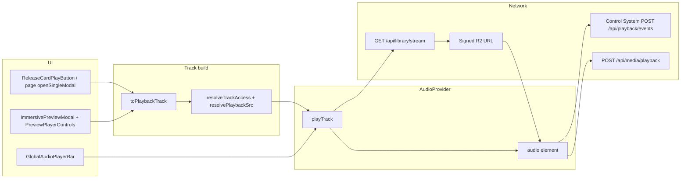

# Audio & unified media stack audit (`/Users/recharge/artist-platform`)

**Scope:** Read-only review of the single `<audio>` engine (`AudioContext`), the `useMediaEngine` / bridge subscription layer, playback surfaces, stream API + client libs, catalog URL helpers, and Control System playback telemetry.

---

## 1. Unified media engine

### 1.1 Files

| Path | Role |
|------|------|
| `/Users/recharge/artist-platform/src/media/useMediaEngine.js` | React hook: `useSyncExternalStore` + snapshot cache → stable `{ state, play, pause, seek, toggle, setVolume, … }` over `useAudioPlayer()` |
| `/Users/recharge/artist-platform/src/media/mediaEngineBridge.js` | Imperative bridge: `registerMediaEngineBridge`, `getMediaEngineBridge`, `notifyMediaEngineBridge`, `subscribeMediaEngine` |
| `/Users/recharge/artist-platform/src/media/MediaEngine.js` | Non-React facade: `MediaEngine.getState()` / `MediaEngine.subscribe()` |
| `/Users/recharge/artist-platform/src/media/index.js` | Re-exports hook, mappers, `MediaEngine`, bridge helpers |

### 1.2 `getMediaEngineBridge` / `notifyMediaEngineBridge` / snapshot caching

- **Registration:** `AudioProvider` registers the bridge once with `getState()` (maps `stateRef` + volume from `audioRef`) and `getAnalyser()` (Web Audio analyser node). See ```461:484:/Users/recharge/artist-platform/src/context/AudioContext.js```.
- **Notify:** Every React `state` commit copies into `stateRef` and calls `notifyMediaEngineBridge()`. See ```451:458:/Users/recharge/artist-platform/src/context/AudioContext.js```.
- **Bridge implementation:** ```13:38:/Users/recharge/artist-platform/src/media/mediaEngineBridge.js``` — `notifyMediaEngineBridge` invokes all `subscribeMediaEngine` listeners with the latest snapshot.
- **Hook caching:** `useMediaEngine` uses `useSyncExternalStore(subscribeMediaEngine, getMediaEngineSnapshot, …)` where `getMediaEngineSnapshot` pulls `getMediaEngineBridge()?.getState()` and **reuses** `_cachedMediaEngineState` unless `mediaEngineStateChanged` detects diffs on track identity, play state, time, duration, volume, queue, `playbackState`, CS/space/bass/atmosphere. See ```49:151:/Users/recharge/artist-platform/src/media/useMediaEngine.js```.
- **`mapAudioContextToMediaEngine`:** Maps context → public API; `play` delegates to `audio.playTrack(mapMediaTrackToPlayInput(track))`. See ```108:141:/Users/recharge/artist-platform/src/media/useMediaEngine.js```.

### 1.3 Components subscribe vs `AudioContext`

| Pattern | Behavior |
|---------|----------|
| **`useAudioPlayer()`** | Full `AudioContext.Provider` value; **any** `setState` patch to `state` triggers re-render for all direct subscribers. |
| **`useMediaEngine()`** | Subscribes via **external store** + **narrow snapshot equality**; re-renders when the bridge snapshot’s compared fields change (not necessarily on every internal ref tick—though RAF-driven `currentTime` patches still flow through React `state` and thus still notify the bridge each frame while playing). |
| **`useImmersivePlayback()`** | Uses **both**: `useAudioPlayer()` (spread into return) + `useMediaEngine()` for `progress` / `handlePlayToggle`. See ```11:36:/Users/recharge/artist-platform/src/lib/player/useImmersivePlayback.js```. |

**Implication:** Hot leaves are encouraged to use `useMediaEngine` for transport UI; anything needing `streamRetryable`, `error`, `isBuffering`, etc. still pulls `useAudioPlayer()` (e.g. `PreviewPlayerControls`).

---

## 2. `AudioContext` (`/Users/recharge/artist-platform/src/context/AudioContext.js`)

### 2.1 State shape (`EMPTY_STATE` + spread)

Core fields include: `currentTrackId`, `currentTrack`, `source`, `isPlaying`, `currentTime`, `duration`, `error`, `hasStarted`, `isBuffering`, `accessDenied`, `streamRetryable`, `streamConflict`, `queue`, `queueIndex`, `repeatMode`, `shuffle`, `csMode`, `csTrack`, `playbackState`, `spaceMode`, `bassMode`, `atmosphereLevel`. See ```75:97:/Users/recharge/artist-platform/src/context/AudioContext.js```.

Context **value** merges `...state` with actions (`playTrack`, `pause`, `seek`, `stop`, queue controls, CS hold preview, `upgradeToFullStream`, etc.). See ```1881:1949:/Users/recharge/artist-platform/src/context/AudioContext.js```.

### 2.2 Important refs (non-exhaustive)

| Ref | Purpose |
|-----|---------|
| `audioRef` | Single hidden `<audio>` element |
| `audioCtxRef` / `analyserRef` / `sourceRef` / `stereoPannerRef` / `bassFilterRef` | Web Audio graph |
| `stateRef` / `queueRef` / `queueIndexRef` | Mirrors for handlers / bridge |
| `streamMetaRef` | `{ slug, url, fetchedAt, expiresIn, streamEventId, sessionId }` for signed stream lifecycle |
| `skipPauseInterruptionRef` | Suppresses `pause` handler side effects during programmatic `src` swaps |
| `playTrackRef` / `applyCSModeToTrackRef` | Lets `ended` / effects call latest callbacks |

### 2.3 `playTrack` → URL resolution → session → element

High-level algorithm (```906:1225:/Users/recharge/artist-platform/src/context/AudioContext.js```):

1. **`initWebAudio()`** and resume suspended `AudioContext` if needed (```907:910```).
2. **`normalizeTrack` / `resolvePlaybackPresentation`** for CS presentation (```916:927```).
3. Detect **library stream** vs **redirect fast path** vs **preview fallback** (```965:983```):
   - If `src` is library stream **and** `metadata.access.canStream` is false but a **preview URL** exists → **`syncSrc = previewSrc`**, `backgroundStreamResolve = true` (visitor / preview-first).
   - If **`redirect=1`** on library URL → browser can follow redirect without JSON prefetch (`redirectFastPath`).
   - Else background JSON resolve for signed URL.
4. **`resolveLibraryStreamForTrack`** calls `fetchLibraryStream` → populates `streamMetaRef` (```886:904```, ```1058:1061```).
5. **`swapToSignedStream`** assigns `audio.src`, seeks to `resumeAt`, updates `currentTrack.metadata.access` to full stream (```1026:1056```).
6. **Resume position:** `options.resumeAt`, local `listening-history`, or `accountState.mediaProgress` (```1064:1079```).
7. **Previous track teardown:** finalize stream analytics, `recordLocalListening` when identity changes (```1089:1108```).
8. **`patchState`** with `syncSrc` (```1110:1121```).
9. **Load + `applyCsToElement`**, optional first-listen volume swell, **`audio.play()`**, `updateMediaSession` (```1125:1210```).

**`upgradeToFullStream`** (```1227:1285```): If still preview-only or on preview URL, builds `libraryTrack` with `redirect=1` stream URL, `resolveLibraryStreamForTrack`, swaps `audio.src`, patches `metadata.access` to non-preview.

**Entitlements refresh:** `window` listener `entitlements:updated` calls `upgradeToFullStream` when `previewOnly` and playing (```1287:1297```).

### 2.4 Transport & queue

| API | Location |
|-----|----------|
| `pause` / `resume` / `toggle` | ```1502:1575``` |
| `seek` (preview cap) | ```1577:1595``` — caps at `PREVIEW_HARD_CAP_SEC` when `metadata.access.previewOnly` |
| `seekBack` / `seekForward` | ```1597:1614``` |
| `stop` | ```1616:1646``` — finalize stream session, `clearLibraryStreamSession`, reset state, clear media session |
| `setQueue` / `playQueue` / `playNext` / `playPrevious` | ```1419:1470``` |
| `overrideConcurrentStream` / `dismissStreamConflict` / `retryStreamPlayback` | ```1303:1324``` |

### 2.5 CS (“chopped & slowed”) mode

- **Presentation:** `resolvePlaybackPresentation` chooses alternate `csAudio` URL or `playbackRate = 0.75` on base src (```139:171```, constants ```53:54```).
- **Toggle:** `toggleCSMode` swaps src if needed, applies rates (```1362:1412```).
- **Hold preview:** `beginCsHoldPreview` / `setCsHoldPlaybackRate` / `endCsHoldPreview` temporarily swap the element for CS preview UX (```1806:1879```).

### 2.6 Web Audio

`initWebAudio`: `MediaElementSource` → `AnalyserNode` → `StereoPannerNode` → `BiquadFilter` (bass shelf) → destination (```396:426```). Bass boost toggles filter gain (```433:443```).

### 2.7 Media Session

- **`updateMediaSession`:** `MediaMetadata`, `playbackState`, artwork fetch, `persistMediaSessionTrack`, `syncPositionState` (```362:387```).
- **Action handlers:** play/pause/seek/next/prev/stop/seekforward/seekbackward; optional `togglemicrophone` → `toggleCSMode` (```1648:1711```).
- **Visibility / lifecycle:** save + rehydrate (```1713:1804```). *Note:* `wasPlayingBeforeHideRef` / `visibilityPausedRef` are largely unused beyond assignment—no automatic tab-hide pause in the visible block.

### 2.8 Stream session & analytics

- **Client meta:** `streamMetaRef` updated in `resolveLibraryStreamForTrack` / refresh paths.
- **End analytics:** `finalizeStreamSession` → `endStreamAnalytics` POST `/api/stream/end` (```276:285```, imported from `stream-client` ```104:112```).
- **Clear session on stop:** `clearLibraryStreamSession` DELETE (```1625```, `stream-client` ```95:102```).

### 2.9 Preview cap (engine)

- **Constant:** `PREVIEW_HARD_CAP_SEC = 30` (```57```).
- **`timeupdate`:** Fade volume in last 2s; pause and clamp at 30s; `playbackState: "ended_preview"`; `setPreviewEnded(true)`; `preview:ended` DOM event (```585:611```).
- **`seek`:** Hard cap for `previewOnly` (```1582:1584```).
- **Separate UI cap:** `PREVIEW_DISPLAY_CAP_SEC = 30` in immersive constants (see §4).

### 2.10 Control System + internal playback logging

Inside the audio element effect, **`persistPlayback`** posts to **`/api/media/playback`** and calls **`sendControlSystemPlaybackEvent`** for the same logical events (```490:524```). Additional explicit **`sendControlSystemPlaybackEvent`** for **`replay`** (```1192:1197```) and **`seek`** (```1589:1593```).

---

## 3. Playback surfaces

### 3.1 Summary table

| Component | Path | Engine access |
|-----------|------|----------------|
| **GlobalAudioPlayerBar** | `/Users/recharge/artist-platform/src/components/audio/GlobalAudioPlayerBar.js` | `useImmersivePlayback()` + **`useMediaEngine()`** for scrub-aligned times / CS toggle (```293:339```). Mini scrub uses **`PlayerBarScrub`** with local preview cap math (`PREVIEW_MAX_SEC`, `PREVIEW_SCRUB_CAP_RATIO`) (```30:31```, ```68:157```). |
| **FloatingMainPlayer** | `/Users/recharge/artist-platform/src/components/player/ImmersivePlayerEngine/FloatingMainPlayer.js` | Mostly props from parent; **`useMediaEngine()`** only for `csMode` / `toggleCSMode` (```62:65```). |
| **PreviewPlayerControls** | `/Users/recharge/artist-platform/src/components/preview/immersive/PreviewPlayerControls.js` | **`useMediaEngine()`** for transport + waveform (`analyser`); **`useAudioPlayer()`** for `isBuffering`, `error`, `retryStreamPlayback` (```160:171```). |
| **ReleaseCardPlayButton** | `/Users/recharge/artist-platform/src/components/music/ReleaseCardPlayButton.js` | **`useAudioPlayer()`** only: `playQueue`, `toggle`, `upgradeToFullStream` (```12:77```). Builds track via **`toPlaybackTrack`**. |
| **ImmersivePreviewModal** | `/Users/recharge/artist-platform/src/components/preview/ImmersivePreviewModal.js` | **`useAudioPlayer()`** for `previewEnded`, `playTrack`, `currentTrack` (```37```); replay uses **`playTrack({ ...currentTrack }, { resumeAt: 0 })`** (```151:156```). |
| **ImmersiveModalStage** | `/Users/recharge/artist-platform/src/components/preview/immersive/ImmersiveModalStage.js` | **`useMediaEngine()`** for scene / analyser / `currentTrack` driven visuals; embeds **`PreviewPlayerControls`** on mobile (```34:81```). |
| **TrackMeta** | (grep) | Uses `useMediaEngine` per project docs—same pattern as other immersive leaves. |

### 3.2 `page.js` (root storefront)

Uses **`useAudioPlayer()`** for `playTrack`, `playQueue`, `pause`, transport when driving modals (```510:522```). Opens preview/feature modals with **`toPlaybackTrack(...)`** then **`playTrack`** (```951:981```, ```1089:1145```). **`useMediaEngine()`** used only to **`pause` ambient tab audio** when engine reports playing (```930:941```).

**Pattern:** Page and cards **start playback** via `playTrack` / `playQueue`; immersive UI mostly **`useMediaEngine`** + modal-specific `useAudioPlayer` fields.

---

## 4. API / server & URL libs

### 4.1 `GET/DELETE /api/library/stream`

File: `/Users/recharge/artist-platform/src/app/api/library/stream/route.js`

| Step | Code |
|------|------|
| Auth | `getFanSessionUser() ?? getGuestUser()` — **401** if null (```96:99```) |
| Entitlement | `userCanStreamProduct` — **403** if not entitled (```35:40```) |
| Product | `resolveProductIdBySlug` — **404** if missing (```47:51```) |
| Session hygiene | Clear overlapping sessions unless `force` (```53:60```) |
| R2 key | `resolvePlaybackKey(admin, slug)` — **404** if no asset (```62:66```) |
| Session + event rows | `createStreamSession`, `insertStreamEvent` (```69:70```) |
| Signed URL | `getOrCreateStreamSignedUrl` → `createR2SignedGetUrl` (```72:74```) |
| Response | `redirect=1` → **302** to signed URL; else **JSON** `{ url, expiresIn, sessionId, streamEventId }` (```76:86```) |
| DELETE | Clears session by `sessionId` or all for user+product (```121:147```) |

**Note:** Client `stream-client` handles **409 `CONCURRENT_STREAM`** (```80:85:/Users/recharge/artist-platform/src/lib/playback/stream-client.js```), but the reviewed **`route.js` does not emit 409`**—conflict UI in `AudioContext` may be forward-looking or served by another deployment path.

### 4.2 `src/lib/playback/*`

| File | Role |
|------|------|
| `stream-client.js` | `isLibraryStreamSrc`, `isLibraryStreamRedirectSrc`, `parseStreamSlugFromSrc`, `streamUrlNeedsRefresh`, `fetchLibraryStream`, `clearLibraryStreamSession`, `endStreamAnalytics` |
| `stream-pipeline.js` | Supabase admin: product id, `stream_sessions` / `stream_events` lifecycle helpers |
| `resolve-playback-key.js` | Resolve canonical R2 storage key from `products` + `release_media` / `media_assets` |
| `normalize-r2-key.js` | Imported by resolve-playback-key |
| `stream-url-cache.js` | **Per-request/server** in-process cache of signed URLs (`getOrCreateStreamSignedUrl`) — ```1:34``` |
| `playback-gate.js` | **`catalogItemAllowsFullPlayback`** — stricter client gate using `ownedSlugs` + subscription; **used from** `src/lib/control-system/media.js`, **not** the main `playTrack` path |

### 4.3 `music-access.js` / `music-playback.js` / `media-urls.js`

- **`resolveTrackAccess` / `resolveContentAccess` / `resolvePlaybackSrc` / `libraryStreamRedirectSrc`:** `/Users/recharge/artist-platform/src/lib/music-access.js`  
  - Full stream: **`/api/library/stream?slug=…&redirect=1`** when `access.canStream` (```194:218```).  
  - Preview: **`catalogPreviewAudioUrl(previewPath)`** (CDN / R2 public) (```214:217```).
- **`toPlaybackTrack`:** `/Users/recharge/artist-platform/src/lib/music-playback.js` — attaches `metadata.access`, resolves **`src`** via `resolvePlaybackSrc`, normalizes CS URLs (```10:46```).
- **`catalogPreviewAudioUrl` / `catalogPublicMediaUrl` / etc.:** `/Users/recharge/artist-platform/src/lib/media-urls.js` (```38:47``` for previews).

---

## 5. Control System integration

- **Implementation:** `/Users/recharge/artist-platform/src/lib/control-system/playback.js`  
  - **`sendControlSystemPlaybackEvent(track, eventType, details)`** → POST to `buildControlSystemUrl("/api/playback/events")` with `x-control-session-id`, **`keepalive: true`** (```52:71```).  
  - Payload derives **`controlSystemTrackId` / `controlSystemReleaseId`** from `track.metadata` or ids (```29:49```).  
  - Maps UI events to backend buckets (`replay`→`play`, `seek`→`progress`, etc.) (```17:22```).

- **Call sites in `AudioContext`:** `persistPlayback` (play/pause/progress/complete), explicit `replay`, explicit `seek` (§2.10).

---

## 6. End-to-end flow (tap play → entitlement → `audio.src` → session → UI)

**Bullet flow**

1. **UI gesture** (card, modal open, queue) builds a track via **`toPlaybackTrack(item, { ...accountState, userId }, source)`** → `metadata.access` from **`resolveTrackAccess`**, `src` from **`resolvePlaybackSrc`** (`music-playback.js` + `music-access.js`).
2. **`playTrack(track)`** (`AudioContext`) normalizes, applies CS presentation, picks **initial `syncSrc`**: preview CDN vs **`/api/library/stream?...&redirect=1`** vs deferred JSON resolve (`AudioContext.js` ```965:1061```).
3. **Hidden `<audio>`** gets **`audio.src = syncSrc`**, **`load()`**, **`play()`** (same function).
4. If **background stream resolve** runs, **`fetchLibraryStream`** hits **`GET /api/library/stream?slug=`** → server checks **entitlements**, writes **stream session/event**, returns **signed R2 URL** (or redirect). Client stores **`streamMetaRef`** and may **`swapToSignedStream`** (`route.js` + `playTrack`).
5. **Element events** update React **`state`** (`isPlaying`, `currentTime`, buffering, errors). **`notifyMediaEngineBridge`** runs after each `setState` (```451:458```).
6. **`useMediaEngine`** subscribers re-render when the **bridge snapshot** changes; **`useAudioPlayer`** subscribers get the full context value.
7. **Global bar / modal controls** call **`seek` / `toggle` / `toggleCSMode`** → same `<audio>`; **Media Session** + **Control System** + **`/api/media/playback`** fire from audio event handlers.

**Mermaid (compact)**



---

## 7. Catalog URLs: preview vs stream (reference)

| Mode | Typical `src` | Set by |
|------|----------------|--------|
| **Preview visitor** | `catalogPreviewAudioUrl(...)` CDN path | `resolvePlaybackSrc` when `!canStream` (`music-access.js` ```214:217```) |
| **Entitled stream** | `/api/library/stream?slug=…&redirect=1` | `libraryStreamRedirectSrc` when `canStream` (`music-access.js` ```194:197```, ```211:212```) |
| **Visitor on library-shaped intent** | Engine may start on **preview** then **swap** to signed URL after `fetchLibraryStream` when `metadata.access.canStream` becomes true | `playTrack` preview-first branch (`AudioContext.js` ```973:983```, ```1058:1061```) |

---

## 8. Gaps / observations (audit-only)

- **`409 CONCURRENT_STREAM`:** Handled in **`stream-client.js`** and **`AudioContext`** (`streamConflict` UI path), but **`src/app/api/library/stream/route.js`** as read does **not** return 409—worth confirming against production or other routes if conflicts are expected.
- **Visibility refs:** `visibilityPausedRef` / `wasPlayingBeforeHideRef` are **underutilized** in the shown visibility handler (write-only for `wasPlayingBeforeHideRef`).
- **`playback-gate.js`:** Parallel entitlement story to **`resolveTrackAccess`**; used from **control-system media**, not wired into **`playTrack`** directly.

---

This completes the read-only audit requested: one coherent map from **catalog + account state** through **`toPlaybackTrack` / `playTrack`**, **stream API**, **single audio element**, **bridge-backed UI**, and **telemetry**.