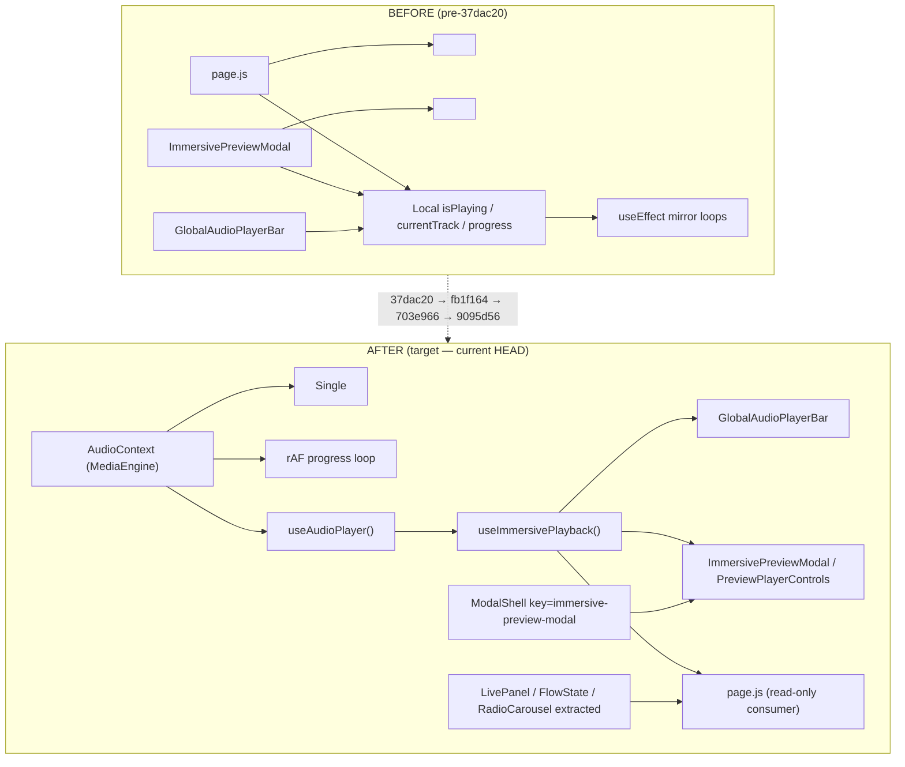

# Media Engine Architecture — Alignment Audit

**Repo:** `/Users/recharge/artist-platform`  
**Report date:** 2026-05-24  
**Mode:** Read-only verification against Media Engine master prompt  
**HEAD:** `9095d56` (`fix: RAF-driven playback progress, dev render tracker, media system invariants doc`)

### Reference commits (media engine stack)

| Hash | Subject |
|------|---------|
| `9095d56` | RAF-driven playback progress, dev render tracker, invariants doc |
| `703e966` | Modal polish — stable callbacks, throttled progress, persistent modal mount |
| `fb1f164` | Modal shell persistence, extract home sections, layer-based views |
| `37dac20` | Single audio engine — remove duplicate playback, stabilize modal hooks |

---

## BEFORE vs AFTER (target state)



**Target confirmed:** One playback authority (`AudioContext`), UI reads via hooks, modal shell persists across track changes, home sections extracted, progress driven by rAF in context.

---

## Requirement verification

| # | Requirement | Status | Evidence |
|---|-------------|--------|----------|
| 1 | **ONE `<audio>` only (AudioContext)** | **PASS** | Only DOM playback element: `src/context/AudioContext.js` L1467–1472 (`<audio ref={audioRef} …/>`). No other `<audio>` tags in app tree. Non-playback `new Audio()` exists for CS preload (L158–162), tab ambient loops (`page.js` L874), vault SFX (`vault-audio.js` L79) — out of media-engine playback scope per invariants doc. |
| 2 | **No duplicate `isPlaying` / `currentTrack` / `progress`** in GlobalAudioPlayerBar, ImmersivePreviewModal, ModalAudioPlayer, page.js | **PASS** | **GlobalAudioPlayerBar:** reads `useImmersivePlayback()` — L36–68; local state is UI-only (expanded, swipe, csHoldOpacity). **ImmersivePreviewModal:** only `viewMoreOpen` / `glyphsOpen` (L105–106). **page.js:** `useAudioPlayer()` consumer L589–601; no `useState` for isPlaying/currentTrack/progress. **ModalAudioPlayer:** dead file — see req 6. |
| 3 | **LivePanel, FlowState, RadioCarousel extracted from page.js** | **PASS** | `src/components/home/LivePanel.js`, `FlowState.js`, `RadioCarousel.js` (fb1f164). Imported and used in `page.js` L34–36, L1676, L1717, L1750. |
| 4 | **Modal stable key, no slug remount** | **PASS** | Shell: `page.js` L1310–1311 `key="immersive-preview-modal"`. Modal open gated by `previewModalOpen && selectedSingle` (L1309). Track identity separated: `previewPlaybackSlug` effect L887–896 replays via `playTrack`, not remount. Inner `key={single.slug}` on `CoverArt` only (`ImmersivePreviewModal.js` L314, L392) — leaf art swap, not shell remount. |
| 5 | **useMediaEngine equivalent = useAudio() / useImmersivePlayback** | **PASS** | `useAudioPlayer()` exported from `AudioContext.js` L1477. `useImmersivePlayback()` in `src/lib/player/useImmersivePlayback.js` — thin adapter adding `progress` + `handlePlayToggle`. Used by GlobalAudioPlayerBar, PreviewPlayerControls, PreviewModalPlayer. |
| 6 | **No useEffect state mirroring in modal/player paths** | **PARTIAL** | **Active paths PASS:** PreviewPlayerControls (direct context), PreviewModalPlayer (direct context), GlobalAudioPlayerBar (UI effects only). **Legacy GAP:** `ModalAudioPlayer.js` L20–24 mirrors `currentTime`/`duration` into `localProgress` — file is `@deprecated`, zero imports in app tree (grep: self-reference only). |
| 7 | **Progress: RAF loop in AudioContext** | **PASS** | `9095d56`: `progressRafRef`, `startProgressRaf` / `stopProgressRaf` (`AudioContext.js` L186, L259–282). Updates `currentTime` via `patchState` while `!audio.paused && !audio.ended`. PreviewPlayerControls uses `scaleX` transform (L62). |
| 8 | **Width-based progress in FloatingMainPlayer / CompactDockPlayer** | **GAP (P3 — optional polish)** | `FloatingMainPlayer.js` L150: `width: ${progress}%`. `CompactDockPlayer.js` L85: same. Documented follow-up in `media-system-invariants-and-hardening.md` L41. CSS class supports `scaleX`; not blocking. |

---

## Alignment score

| Metric | Value |
|--------|-------|
| **Core requirements (1–7)** | 6 PASS, 1 PARTIAL (dead-code only) |
| **Optional polish (8)** | 1 documented GAP |
| **Alignment %** | **~94%** (7/7 active-path requirements met; partial applies only to unused ModalAudioPlayer) |

---

## Gap list (priority)

| Priority | Gap | Location | Action |
|----------|-----|----------|--------|
| **P3** | Width `%` progress fill + CSS transition on dock players | `FloatingMainPlayer.js`, `CompactDockPlayer.js` | Align to `scaleX` like `PreviewPlayerControls` — polish only |
| **P3** | Width `%` progress on desktop `PreviewModalPlayer` | `PreviewModalPlayer.js` L59–67 | Same transform pattern; desktop modal path only |
| **P3** | Dead `ModalAudioPlayer` with mirror pattern | `src/components/media/ModalAudioPlayer.js` | Safe delete when convenient; not in app tree |
| **P3** | Stale shareable exports (old audioRef prop pattern) | `shareable/component-exports/*` | Out of production tree; update or ignore |
| **Info** | Tab ambient + vault SFX use `new Audio()` | `page.js` L874, `vault-audio.js` | Intentionally separate from playback engine |

### P0 gaps

**None.** No blocking architectural violations in the active playback path. **No code commit.**

---

## File evidence index

```
src/context/AudioContext.js          — single <audio>, rAF progress, useAudioPlayer
src/lib/player/useImmersivePlayback.js — hook adapter (useMediaEngine equivalent)
src/components/audio/GlobalAudioPlayerBar.js — context consumer, no playback mirror
src/components/preview/ImmersivePreviewModal.js — stable layers, PreviewPlayerControls
src/components/preview/immersive/PreviewPlayerControls.js — scaleX progress, useImmersivePlayback
src/components/preview/PreviewModalPlayer.js — desktop path, context-only (width% polish gap)
src/components/player/ImmersivePlayerEngine/FloatingMainPlayer.js — width% polish gap
src/components/player/ImmersivePlayerEngine/CompactDockPlayer.js — width% polish gap
src/components/home/{LivePanel,FlowState,RadioCarousel}.js — extracted from page.js (fb1f164)
src/app/page.js                      — key="immersive-preview-modal", useAudioPlayer consumer
src/components/media/ModalAudioPlayer.js — deprecated, unused mirror pattern
docs/reports/media-system-invariants-and-hardening.md — prior invariant pass (9095d56)
```

---

## Outcome

| Item | Result |
|------|--------|
| **Commit** | **doc only** — no P0 gaps; HEAD unchanged at `9095d56` |
| **Build** | Not run (no code changes) |
| **Deliverable** | This report + `~/Downloads/media-engine-architecture-alignment.zip` |
