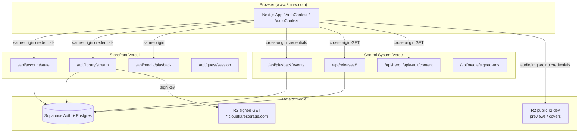

# Production stabilization audit — 2026-05-26

**Scope:** Network, CORS, media delivery, env dependencies, domain canonicalization, and request-flow verification for 2MRRW production. **Not** a greenfield rebuild; **no** AudioContext rewrite.

**Repos audited:**

| Repo | Path | Production alias |
|------|------|------------------|
| Storefront | `/Users/recharge/artist-platform` | https://www.2mrrw.com |
| Control System | `/Users/recharge/2MRRW-Control-System` | https://2mrrw-control-system.vercel.app |

**Recent CORS commits (verified, not re-applied):**

| Repo | SHA | Summary |
|------|-----|---------|
| Control System | `ad351e3` | Remove static `next.config` CORS; shared `corsPreflight`; `proxy.ts` per-origin |
| Storefront | `ad2b549` | Apex→www redirect; `/api/library/stream` OPTIONS; R2 CORS doc |
| Storefront | `b8b21da` | Deploy IDs + probe notes in `cors-architecture-fix-20260526.md` |

---

## 1. Architecture map



**Authorization source of truth:** Stripe/webhooks → Supabase tables → storefront `/api/account/state` → `AuthContext`. UI never invents entitlements.

**Playback paths:**

1. **Preview / catalog** — `catalogPreviewAudioUrl()` → public `NEXT_PUBLIC_R2_PUBLIC_URL` (`*.r2.dev`).
2. **Full stream (entitled)** — `stream-client.js` → same-origin `/api/library/stream` → JSON signed URL or `redirect=1` → R2 signed host.
3. **Analytics** — `playback.js` → cross-origin `POST` Control System `/api/playback/events`.

---

## 2. Origin interaction map

| Origin | Role | Called by | CORS model |
|--------|------|-----------|------------|
| `https://www.2mrrw.com` | Canonical storefront | User browser | Same-origin for `/api/*` |
| `https://2mrrw.com` | Apex | 307 → www | Must not be primary UI origin |
| `https://2mrrw-control-system.vercel.app` | Catalog + playback API | Storefront client (`NEXT_PUBLIC_CONTROL_SYSTEM_API_URL`) | `proxy.ts` + `http.ts` dynamic ACAO |
| `https://artist-platform-silk.vercel.app` | Vercel preview storefront | Allowed in CS CORS | Pattern + static allowlist |
| `https://2mrrw-official.vercel.app` | Alt preview | Allowed in CS CORS | Static allowlist |
| `NEXT_PUBLIC_SUPABASE_URL` | Auth session | `@supabase/supabase-js` | Supabase-managed |
| `https://pub-643e4a94e0184b1fabf6522cfbb16f75.r2.dev` | Public media CDN | `<audio>`, ``, Next Image | **R2 bucket CORS** (manual) |
| `*.r2.cloudflarestorage.com` | Signed full streams | Redirect from `/api/library/stream` | S3 presigned; no cookies |
| `api.stripe.com`, `api.resend.com`, `api.printful.com` | Server-side only | API routes | N/A to browser CORS |

**Storefront fetch URL inventory (grep):**

| Pattern | Examples |
|---------|----------|
| Relative `/api/*` | `AuthContext`, `stream-client`, `page.js` catalog, gifts, checkout |
| `buildControlSystemUrl` / `fetchControlSystemJson` | releases, hero, vault, audio-visuals, playback events |
| `NEXT_PUBLIC_R2_PUBLIC_URL` | `media-urls.js`, `r2-public-cdn.js`, control-system media absolutize |
| Absolute third-party | Resend, Printful (server routes only) |

**Unused env patterns:** `NEXT_PUBLIC_API_URL`, `VITE_*`, `REACT_APP_*`, `MEDIA_URL`, `CDN_URL`, `STREAM_URL`, `API_BASE_URL`, `AUTH_URL` — **not referenced** in storefront source.

---

## 3. CORS audit

### Control System (owner of cross-origin API CORS)

| Mechanism | Status |
|-----------|--------|
| `src/proxy.ts` `applyApiCors` | **Active** — per-request `Access-Control-Allow-Origin` when origin allowed |
| `src/server/http.ts` `corsPreflight` / `withCors` | **Active** — route-level POST responses + dedicated OPTIONS on key routes |
| `next.config.mjs` static `headers()` | **Removed** (`ad351e3`) — no conflict |
| `Access-Control-Allow-Credentials: true` | **Set** on proxy + http helpers |
| Allowlist | www, apex, localhost:3000/5173, 127.0.0.1:3000/5173, preview hosts, `CONTROL_SYSTEM_ALLOWED_ORIGINS` |

### Storefront

| Mechanism | Status |
|-----------|--------|
| `next.config.mjs` CORS headers | **None** — correct |
| `middleware.js` | Supabase session only; **no** API CORS |
| `/api/library/stream` OPTIONS | **204** (minimal; same-origin primary) |
| `/api/account/state` | Same-origin only in production client |

### Gaps

| Gap | Severity | Action |
|-----|----------|--------|
| `getControlSystemAccountState` → CS `/api/account/state` | Low (dead client path) | Document; optional future removal |
| `offline-cache.js` uses `credentials: "include"` on arbitrary stream URL | Low | Prefer `omit` for public R2 URLs in future hardening |
| R2 policy missing `localhost:5173` | Dev-only | Optional add to `r2-cors-policy-recommended.json` |

**No CORS code changes required this session** — production probes pass (see §12).

---

## 4. OPTIONS / preflight audit

| Endpoint | Repo | Handler | Prod probe |
|----------|------|---------|------------|
| `/api/playback/events` | CS | `proxy.ts` OPTIONS 204 + route `corsPreflight` | **PASS** www + apex |
| `/api/releases/[slug]` | CS | `proxy.ts` + route `corsPreflight` | **PASS** www |
| All other `/api/*` | CS | `proxy.ts` line 148–149 | Covered by middleware |
| `/api/library/stream` | Storefront | Route `OPTIONS` → 204 | **PASS** www (204, no ACAO — same-origin sufficient) |
| `/api/account/state` | Storefront | No OPTIONS (simple GET same-origin) | N/A |

**Preflight triggers on CS calls:** `fetchControlSystemJson` sends `x-control-session-id` + `credentials: "include"` → browser preflights GET/POST to Control System. Proxy OPTIONS must run **before** auth guards — confirmed for `/api/*`.

---

## 5. Media delivery audit

| Asset type | Delivery | URL builder | Credentials on load |
|------------|----------|-------------|---------------------|
| Preview audio | Public R2 CDN | `catalogPreviewAudioUrl` | **No** (`<audio src>`) |
| Cover / motion | Public R2 CDN | `catalogCoverUrl`, `catalogMotionVideoUrl` | **No** |
| Full entitled stream | Signed R2 via storefront API | `/api/library/stream` → `createR2SignedGetUrl` | Cookie to storefront only; redirect URL unsigned |
| Vault protected | Storefront `/api/vault/media` | Server signs R2 | Same-origin |
| CS vault / paid assets | CS `/api/media/signed-url(s)` | `control-system/media.js` | `credentials: "include"` to CS |
| Next/Image | `next.config.mjs` `remotePatterns` | r2.dev, r2.cloudflarestorage.com | N/A |

**Env guardrails:** `r2-public-cdn.js` warns if `NEXT_PUBLIC_R2_PUBLIC_URL` points at wrong account (`pub-992d4f5d`).

**AudioContext:** Sets `audio.src` from track URLs (preview CDN or library stream paths). **No change this session** — network layer verified first per stabilization policy.

---

## 6. Env dependency map

### Storefront `.env.example`

| Variable | Purpose |
|----------|---------|
| `NEXT_PUBLIC_SITE_URL` | Canonical URL (checkout, emails) |
| `NEXT_PUBLIC_BASE_URL` | Optional override |
| `NEXT_PUBLIC_CONTROL_SYSTEM_API_URL` | Cross-origin CS API base |
| `NEXT_PUBLIC_R2_PUBLIC_URL` | Public CDN base |
| `CLOUDFLARE_R2_*` | Server signing for `/api/library/stream` |
| `NEXT_PUBLIC_POSTHOG_*` | Telemetry |
| `NEXT_PUBLIC_SUPABASE_URL` / `NEXT_PUBLIC_SUPABASE_ANON_KEY` | Auth (used; not in example — legacy in docs) |
| `SUPABASE_SERVICE_ROLE_KEY` | Server admin |
| `STRIPE_*`, `PRINTFUL_*`, `GUEST_SESSION_SECRET` | Commerce / guest |

### Control System `.env.example`

| Variable | Purpose |
|----------|---------|
| `NEXT_PUBLIC_APP_URL` | CS self URL + CORS |
| `CONTROL_SYSTEM_ALLOWED_ORIGINS` | Extra CORS origins |
| `CONTROL_SYSTEM_FRONTEND_SHARED_SECRET` | Trusted identity headers |
| `CONTROL_SYSTEM_ADMIN_API_KEY` | Admin API |
| `STOREFRONT_SYNC_URL` / `ADMIN_SEED_SECRET` | Catalog sync push |
| `NEXT_PUBLIC_SUPABASE_*`, `SUPABASE_SERVICE_ROLE_KEY` | Auth + DB |
| `CLOUDFLARE_R2_*`, `NEXT_PUBLIC_R2_PUBLIC_URL` | Media storage |
| `STRIPE_*` | Payments |

### Local `.env.local` variable **names** only (no values)

**Storefront:** `ADMIN_SEED_SECRET`, `CLOUDFLARE_R2_*` (5), `GUEST_SESSION_SECRET`, `NEXT_PUBLIC_BASE_URL`, `NEXT_PUBLIC_CONTROL_SYSTEM_API_URL`, `NEXT_PUBLIC_R2_PUBLIC_URL`, `NEXT_PUBLIC_SITE_URL`, `NEXT_PUBLIC_STRIPE_PUBLISHABLE_KEY`, `NEXT_PUBLIC_SUPABASE_ANON_KEY`, `NEXT_PUBLIC_SUPABASE_URL`, `PRINTFUL_API_KEY`, `STRIPE_*`, `SUPABASE_SERVICE_ROLE_KEY`

**Control System:** `CLOUDFLARE_R2_*`, `NEXT_PUBLIC_R2_PUBLIC_URL`, `NEXT_PUBLIC_SUPABASE_*`, `SUPABASE_MEDIA_BUCKET` (deprecated), `SUPABASE_SERVICE_ROLE_KEY`, `VERCEL_OIDC_TOKEN`

**Production risk:** Local storefront `.env.local` lists `NEXT_PUBLIC_R2_PUBLIC_URL` but **not** `CLOUDFLARE_R2_*` — local full-stream signing may fail until those are set (Vercel prod should have them).

---

## 7. Credential audit

| Call site | Target | `credentials` | Correct? |
|-----------|--------|---------------|----------|
| `AuthContext` | `/api/account/state`, `/api/library`, guest | `include` | Yes — same-origin session |
| `stream-client.js` | `/api/library/stream`, `/api/stream/end` | `include` | Yes |
| `control-system/client.js` | CS catalog APIs | `include` | Yes — needs CS `Allow-Credentials` |
| `control-system/playback.js` | CS `/api/playback/events` | `include` | Yes |
| `control-system/media.js` | CS signed-url batch | `include` | Yes |
| `AudioContext` | `/api/media/playback` | `include` | Yes — same-origin |
| `<audio>` / `` | `r2.dev` | Default omit | Yes |
| `offline-cache.js` | Any stream URL | `include` | Review — may be unnecessary for public R2 |
| Supabase client | Supabase host | Cookie via SDK | Yes |

**Rule:** Never send cookies to `r2.dev` or `cloudflarestorage.com` from custom `fetch` unless explicitly required (not required today).

---

## 8. CDN / R2 audit

| Check | Result |
|-------|--------|
| Public bucket host | `pub-643e4a94e0184b1fabf6522cfbb16f75.r2.dev` |
| Recommended CORS JSON | [`r2-cors-policy-recommended.json`](./r2-cors-policy-recommended.json) |
| Production R2 CORS applied? | **Yes** — probe with `Origin: https://www.2mrrw.com` returns `Access-Control-Allow-Origin: https://www.2mrrw.com` |
| Signed stream host | `*.r2.cloudflarestorage.com` via AWS SDK presign |
| Next.js image allowlist | `r2.dev`, `r2.cloudflarestorage.com`, env host |

### Manual Cloudflare steps (if re-applying or new preview host)

1. Cloudflare Dashboard → **R2** → bucket **`2mrrw-media`** → **Settings** → **CORS policy**.
2. Paste contents of `docs/reports/r2-cors-policy-recommended.json`.
3. Confirm **Public access** is enabled for the documented `r2.dev` subdomain.
4. Verify Vercel env `NEXT_PUBLIC_R2_PUBLIC_URL` matches that hostname (wrong account ID → 401 on previews).
5. CLI alternative:

```bash
npx wrangler login
npx wrangler r2 bucket cors put 2mrrw-media --file docs/reports/r2-cors-policy-recommended.json
```

6. Re-probe:

```bash
curl -sI -H "Origin: https://www.2mrrw.com" \
  "https://pub-643e4a94e0184b1fabf6522cfbb16f75.r2.dev/previews/<known-file>.mp3" | grep -i access-control
```

---

## 9. Canonical domain plan

| Host | Behavior | Config |
|------|----------|--------|
| `https://2mrrw.com/*` | **307** → `https://www.2mrrw.com/*` | `next.config.mjs` `redirects()` |
| `https://www.2mrrw.com` | **200** — canonical | Production alias |
| CS API | Single host `2mrrw-control-system.vercel.app` | No apex/www split |

**Prod probe (2026-05-27):** `curl -sI https://2mrrw.com/` → `307`, `location: https://www.2mrrw.com/`.

**Recommendation:** Set `NEXT_PUBLIC_SITE_URL=https://www.2mrrw.com` everywhere; never use apex in Stripe return URLs or marketing links.

---

## 10. Prioritized repair roadmap

| Priority | Item | Owner | Status |
|----------|------|-------|--------|
| P0 | CS dynamic CORS (no static next.config) | CS | **Done** `ad351e3` |
| P0 | Storefront apex→www | Storefront | **Done** `ad2b549` |
| P0 | R2 bucket CORS for browser media | Cloudflare manual | **Verified** in prod |
| P1 | Confirm Vercel prod has `CLOUDFLARE_R2_*` on storefront | Ops | Verify dashboard |
| P1 | Confirm `NEXT_PUBLIC_R2_PUBLIC_URL` on all envs | Ops | Matches public r2.dev |
| P2 | Remove or wire `getControlSystemAccountState` dead path | Storefront code | Backlog |
| P2 | `offline-cache` use `credentials: "omit"` for public CDN URLs | Storefront | Backlog |
| P3 | Add `localhost:5173` to R2 CORS if Vite dev hits R2 directly | Cloudflare | Optional |
| — | AudioContext / player logic | — | **Deferred** until network stable |

---

## 11. Implementation plan

### Completed (prior session — do not duplicate)

1. Deploy Control System `ad351e3` before storefront.
2. Deploy storefront `ad2b549` (redirect + stream OPTIONS + docs).
3. Apply R2 CORS policy on bucket `2mrrw-media`.
4. Post-deploy curl OPTIONS probes (documented below).

### Next ops checks (no code deploy required)

1. Vercel → storefront production → Environment: all `CLOUDFLARE_R2_*` present.
2. Play entitled track on www — Network tab: `/api/library/stream` 200, audio loads from signed URL.
3. Play preview — audio from `r2.dev` without CORS errors.
4. Confirm playback analytics POST to CS returns 200 (not blocked by CORS).

### If regression detected

1. Capture browser preflight failure (URL, Origin, missing header).
2. Compare response headers to §12 probes.
3. Patch **only** the owning layer (CS `proxy.ts` vs R2 dashboard vs storefront route).
4. Redeploy CS first, then storefront.

---

## 12. Patches applied this session

**None.** Audit and production verification only; working tree clean on `main` for both repos.

### Commit SHAs (production fixes already on `main`)

| Repo | Commit | Message |
|------|--------|---------|
| 2MRRW-Control-System | `ad351e3` | fix(cors): remove static next.config headers; use shared preflight |
| artist-platform | `ad2b549` | fix(cors): apex→www redirect, stream OPTIONS, R2 CORS policy doc |
| artist-platform | `b8b21da` | docs: add CORS fix deploy IDs and probe results |

### Deploy IDs (from `cors-architecture-fix-20260526.md`)

| Repo | Deployment ID | Alias |
|------|---------------|-------|
| Control System | `dpl_66FDDs38VT4PNyDgHrYzWYCX4BZe` | https://2mrrw-control-system.vercel.app |
| Storefront | `dpl_3apApY2hyCMRgjGJf9L43xz4N6Qi` | https://www.2mrrw.com |

### Production probes (2026-05-27, live curl)

| Test | Result |
|------|--------|
| OPTIONS CS `/api/playback/events` + `Origin: https://www.2mrrw.com` | **204**, `ACAO: https://www.2mrrw.com`, `Allow-Credentials: true` |
| OPTIONS CS `/api/playback/events` + `Origin: https://2mrrw.com` | **204**, `ACAO: https://2mrrw.com`, `Allow-Credentials: true` |
| OPTIONS CS `/api/releases/test-slug` + www | **204**, matching ACAO |
| OPTIONS storefront `/api/library/stream` | **204** |
| GET `https://2mrrw.com/` | **307** → www |
| GET `https://www.2mrrw.com/` | **200** |
| HEAD R2 public CDN + `Origin: www` | **404** on bucket root (expected), **`Access-Control-Allow-Origin: https://www.2mrrw.com`** |

---

## 13. Frontend request flow (Phase 9)

| Consumer | Endpoint | Base | Notes |
|----------|----------|------|-------|
| `AuthContext.refreshAccountState` | `/api/account/state` | Same-origin relative | **Production path** |
| `AuthContext.refreshLibrary` | `/api/library` | Same-origin | |
| `stream-client.fetchLibraryStream` | `/api/library/stream` | Same-origin | Entitlement + R2 sign |
| `fetchControlSystemJson` | `/api/releases`, `/api/hero`, etc. | `NEXT_PUBLIC_CONTROL_SYSTEM_API_URL` | Cross-origin |
| `sendControlSystemPlaybackEvent` | `/api/playback/events` | Control System absolute | Cross-origin POST |
| **`getControlSystemAccountState`** | CS `/api/account/state` | Control System | **Dead** — exported, **zero** imports in `src/` |

Storefront also implements its own `/api/account/state` (Supabase entitlements). CS `/api/account/state` exists for CS-native clients only.

---

## 14. Audio stabilization note (Phase 10)

**AudioContext was not modified.** Recent audio commits (`61b25c2` canplay wait) are playback-timing fixes, not network.

Stabilization order:

1. **Network** — CORS, redirects, R2, env (this document) ✅ verified
2. **Entitlements** — `/api/account/state` correctness
3. **Stream signing** — `/api/library/stream` + R2 keys on Vercel
4. **Player** — only after 1–3 are green in production Network tab

---

## Related reports

- [`cors-architecture-fix-20260526.md`](./cors-architecture-fix-20260526.md) — detailed CORS fix narrative
- [`r2-cors-policy-recommended.json`](./r2-cors-policy-recommended.json) — R2 bucket policy
- [`production-api-probe-20260526.md`](./production-api-probe-20260526.md) — storefront API reachability

---

*Generated: 2026-05-27. Session: production stabilization audit (verify-only).*
