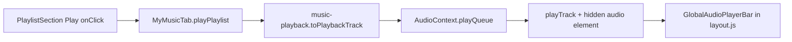

# 2MRRW Artist Platform — Music Audit (read-only)

**Repo audited:** `/Users/recharge/artist-platform`  
**Generated:** 2026-05-22  
**Bundle:** `2MRRW-Artist-Platform-Music-Audit-2026-05-22.zip`

Read this INDEX first, then the copied source files under `src/` in the zip.

---

## INDEX — All 10 answers

### 1. Playlist Play button → audio engine (My Music)

**Click handler (playlist row “Play”):**

`src/components/music/PlaylistSection.js` — `onClick={() => onPlayPlaylist?.(playlist)}`

```324:337:src/components/music/PlaylistSection.js
                <button
                  type="button"
                  disabled={subscriptionLocked || !(playlist.tracks?.length || playlist.trackIds?.length)}
                  onClick={() => onPlayPlaylist?.(playlist)}
                  style={{
                    padding: "8px 14px",
                    background: "#00ffff",
                    color: "#000",
                    border: "none",
                    borderRadius: 8,
                    cursor: subscriptionLocked ? "not-allowed" : "pointer",
                    fontSize: 11,
                    fontWeight: 800,
                    opacity: subscriptionLocked ? 0.4 : 1,
                  }}
                >
                  Play
                </button>
```

**Wired from My Music tab:**

`src/components/music/MyMusicTab.js` — prop `onPlayPlaylist={playPlaylist}`

```255:261:src/components/music/MyMusicTab.js
      <PlaylistSection
        userId={user?.id}
        catalogTracks={catalogTracks}
        onPlayPlaylist={playPlaylist}
        subscriptionLocked={subscriptionLocked}
        isMobile={isMobile}
      />
```

**Handler:** `playPlaylist` → `toPlaybackTrack` → `playQueue`

```162:178:src/components/music/MyMusicTab.js
  const playPlaylist = useCallback(
    (playlist) => {
      const catalogBySlug = new Map(catalogTracks.map((t) => [t.slug, t]));
      const refs = (playlist.tracks || []).length
        ? playlist.tracks
        : (playlist.trackIds || []).map((id) => catalogBySlug.get(id)).filter(Boolean);
      const tracks = refs
        .map((item) => {
          const merged = { ...catalogBySlug.get(item.slug), ...item };
          return toPlaybackTrack(merged, { ...accountState, userId: user?.id }, "playlist");
        })
        .filter((t) => t.src);
      if (!tracks.length) return;
      void playQueue(tracks, 0);
    },
    [accountState, catalogTracks, playQueue, user?.id]
  );
```

**Track normalization:** `src/lib/music-playback.js` — `toPlaybackTrack`, `resolvePlaybackSrc`

```3:19:src/lib/music-playback.js
export function toPlaybackTrack(item, accountState, source = "library", overrides = {}) {
  const access = resolveTrackAccess(item, accountState);
  const userId = accountState?.userId || overrides.userId;
  return {
    id: item?.slug || item?.id,
    slug: item?.slug,
    title: item?.title || "Untitled",
    artist: item?.artist || "2MRRW",
    cover: item?.cover || item?.coverArt || null,
    src: resolvePlaybackSrc(item, access, { userId }),
    source,
    metadata: {
      access,
      price: item?.price,
      ...overrides,
    },
  };
}
```

**Global engine:** `src/context/AudioContext.js`

| Step | Function |
|------|----------|
| Hook | `useAudioPlayer()` → `playQueue` |
| Queue | `playQueue` → `setQueue` → `playTrack` |
| DOM | `audioRef.current.src = nextTrack.src`; `await audio.play()` |
| Element | `<audio ref={audioRef} preload="metadata" />` inside `AudioProvider` |

```315:318:src/context/AudioContext.js
  const playQueue = useCallback(async (tracks = [], startIndex = 0, options = {}) => {
    const normalized = setQueue(tracks, startIndex);
    if (!normalized.length) return false;
    return playTrack(normalized[Math.max(0, Math.min(startIndex, normalized.length - 1))], options);
```

```210:231:src/context/AudioContext.js
      if (!isSameTrack) {
        audio.pause();
        audio.src = nextTrack.src;
        audio.load();
        pendingSeekRef.current = options.resumeAt && options.resumeAt > 5 ? options.resumeAt : null;
      } else if (options.resumeAt && options.resumeAt > 5 && Math.abs(audio.currentTime - options.resumeAt) > 2) {
        audio.currentTime = options.resumeAt;
      }
      // ...
      await audio.play();
```

```403:407:src/context/AudioContext.js
  return (
    <AudioContext.Provider value={value}>
      {children}
      <audio ref={audioRef} preload="metadata" style={{ display: "none" }} />
    </AudioContext.Provider>
```

**Playback persistence:** `POST /api/media/playback` + `sendControlSystemPlaybackEvent` (lines 78–99 in `AudioContext.js`).

---

### 2. Full-screen player — path and when it appears

**Component:** `src/components/preview/ImmersivePreviewModal.js`  
**In-modal controls:** `src/components/preview/PreviewModalPlayer.js` (separate `audioRef`, not `AudioContext`)

**When it appears:** `selectedSingle` is set on the home SPA (`src/app/page.js`). **Not** used for My Music playlist Play.

```1259:1275:src/app/page.js
      <AnimatePresence>
        {selectedSingle && (
          <ImmersivePreviewModal
            key={selectedSingle.slug}
            single={selectedSingle}
            releaseDetail={selectedReleaseDetail}
            isMobile={isMobile}
            audioRef={modalAudioRef}
            trackAccess={selectedSingleAccess}
            userId={currentUser?.id}
            onLibraryChange={() => { void refreshAccountState(); void refreshLibrary(); }}
            onClose={() => setSelectedSingle(null)}
            onAddToCart={addToCart}
            onAddVinyl={addVinylToCart}
          />
        )}
      </AnimatePresence>
```

**Open trigger:** `openSingleModal` → `setSelectedSingle(single)` (~879–881 in `page.js`).

**Shell:** fixed `inset: 0`, `zIndex: 8888` (`ImmersivePreviewModal.js` ~114–128).

---

### 3. Mini player — path, global vs per-page

**Two separate systems:**

| Player | Path | Mount | Used by playlist Play? |
|--------|------|-------|------------------------|
| **Global bar** | `src/components/audio/GlobalAudioPlayerBar.js` | Root `layout.js` (all routes) | **Yes** |
| **Legacy “now playing”** | Inline in `src/app/page.js` | Home SPA when `nowPlaying` set | **No** (Features rail) |

**Global (playlist path):**

```11:20:src/app/layout.js
export default function RootLayout({ children }) {
  return (
    <html lang="en">
      <body style={{ margin: 0, background: "#0a0a0a", color: "white" }}>
        <AuthProvider>
          <AudioProvider>
            <StripeProvider>
              {children}
              <GlobalAudioPlayerBar />
```

Shows when `hasStarted && currentTrack` from `AudioContext`:

```41:41:src/components/audio/GlobalAudioPlayerBar.js
  if (!hasStarted || !currentTrack) return null;
```

**Legacy mobile mini player** (`nowPlaying` / `nowPlayingAudioRef`, not `AudioContext`): `page.js` ~2150–2187, `zIndex: 6750`.

---

### 4. “+ New Playlist” — modal vs navigate

**My Music playlists section:** **inline create, no route, no modal.**

`src/components/music/PlaylistSection.js` — `handleCreate` → `usePlaylists().create`

```188:192:src/components/music/PlaylistSection.js
  const handleCreate = () => {
    const created = create({ title: "New Playlist" });
    setEditingId(created.id);
    setDraftTitle(created.title);
  };
```

```222:238:src/components/music/PlaylistSection.js
        <button
          type="button"
          onClick={handleCreate}
          ...
        >
          + New Playlist
        </button>
```

**Separate modal path** (per-track “+” menu): `PlusActionSheet.js` via `MusicPlusButton.js` — `createPlaylist` from `src/lib/playlists.js`. **Not** the header “+ New Playlist” button.

---

### 5. My Music page component

**Tab UI:** `src/components/music/MyMusicTab.js`  
**Rendered in:** `src/app/page.js` when `activeTab === "mymusic"`

```1758:1769:src/app/page.js
                  {activeTab==="mymusic" && (
                    <>
                      <h2 className="section-heading">My Music</h2>
                      <MyMusicTab
                        singles={singles}
                        albums={albums}
                        isMobile={isMobile}
                        onSwitchTab={switchTab}
                        onOpenSingle={openSingleModal}
                        onOpenAlbum={setSelectedAlbum}
                      />
                    </>
                  )}
```

“My Music” is sub-tab `mymusic` under the MUSIC group in `page.js`.

---

### 6. Playlist card component

**File exists:** `src/components/music/PlaylistCard.js`  
**Not imported** anywhere (zero `import PlaylistCard` in repo).

**Active My Music playlist UI** is **inline rows** in `PlaylistSection.js`, not `PlaylistCard`.

**Unused detail view:** `src/components/music/PlaylistDetail.js` — also no imports.

---

### 7. Playlist cover art — UI and data field

**Active UI (`PlaylistSection`):** no cover image on playlist rows (title, track count, Play, quick-add chips only).

**Dormant card component:**

```4:27:src/components/music/PlaylistCard.js
export default function PlaylistCard({ playlist, trackCount, onClick, isMobile }) {
  const cover = playlist.artwork || playlist.tracks?.[0]?.cover;
  return (
    <button
      ...
      <div
        style={{
          aspectRatio: "1/1",
          background: cover
            ? `url(${cover}) center/cover`
            : "linear-gradient(135deg,rgba(0,255,255,0.08),rgba(162,89,255,0.08))",
        }}
      />
```

**Data model:** `src/lib/playlists.js` — field `artwork` on create (`createPlaylist`, ~27–37). Fallback via `resolvePlaylistTracks` (track `cover` / `coverArt`).

---

### 8. Global audio / playback state

**React Context** — not Zustand/Redux.

| Piece | Path |
|-------|------|
| Provider + state | `src/context/AudioContext.js` |
| Hook | `useAudioPlayer()` |
| State | `useState(EMPTY_STATE)` — track, queue, repeat, shuffle |
| Provider wrap | `src/app/layout.js` — `<AudioProvider>` |

```10:23:src/context/AudioContext.js
const EMPTY_STATE = {
  currentTrackId: null,
  currentTrack: null,
  source: null,
  isPlaying: false,
  currentTime: 0,
  duration: 0,
  error: null,
  hasStarted: false,
  queue: [],
  queueIndex: -1,
  repeatMode: "off",
  shuffle: false,
};
```

Playlists: **localStorage** via `src/lib/playlists.js` + `src/hooks/usePlaylists.js` (separate from playback state).

---

### 9. Bottom nav — persistence and path

**Implementation:** inline JSX in `src/app/page.js` (not a separate nav file). Icons: `MobileNavAnimatedIcon.js`, `VaultNavLockIcon.js`.

```24:32:src/app/page.js
const MOBILE_NAV_TABS = [
  { id: "home", label: "Home" },
  { id: "singles", label: "Music" },
  { id: "shop", label: "Shop" },
  { id: "cards", label: "Cards" },
  { id: "vault", label: "Vault", vault: true },
  { id: "shows", label: "Shows" },
  { id: "more", label: "More", more: true },
];
```

**Mobile bar:** `position: fixed`, `bottom: 0`, `zIndex: 6700` (~2120–2148).

**Persistence:** On `/`, tab switches use `activeTab` in the same `page.js` tree — bottom nav **does not remount** when switching Home / Music / My Music / Shop.

**Not in** `layout.js`. Deep-link routes (`/song/[slug]`, etc.) redirect back to `/`.

---

### 10. Library / empty state component path

**No dedicated `LibraryEmpty` component.** States are **inline**:

| State | Path | Condition |
|-------|------|-----------|
| Logged out gate | `MyMusicTab.js` | `!user` (~188–204) |
| Loading | `MyMusicTab.js` | `loading` (~207–209) |
| **Library empty** | `MyMusicTab.js` | `!hasAnyContent` (~330–343) |
| **Playlists empty** | `PlaylistSection.js` | `playlists.length === 0` (~241–254) |

```330:343:src/components/music/MyMusicTab.js
      {!hasAnyContent && (
        <div style={{ background: "#0d0d0d", border: "1px solid #1e1e1e", borderRadius: 20, padding: "40px 28px", textAlign: "center" }}>
          <div style={{ fontSize: 18, fontWeight: 700, marginBottom: 8 }}>Your library is empty</div>
          <div style={{ fontSize: 13, color: "#555", marginBottom: 20 }}>Purchase singles or albums to start streaming here.</div>
          ...
        </div>
      )}
```

**Unused alternative:** `src/components/music/ContinueListening.js` (not imported; My Music has inline “Continue Listening” ~231–252).

---

## Architecture summary (playlist play)



**Not in playlist path:** `page.js` `nowPlaying` / `nowPlayingAudioRef`, `ImmersivePreviewModal`.

---

## Files in this zip

| File | Role |
|------|------|
| `INDEX.md` | This document |
| `README.txt` | Bundle manifest |
| `src/components/music/PlaylistSection.js` | Playlists UI + Play button |
| `src/components/music/MyMusicTab.js` | My Music tab + `playPlaylist` |
| `src/context/AudioContext.js` | Global playback engine |
| `src/components/audio/GlobalAudioPlayerBar.js` | Global mini player |
| `src/lib/music-playback.js` | Track → playback URL mapping |
| `src/app/layout.js` | `AudioProvider` + bar mount |
